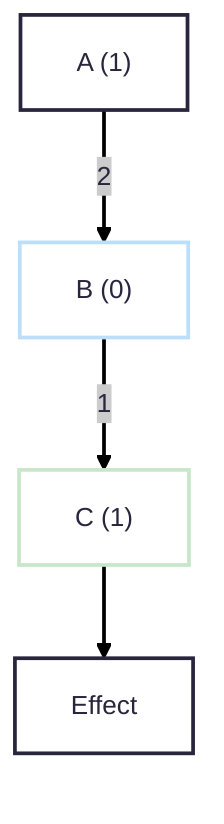

<h2>Vue reactivity system 演进</h2>
<p class="text-gray-400 text-s">
Doctor Wu / 2025-07-12
</p>

<!-- 
打招呼, 听完早上尤大的分享, 大家心里可能会有些疑问, Vue 的响应式系统究竟发生了什么变化, 包括尤大提到的 
alien signal, 他究竟做了哪些工作, 有着怎样的历史呢?

那么今天我就来给大家分享一下 Vue 的响应式系统在过去几个版本的演进, 那么先介绍一下我自己
-->
---
layout: intro
class: pl-35
glowSeed: 14
---


## Doctor Wu

<div class="[&>*]:important-leading-10 opacity-80">

{Vue} {VueUse} 核心团队成员<br>
目前就职于 {MoeGo} <br>

</div>

<div my-10 w-max flex="~ gap-1" items-center justify-center>
  <div i-ri-user-3-line op50 ma text-xl />
  <div><a href="https://doctorwu.me" target="_blank" class="border-none! font-300">doctorwu.me</a></div>
  <div i-ri-github-line op50 ma text-xl ml4/>
  <div><a href="https://github.com/Doctor-wu" target="_blank" class="border-none! font-300">Doctor-wu</a></div>
  <div i-ri-twitter-x-line op50 ma text-xl ml4/>
  <div><a href="https://twitter.com/Doctorwu666" target="_blank" class="border-none! font-300">Doctorwu666</a></div>
  <div i-ri-bilibili-line op50 ma text-xl ml4/>
  <div><a href="https://space.bilibili.com/343921694" target="_blank" class="border-none! font-300" ws-nowrap>Doctor___Wu</a></div>
</div>


<!-- 
我的网名是 Doctor Wu, 你们可以叫我 Doctor, 但是他们也会叫我吴博, 大家叫的开心就好

我是 Vue & VueUse 的团队成员, 也是一名开源爱好者, 大家可以在下面这些地方找到我

在 Vue 升级响应式系统的过程中, 我也参与了一些工作, 今天我会结合我开源的经验, 和大家分享一下, Vue 在过去几个 minor 版本中, 响应式系统是如何演进的
-->

---
layout: fact
---

## Challenges in Reactive system
响应式系统的挑战

<!-- 
在我参与 Vue 响应式的贡献的过程中, 我遇到了许多问题, 但是由于没有对这些问题有宏观的了解, 导致过程中走了很多弯路
很多时候分析问题比较局部微观

随着经验的积累, 我发现这些问题都是有迹可循的, 我们本质上是在应对响应式系统中的一些挑战, 如果对这些挑战有较为宏观的了解, 可以帮助我们更好地理解响应式系统, 也可以帮助我们更好地解决问题

所以今天我将会从响应式系统中的一些挑战出发, 和大家分享一下我们是怎么一步步解决这些问题的
-->

---
layout: fact
---
## Glitch
毛刺
<!-- 
那么首先, 我们来聊聊响应式系统中很经典的一个问题, 毛刺现象
-->
---

## 经典 Glitch 问题

<p flex justify-between>

<section flex-col justify-between>

````md magic-move
```ts
const A = ref(1);
const B = computed(() => A.value * 2); // B is now: 2
const C = computed(() => A.value + 1); // C is now: 2
const D = computed(() => B.value + C.value); // D is now: 4

watchEffect(() => {
  console.log('D is now:', D.value); // D is now: 4
});
```
```ts
const A = ref(1);
const B = computed(() => A.value * 2);
const C = computed(() => A.value + 1);
const D = computed(() => B.value + C.value);

watchEffect(() => {
  console.log('D is now:', D.value); // D is now: 4
});

A.value = 2;
// B -> 4, C is still 2
// effect re-run -> "D is now: 6" (B 更新了但是 C 没有更新还是 2)
// C -> 3
// effect re-run -> "D is now: 7"
// 这就是经典的 "Glitch" 问题 (钻石依赖)

```
````

</section>

<section flex justify-end>
  <tldraw class="w-100 h-100 float-right" doc="tldraw/doc-QlFu8VrzFr6iJuxd9NFgi.json"></tldraw>
</section>
</p>
---
---

## Scheduler
<br>
<tldraw class="w-full h-full" doc="tldraw/doc-F7okTfOjaUtlwwh16xlcr.json"></tldraw>

---
layout: center
---
## 所以, 我们已经安全了<v-click>吗?</v-click>
---

<p flex justify-between>

<section flex-col justify-between>

````md magic-move
```ts
const A = ref(1);
const B = computed(() => A.value * 2);
const C = computed(() => A.value + 1);
const D = computed(() => B.value + C.value);

watchEffect(() => {
  console.log('D is now:', D.value);
});
```
```ts
const A = ref(1);
const B = computed(() => A.value * 2);
const C = computed(() => A.value + 1);
const D = computed(() => B.value + C.value);
const E = computed(() => C.value + 1);

watchEffect(() => {
  console.log('D is now:', D.value);
  console.log('E is now:', E.value);
});
```
```ts
const A = ref(1);
const B = computed(() => A.value * 2);
const C = computed(() => A.value + 1);
const D = computed(() => B.value + C.value);
const E = computed(() => C.value + 1);

watchEffect(() => {
  console.log('D is now:', D.value);
  console.log('E is now:', E.value);
});

A.value = 2;
// B -> Dirty, C -> Dirty
// D -> Dirty
// schedule effect
// E -> Dirty
// schedule effect (unnecessary)
```
````

</section>

<v-click at="1">
  <section flex justify-end>
    <tldraw class="w-100 h-100 float-right" doc="tldraw/doc-xHpX9SbbC7uUDkVwQKoOn.json"></tldraw>
  </section>
</v-click>
</p>
---

## Oops, effect 怎么跑了两次
<br>
<tldraw class="w-220 h-full" doc="tldraw/doc-qEVHfD2-8mEiS-uLChoNs.json"></tldraw>

<!-- 
  抖一下 React 严格模式的包袱
-->

---
layout: fact
---

<PR link="https://github.com/vuejs/core/pull/5912" title="feat(reactivity): more efficient reactivity system" />

<section pos-absolute bottom-10 right-10 w-36 h-36 flex justify-center>
  
  
</section>

---

## Effect 支持脏值检查
<br>
<p flex justify-between>

<section w-100>

```ts
const update: SchedulerJob = (instance.update = () => {
  if (effect.dirty) {
    effect.run()
  }
})
```
</section>

<section w-100>

```ts
public get dirty() {
  if (
    this._dirtyLevel === DirtyLevels.MaybeDirty
  ) {
    // check if effect is dirty
  }
  return this._dirtyLevel >= DirtyLevels.Dirty
}
```
</section>
</p>

<tldraw class="w-full h-full" doc="tldraw/doc-lTGiy23wuEjSU8Z1-jslY.json"></tldraw>

---
layout: fact
---
## Equality check problem
相等性检查

<v-click>

</v-click>

---

<p flex justify-between>
<section flex-col>

````md magic-move
```typescript
const A = ref(3);
const B = computed(() => A.value * 0); // always 0
const C = computed(() => B.value + 1);

watchEffect(() => {
  console.log('C is now:', C.value);
});
```
```typescript
const A = ref(3);
const B = computed(() => A.value * 0); // always 0
const C = computed(() => B.value + 1);

watchEffect(() => {
  console.log('C is now:', C.value);
});

A.value = 2;
// B -> Dirty
// C -> Dirty
// effect re-run (unnecessary)
```
````

</section>

<section v-click w-120>
  <tldraw class="w-120 h-120" doc="tldraw/doc-7wNyyezOC7Wo_oMl3Wzzs.json"></tldraw>
</section>
</p>

---

<p flex justify-between>
<section flex-col>

## 染色算法
<br>

````md magic-move
```typescript
const A = ref(3);
const B = computed(() => A.value * 0); // always 0
const C = computed(() => B.value + 1);

watchEffect(() => {
  console.log('C is now:', C.value);
});
```
```typescript
const A = ref(3);
const B = computed(() => A.value * 0); // always 0
const C = computed(() => B.value + 1);

watchEffect(() => {
  console.log('C is now:', C.value);
});

A.value = 2;
// B -> Dirty
// C -> MaybeDirty
// effect check C, re-run C, C is Clean
```
````

</section>

<section v-click w-120>
  <tldraw class="w-120 h-120" doc="tldraw/doc-0FR8PqzGEBwzObZ-pX7kH.json"></tldraw>
</section>
</p>

---
---
````md magic-move
```ts 
let sec_counter = 0
let min_counter = 0
let hour_counter = 0

const ms = ref(0)
const sec = computed(() => { sec_counter++; return Math.floor(ms.value / 1000) })
const min = computed(() => { min_counter++; return Math.floor(sec.value / 60) })
const hour = computed(() => { hour_counter++; return Math.floor(min.value / 60) })

for (ms.value = 0;  ms.value < 10000000; ms.value += 1) {
  hour.value
}
```
```ts 
let sec_counter = 0
let min_counter = 0
let hour_counter = 0

const ms = ref(0)
const sec = computed(() => { sec_counter++; return Math.floor(ms.value / 1000) })
const min = computed(() => { min_counter++; return Math.floor(sec.value / 60) })
const hour = computed(() => { hour_counter++; return Math.floor(min.value / 60) })

for (ms.value = 0;  ms.value < 10000000; ms.value += 1) {
  hour.value
}

console.log(`sec: ${sec.value}, sec_counter: ${sec_counter}`) // sec: 10000, sec_counter: 10000001
console.log(`min: ${min.value}, min_counter: ${min_counter}`) // min: 166, min_counter: 10000001
console.log(`hour: ${hour.value}, hour_counter: ${hour_counter}`) // hour: 2, hour_counter: 10000001
```
```ts 
let sec_counter = 0
let min_counter = 0
let hour_counter = 0

const ms = ref(0)
const sec = computed(() => { sec_counter++; return Math.floor(ms.value / 1000) })
const min = computed(() => { min_counter++; return Math.floor(sec.value / 60) })
const hour = computed(() => { hour_counter++; return Math.floor(min.value / 60) })

for (ms.value = 0;  ms.value < 10000000; ms.value += 1) {
  hour.value
}

// computed 增加了 value 校验
console.log(`sec: ${sec.value}, sec_counter: ${sec_counter}`) // sec: 10000, sec_counter: 10000001
console.log(`min: ${min.value}, min_counter: ${min_counter}`) // min: 166, min_counter: 10001
console.log(`hour: ${hour.value}, hour_counter: ${hour_counter}`) // hour: 2, hour_counter: 167
```
````
<div h-3></div>
<tldraw class="w-200 h-80 float-right" doc="tldraw/doc-7PhAqgUgMNwIxzpG3H5nN.json"></tldraw>

---
layout: fact
---

## Memory usage
内存占用优化

---
---
<p flex justify-between>
  <section>

  ## 基于 Set 的数据结构
  <br>

```typescript
// 全局的 WeakMap，存储所有响应式对象的依赖
// target -> depsMap
const targetMap = new WeakMap();

// 当前正在执行的 effect
let activeEffect = null;

// effect 的结构
class ReactiveEffect {
  constructor(fn) {
    this.fn = fn;
    // deps 是一个数组，存储了所有包含此 effect 的 Set (dep)
    this.deps = [];
  }
  run() { /* ... */ }
}
```

  </section>
  <section v-click>

  ## track 依赖收集

  <br>

```typescript
function track(target, key) {
  if (!activeEffect) return;
  let depsMap = targetMap.get(target);

  if (!depsMap) {
    depsMap = new Map();
    targetMap.set(target, depsMap);
  }
  let dep = depsMap.get(key);

  if (!dep) {
    // *** 核心痛点 1: 每次都可能创建一个新的 Set 实例 ***
    dep = new Set();
    depsMap.set(key, dep);
  }

  dep.add(activeEffect);

  activeEffect.deps.push(dep);
}
```

  </section>
</p>
---
---
<p flex justify-around>
  <section flex-1 mr-16>

  ## trigger 触发更新
  <br>

```typescript
function trigger(target, key) {
  const depsMap = targetMap.get(target);
  if (!depsMap) return;

  const dep = depsMap.get(key);
  if (!dep) return;

  // 遍历 Set，执行所有依赖的 effect
  dep.forEach(effect => {
    effect.run(); // 重新执行副作用函数
  });
}
```

  </section>
  <section v-click>

  ## cleanupEffect 依赖清理

  <br>

```typescript
function cleanupEffect(effect) {
  // *** 核心痛点 2: 这是一个 O(N) 操作，N 是依赖项数量 ***
  for (const dep of effect.deps) {
    // 从每一个 dep (Set) 中删除自己
    dep.delete(effect);
  }
  // 清空自己的 deps 数组
  effect.deps.length = 0;
}
```

  </section>
</p>
---
layout: fact
---

## Doubly-linked list
双向链表

---
---
<p flex justify-between>
  <section>

  ## 基于双向链表的数据结构
  <br>

```typescript
// targetMap 和 depsMap 结构保持不变
const targetMap = new WeakMap();
let activeEffect = null;

// effect 的结构发生了变化
class ReactiveEffect {
  constructor(fn) {
    this.fn = fn;
    // this.deps 不再需要了

    // *** 新增的链表指针 ***
    // 插入删除时间复杂度更低, O(1)
    this.next = null; // 指向链表中的下一个 effect
    this.prev = null; // 指向链表中的上一个 effect
  }
  run() { /* ... */ }
}
```

  </section>
  <section v-click>

  ## track 依赖收集

  <br>

```typescript
function track(target, key) {
  // ...

  // dep 不再是 Set，而是一个指向链表头的 Link 指针
  // dep 现在可能是 undefined 或一个 Link
  let dep = depsMap.get(key); 

  // *** 核心优化点: O(1) 的链表头插入操作 ***
  // 将 activeEffect 链接到 dep 链表的头部
  if (dep !== activeEffect) { // 防止重复链接
      // 新 effect 的 next 指向旧的链表头
      activeEffect.next = dep; 
      if (dep) {
          // 旧的链表头 prev 指向新 effect
          dep.prev = activeEffect; 
      }
      // 更新 map，让 dep 指向新的链表头 (activeEffect)
      depsMap.set(key, activeEffect); 
  }
}
```

  </section>
</p>

<!--
使用的是伪代码, 主要为了说明问题, 并不是正式实现

时间复杂度更低
任意位置插入/移除节点时只需 O(1)，对比传统数组依赖管理（push/splice 需要 O(n) 操作），在频繁的依赖变更场景中性能更优。
内存效率更高
每一对订阅者/依赖项之间会建立一个固定的 Node 节点，依赖关系稳定则节点稳定，高频更新也不会销毁重建而是一直复用。传统的发布-订阅模式可能会频繁创建/销毁 Watcher 对象，导致 GC 压力增大。
-->
---
layout: fact
---
<section flex items-center flex-col>

<span text-xs text-gray-400>
图片来自 <a href="https://soonwang.me/vue-reactivity-3.5-preact-signals/" target="_blank">soonwang</a>
</span>
</section>
---
layout: fact
---

## Change propagation algorithms
变化传播算法

---
layout: fact
---

### Push-based (Eager) propagation
基于 "推" 的传播算法, 当值变化时, 立即通知消费者。<br>
这些通知一般包含所有必要信息, 消费者不需要再查询额外信息。

---
layout: fact
---
### Pull-based (Lazy) propagation
基于 "拉" 的传播算法, 消费者定期 (或按需) 查询源以获取值。

---
layout: fact
---
### Push-pull-based propagation
结合 "推" 和 "拉" 的传播算法。<br>
当值变化时, 先发送轻量级的通知 然后消费者根据通知请求具体信息。

---
layout: fact
---

## Version counting
版本计数

---

<p flex justify-between>

````md magic-move
```typescript
const A = ref(0);
const B = computed(() => A.value * 0); // always 0
const C = computed(() => B.value + 1);

watchEffect(() => {
  console.log('C is now:', C.value);
});
```
```typescript
const A = ref(0);
const B = computed(() => A.value * 0); // always 0
const C = computed(() => B.value + 1);

watchEffect(() => {
  console.log('C is now:', C.value);
});

A.value = 1
// B -> 0, version 不会变因为 B 的依赖没有变化
// watchEffect 不会重新执行, 因为 C 的没有变化
```
````

<section flex flex-1 justify-center>


<div v-click='1' ml-4>


</div>
</section>

</p>

---
layout: center
---


---

<p flex justify-between>
<section flex-col>

```typescript
const src = signal(10);
const double = computed(() => src() * 2);

double(); // -> 20

src(999); // double.flags -> Dirty
src(10);  // double.flags -> Dirty

double(); // propagate (unnecessary)
```

</section>

<section w-120>
  <tldraw class="w-120 h-120" doc="tldraw/doc-xpYOb45nuyUymA35Q3wtc.json"></tldraw>
</section>
</p>

---

<p flex justify-between>
<section flex-col>

## 更加极致的染色算法
<br>
<br>
<br>

````md magic-move
```typescript
const src = signal(10);
const double = computed(() => src() * 2);

double(); // -> 20

src(999); // double.flags -> Dirty
src(10);  // double.flags -> Dirty

double(); // propagate (unnecessary)
```
```typescript
const src = signal(10);
const double = computed(() => src() * 2);

double(); // -> 20

src(999); // double.flags -> Pending
src(10);  // no effect

double(); 
// Checks src state -> unchanged
// no recomputation needed
```
````

</section>

<section v-click='1' w-120>
  <tldraw class="w-120 h-120" doc="tldraw/doc-IE1B7DMSb038KrplVu1Ge.json"></tldraw>
</section>
</p>

---
layout: fact
---

<p flex justify-between>


</p>

---
layout: fact
---

<p flex justify-around>

<section w-100 text-left ml-20>

```ts
const foo = { a: 1, foo: 1 }
const bar = { a: 1, bar: 1}

funcA(foo);
funcA(bar);
funcB(foo, foo.a);
funcB(bar, bar.a);

function funcA(obj) {
    const a = obj.a;
    ...
}
function funcB(obj, a) {
    ...
}
```

</section>

<section flex-1 flex justify-center>
<tldraw class="w-80 h-120" doc="tldraw/doc-fohCMVlPgXW1z532M6B1z.json"></tldraw>
</section>

</p>

---
layout: fact
---


---
layout: fact
---

## Huge thanks to

<section pos-absolute bottom-10 right-10 w-36 h-36 flex justify-center>
  
  
</section>

---
layout: fact
---

## Thank you!

<section pt-10 text-s text-gray-400>
Created using <logos-slidev ml-2 /> Slidev
</section>