# BFF 产品说明书

本文档旨在帮助开发者全面了解 BFF (Backend for Frontend) 的工作方式、架构设计、技术选型及能力边界。无论你是初次接触 BFF 的新手，还是希望深入了解其内部机制的资深开发者，都能在本文档中找到所需的信息。

## 目录

1. [概述与架构](#1-概述与架构)
2. [代码组织结构](#2-代码组织结构)
3. [Schema 体系](#3-schema-体系)
   - [3.2 Proto -> Zod 自动生成](#32-proto---zod-自动生成) - 含动机说明
   - [3.2.3 循环引用处理](#323-循环引用处理zlazy-的必要性) - z.lazy 与 unwrap
   - [3.2.4 手写扩展循环引用 Schema](#324-手写扩展循环引用-schema-的最佳实践) - 最佳实践
   - [3.3.5 Schema 的 parse/encode 行为详解](#335-schema-的-parseencode-行为详解) - 含 strip 机制
4. [路由定义](#4-路由定义)
5. [中间件与鉴权](#5-中间件与鉴权)
6. [错误处理](#6-错误处理)
7. [调用后端服务](#7-调用后端服务)
8. [产物输出](#8-产物输出)
   - [8.4 Client 端运行时检查机制](#84-client-端运行时检查机制) - 质量左移
9. [多进程与集群调度](#9-多进程与集群调度)
10. [本地开发](#10-本地开发)
11. [CI/CD 与版本管理](#11-cicd-与版本管理)
12. [能力边界](#12-能力边界)

---

## 1. 概述与架构

### 1.1 BFF 定位

BFF (Backend for Frontend) 是位于前端与后端微服务之间的聚合/编排层。它的核心职责是：

- **接口聚合**: 将多个后端服务的调用聚合为一个前端友好的 API
- **协议转换**: 将后端的 gRPC 协议转换为前端可用的 REST API
- **类型安全**: 提供端到端的类型安全，从 Schema 定义到前端调用
- **统一鉴权**: 在 BFF 层统一处理认证与授权逻辑

### 1.2 架构概览

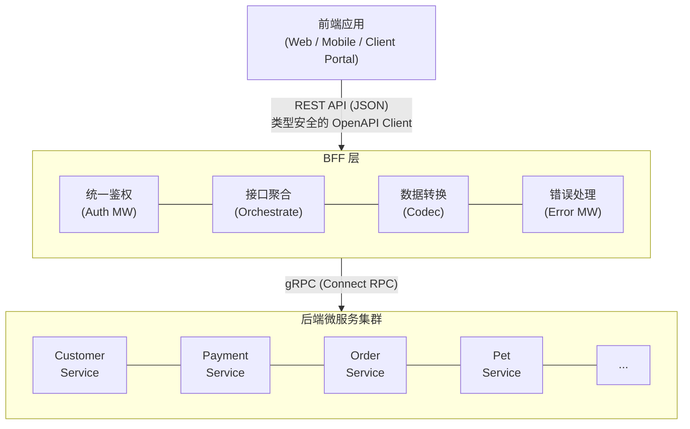

### 1.3 技术选型

| 技术领域 | 选型 | 说明 |
|---------|------|------|
| 运行时 | Node.js 23+ | 支持最新 ES 特性 |
| Web 框架 | Hono | 轻量、高性能、TypeScript 友好 |
| 类型系统 | TypeScript 5.7+ | 严格类型检查 |
| Schema 验证 | Zod + @hono/zod-openapi | 运行时验证 + OpenAPI 生成 |
| API 协议 | OpenAPI 3.1 | 标准化 API 描述 |
| 后端通信 | Connect RPC (@connectrpc/connect) | gRPC-Web 兼容 |
| 客户端生成 | @zodios/core + openapi-zod-client | 类型安全的 API Client |
| 链路追踪 | dd-trace | Datadog APM |
| Feature Flag | Growthbook | 功能开关控制 |

---

## 2. 代码组织结构

### 2.1 目录结构

```
moego-bff/
├── server/                      # 服务端核心代码
│   ├── bootstrap.ts             # 应用启动入口
│   ├── cluster.ts               # 多进程调度管理
│   ├── routes/                  # 路由实现（按领域组织）
│   │   ├── customer/            # 客户领域
│   │   ├── payment/             # 支付领域
│   │   ├── order/               # 订单领域
│   │   └── ...
│   ├── middleware/              # 中间件
│   ├── services/                # 服务封装（业务逻辑封装）
│   ├── utils/                   # 工具函数（纯函数工具）
│   ├── common/                  # 公共定义（错误类等）
│   └── types/                   # TypeScript 类型定义
│
├── packages/                    # NPM 包产物
│   ├── schemas/                 # Zod Schema 定义
│   │   └── src/
│   │       ├── generated/       # 从 Proto 自动生成的 Schema
│   │       ├── shared/          # 共享的基础 Schema (zId, zDate 等)
│   │       ├── built-in/        # 内置通用 Schema
│   │       ├── customer/        # 按领域文件夹组织（可选）
│   │       │   ├── request.schema.ts
│   │       │   └── response.schema.ts
│   │       └── *.schema.ts      # 按领域组织的 Schema
│   │
│   └── openapi/                 # 生成的 OpenAPI Client
│       ├── clients/             # 各领域的 Client 实现
│       ├── docs/                # OpenAPI YAML 文件
│       └── client-utils.ts      # Client 工具函数
│
├── scripts/                     # 构建和工具脚本
│   ├── sync-models-to-zod.ts    # Proto -> Zod Schema 生成
│   └── openapi/                 # OpenAPI 生成相关
│
└── ci/                          # CI/CD 脚本
```

### 2.2 services/ vs utils/ 的区别

**重要区别**:

| 特性 | `services/` | `utils/` |
|------|-------------|----------|
| 定位 | 业务逻辑封装 | 纯工具函数 |
| 状态 | 可能有状态/依赖 | 无状态、无副作用 |
| 用途 | 封装复杂的业务流程 | 通用的数据处理 |
| 示例 | 发送邮件、权限校验、领域服务 | 日期格式化、ID 解析、字符串处理 |

**建议**: 如果代码涉及业务逻辑封装、与外部服务交互，应放在 `services/` 目录；如果是纯粹的工具方法，放在 `utils/` 目录。

---

## 3. Schema 体系

Schema 体系是 BFF 的核心设计，它实现了**类型定义一次编写，Server/Client 共享使用**的目标。

### 3.1 设计哲学：同构思想

**Single Source of Truth**: Schema 定义一次，多处复用。

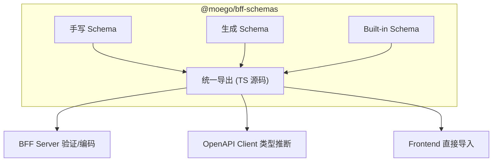

**核心特点**:

- **同构运行**: `@moego/bff-schemas` 直接发布 TypeScript 源码，前端可直接导入
- **端到端类型安全**: Schema 不仅提供类型，还提供运行时验证
- **OpenAPI 驱动**: Schema 自动生成 OpenAPI 规范和类型安全 Client
- **前端复用**: 同一套 Schema 可用于前端表单校验、错误提示等场景

### 3.2 Proto -> Zod 自动生成

#### 3.2.1 设计动机

后端的 Proto 定义已经完整描述了数据结构，如果在 BFF 层手动翻译这些定义，会存在以下问题：

- **重复劳动**：后端已经定义好的数据结构需要在 BFF 层重新手写一遍
- **同步困难**：当后端 Proto 更新时，BFF 侧的 Schema 需要手动同步，容易遗漏
- **容易出错**：手动翻译过程中可能引入类型不一致的问题

通过自动生成机制，可以**直接将 Proto 定义转换为 BFF 协议的 Schema**，实现：

- ✅ 一次定义，自动同步：后端更新 Proto 后，运行命令即可自动更新 Schema
- ✅ 类型保证：自动生成确保类型与后端 Proto 完全一致
- ✅ 减少人工成本：无需手动翻译，降低维护负担

#### 3.2.2 生成流程

通过 `pnpm generate:zod` 命令，从后端 Proto 定义自动生成 Zod Schema。

```
@moego/api-node-v2/*_pb.ts  --pnpm generate:zod-->  packages/schemas/generated/*_schema.ts
```

**AST 转换优化**:

1. 将 `import { z } from 'zod'` 替换为 `@hono/zod-openapi`
2. 将 `z.bigint()` 替换为 `zId`（支持 encode/decode）
3. 将 `z.date()` 替换为 `zDate`
4. 为 `z.nativeEnum()` 添加 OpenAPI 元信息
5. 自动添加 `.openapi('SchemaName')` 注册
6. 处理循环引用类型（使用 `z.lazy()` + `.unwrap()`）

#### 3.2.3 循环引用处理：z.lazy 的必要性

**为什么需要 z.lazy？**

在 Proto 定义中，经常存在循环引用的数据结构。例如：

```protobuf
message ServiceInstanceImpl {
  int64 service_instance_id = 1;
  string name = 2;
  repeated ServiceInstanceImpl addons = 9;  // 循环引用自身
}
```

这种递归类型在 TypeScript 中可以直接定义，但在 Zod 中会遇到问题：

```typescript
// ❌ 错误：Cannot access 'zServiceInstanceImpl' before initialization
export const zServiceInstanceImpl = z.object({
  serviceInstanceId: zId,
  name: z.string(),
  addons: z.array(zServiceInstanceImpl),  // 自引用，此时 zServiceInstanceImpl 还未定义完成
});
```

**Zod 的传统方案：z.lazy() 及其类型困境**

Zod 提供了 `z.lazy()` 来延迟 Schema 的求值，从而支持循环引用：

```typescript
export const zServiceInstanceImpl = z.lazy(() =>
  z.object({
    serviceInstanceId: zId,
    name: z.string(),
    addons: z.array(zServiceInstanceImpl),  // ✅ 在 lazy 函数内部，可以引用外部变量
  })
);
```

**但这种方案存在严重的类型不便利性问题**：

1. **必须显式声明类型**
   ```typescript
   // ❌ 无法使用类型推断，必须手写类型
   export const zServiceInstanceImpl: z.ZodSchema<ServiceInstanceImpl> = z.lazy(() =>
     z.object({ /* ... */ })
   ) as unknown as z.ZodSchema<ServiceInstanceImpl>;
   ```

2. **必须进行类型断言**
   - 需要 `as unknown as z.ZodSchema<T>` 双重断言
   - 破坏类型安全，失去编译时检查
   - 类型声明与实际 schema 可能不一致

3. **类型推断完全失效**
   ```typescript
   // ❌ z.infer 无法正确推断类型
   type InferredType = z.infer<typeof zServiceInstanceImpl>;
   // InferredType 变成 any，而不是 { serviceInstanceId: bigint, name: string, addons: ... }
   ```

4. **扩展 Schema 非常困难**
   ```typescript
   // ❌ 旧方案：必须手写 interface + 多次类型断言
   export interface ServiceInstanceImplExtended
     extends Omit<ServiceInstanceImpl, 'addons'> {
     addons: ServiceInstanceImplExtended[];
     extraField: string;
   }
   
   export const zServiceInstanceImplExtended: z.ZodSchema<ServiceInstanceImplExtended> = z.lazy(() =>
     (zServiceInstanceImpl as unknown as ZodLazy<ZodObject>)
       .unwrap()  // 需要先 unwrap
       .extend({
         extraField: z.string(),
         addons: z.array(zServiceInstanceImplExtended),  // 又要 lazy
       })
   ) as unknown as z.ZodSchema<ServiceInstanceImplExtended>;  // 再次断言
   ```

5. **IDE 智能提示差**
   - 字段无法自动补全
   - 无法跳转到字段定义
   - 类型提示显示为 `any`

6. **代码冗余**
   - 返回的是 `ZodLazy` 类型，使用时需要 `.unwrap()`
   - 有额外的 lazy 包装层
   - Schema 和 Type 定义分离，需要维护两份

**简而言之**：使用 `z.lazy()` 后，Zod 引以为傲的**类型推断能力完全失效**，退化成了手写 TypeScript interface 的时代，失去了 Schema-First 的优势

**我们的最优方案：getter 延迟求值（Zod 4 新特性）**

经过迭代，我们发现 `z.lazy()` 其实不是必需的！**Zod 4 开始支持在 `z.object()` 中使用 getter**，结合 JavaScript 的 getter 延迟求值特性，我们采用了最简洁的方案：

```typescript
// ✅ 最终方案：只用 getter，不需要 z.lazy
export const zServiceInstanceImpl = z.object({
  serviceInstanceId: zId.openapi({ description: '服务实例ID' }),
  name: z.string(),
  // 循环引用字段使用 getter - 延迟到访问时才求值
  get addons() { 
    return z.array(zServiceInstanceImpl).openapi({ description: '子服务实例列表' }); 
  },
}).openapi("ServiceInstanceImpl");
```

**方案优势**（对比旧方案）:

| 对比维度 | 旧方案 (z.lazy) | 新方案 (getter) |
|---------|----------------|----------------|
| **类型推断** | ❌ 完全失效，`z.infer` 返回 `any` | ✅ 完美推断，自动生成类型 |
| **类型声明** | ❌ 必须手写 `: z.ZodSchema<T>` | ✅ 无需声明，自动推断 |
| **类型断言** | ❌ 必须 `as unknown as z.ZodSchema<T>` | ✅ 无需任何断言 |
| **Schema 扩展** | ❌ 需要 `.unwrap()` + 手写 interface | ✅ 直接 `.extend()`，简单直接 |
| **IDE 支持** | ❌ 无自动补全，类型提示为 `any` | ✅ 完整的智能提示和跳转 |
| **代码简洁性** | ❌ 多层包装：`z.lazy(() => ...)` | ✅ 直接 `z.object()`，只在需要时用 getter |
| **维护性** | ❌ Schema 和 Type 分离维护 | ✅ 单一真实来源 (Schema-First) |
| **技术依赖** | Zod 1.x+ (传统方案) | Zod 4+ (原生 getter 支持) |

**核心优势总结**：

1. **类型推断完美恢复**: `z.infer<typeof zSchema>` 能正确推断所有字段类型
2. **无需任何类型断言**: 代码更安全，编译器能捕获错误
3. **IDE 智能提示完整**: 字段自动补全、类型提示、跳转定义全部正常工作
4. **Schema 扩展简单**: 直接使用 `.extend()`，无需 unwrap 或手写 interface
5. **延迟求值**: getter 在访问时才求值，打破循环依赖
6. **自动生成**: 脚本自动识别循环引用并生成 getter 形式

**方案演化历程**:

| 方案 | 代码形式 | 类型问题 |
|------|---------|---------|
| 初版 | `z.lazy(() => z.object({...}))` | ❌ 必须手写 `z.ZodSchema<T>` + `as unknown as` 断言<br/>❌ `z.infer` 失效，返回 `any`<br/>❌ 扩展困难，需要手写 interface |
| 改进版 | `z.lazy(() => z.object({...})).unwrap().openapi()` + getter | ❌ 仍需 `.unwrap()`<br/>❌ 代码冗余，有 lazy 包装层 |
| **最终版** | `z.object({...})` + getter | ✅ 类型完美推断，无需任何断言<br/>✅ IDE 智能提示完整<br/>✅ 扩展简单，直接 `.extend()` |

**生成流程**:

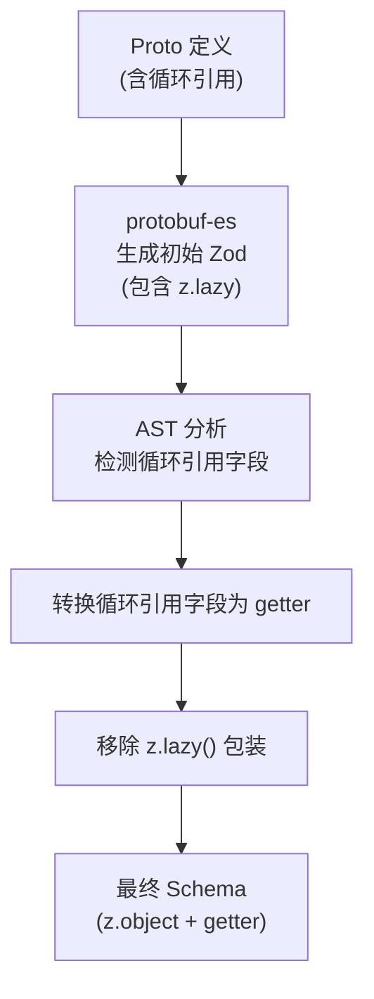

**实现细节**:

我们使用 **ast-grep** 进行结构化代码转换，分两个阶段处理循环引用：

#### 阶段一：检测并转换循环引用字段为 getter

```typescript
// scripts/sync-models-to-zod.ts - convertCircularFieldsToGetters()

// 步骤 1: 收集所有使用 z.lazy 的 schema 名称
const lazySchemaNames = new Set<string>();
root.findAll({ rule: { pattern: 'z.lazy($FUNC)' } }).forEach(node => {
  // 提取 schema 名称，如 zServiceInstanceImpl, zFieldRules 等
  lazySchemaNames.add(schemaName);
});

// 步骤 2: 对于每个 lazy schema，检查其字段
lazyNodes.forEach(node => {
  const schemaName = extractSchemaName(node);  // 如 zServiceInstanceImpl
  const fields = extractFieldsFromLazy(node);
  
  fields.forEach(field => {
    // 步骤 3: 检查字段是否引用了任何 lazy schema
    let hasCircularRef = false;
    for (const lazyName of lazySchemaNames) {
      if (containsSelfReference(field.value, lazyName)) {
        hasCircularRef = true;
        break;
      }
    }
    
    // 步骤 4: 如果有循环引用，转换为 getter
    if (hasCircularRef) {
      replaceField(field, `
        get ${fieldName}() { 
          return ${originalValue}.openapi({ description: '...' }); 
        }
      `);
    }
  });
});
```

**关键函数 - containsSelfReference**:

```typescript
function containsSelfReference(node: SgNode, schemaName: string): boolean {
  // 使用 ast-grep 查找所有 identifier 节点
  const identifiers = node.findAll({
    rule: {
      kind: 'identifier',
      pattern: schemaName,  // 如 zServiceInstanceImpl
    },
  });
  return identifiers.length > 0;
}
```

这个函数能够深度遍历 AST，找到所有对指定 schema 的引用，无论嵌套多深。

#### 阶段二：移除 z.lazy() 包装

```typescript
// scripts/sync-models-to-zod.ts - removeLazyWrapper()

root.findAll({ rule: { pattern: 'z.lazy($FUNC)' } }).forEach(node => {
  const func = node.getMatch('FUNC');
  
  // 检查这个 lazy 函数内部是否有 getter
  const hasGetter = func.text().includes('get ');
  
  if (hasGetter) {
    // 提取 z.object() 部分
    const objectNode = func.find({ pattern: 'z.object($FIELDS)' });
    
    // 移除 z.lazy 包装，直接使用 z.object
    // Before: z.lazy(() => z.object({ ... }))
    // After:  z.object({ ... }).openapi("SchemaName")
    node.replace(objectNode.text() + '.openapi("SchemaName")');
  }
});
```

#### 处理相互引用的关键逻辑

```typescript
// 示例：zFieldRules ↔ zRepeatedRules 相互引用

// 第一步收集所有 lazy schema：
lazySchemaNames = Set(['zFieldRules', 'zRepeatedRules', 'zMapRules'])

// 第二步处理 zFieldRules 的字段：
- repeated 字段的值包含 zRepeatedRules → 转换为 getter
- items 字段的值包含 zFieldRules → 不转换（已是 getter 或不需要）

// 第二步处理 zRepeatedRules 的字段：
- items 字段的值包含 zFieldRules → 转换为 getter

// 结果：
zFieldRules.repeated → getter (引用 zRepeatedRules)
zRepeatedRules.items → getter (引用 zFieldRules)
```

#### 为什么要分两个阶段？

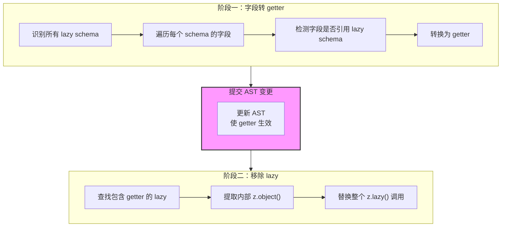

**分阶段的原因**：

1. **避免覆盖**：如果在同一次遍历中既修改字段又替换整个 lazy 表达式，字段的修改会被覆盖
2. **保证一致性**：第一阶段的 getter 转换需要先提交到 AST，第二阶段才能看到完整的带 getter 的对象
3. **调试友好**：分阶段处理使得每一步的转换结果都清晰可见

#### 完整的代码转换示例

**输入（protobuf-es 生成）**:

```typescript
export const zServiceInstanceImpl = z.lazy(() =>
  z.object({
    serviceInstanceId: zId,
    name: z.string(),
    addons: z.array(zServiceInstanceImpl),  // 循环引用
  })
) as unknown as z.ZodSchema<ServiceInstanceImpl>;
```

**阶段一后（字段转 getter）**:

```typescript
export const zServiceInstanceImpl = z.lazy(() =>
  z.object({
    serviceInstanceId: zId,
    name: z.string(),
    get addons() {  // ✅ 已转为 getter
      return z.array(zServiceInstanceImpl).openapi({ description: '子服务实例列表' });
    },
  })
);  // ✅ 类型断言已移除
```

**阶段二后（移除 lazy）**:

```typescript
export const zServiceInstanceImpl = z.object({  // ✅ 去掉 z.lazy
  serviceInstanceId: zId,
  name: z.string(),
  get addons() {
    return z.array(zServiceInstanceImpl).openapi({ description: '子服务实例列表' });
  },
}).openapi("ServiceInstanceImpl");  // ✅ 添加 openapi 注册
```

**最终结果**：代码更简洁，类型推断完美，无需任何手动类型断言。

#### 关键技术点总结

| 技术 | 作用 |
|------|------|
| **ast-grep** | 结构化代码搜索和转换，避免正则表达式的脆弱性 |
| **两阶段处理** | 确保 getter 转换不被后续的整体替换覆盖 |
| **Set 收集** | 一次性收集所有 lazy schema，支持相互引用检测 |
| **深度遍历** | containsSelfReference 能找到任意嵌套深度的引用 |
| **getter 延迟求值** | 基于 Zod 4 对 getter 的支持 + JavaScript 延迟求值特性，无需 z.lazy 也能打破循环 |

这种方案既解决了自引用（A → A）也解决了相互引用（A ↔ B），同时保持了代码的最大简洁性和类型安全。

#### 3.2.4 手写扩展循环引用 Schema 的最佳实践

当需要在 Proto 生成的循环引用 Schema 基础上扩展字段时，直接扩展即可，使用 getter 处理循环引用字段：

```typescript
// packages/schemas/src/appointment.schema.ts

// Proto 生成的基础 Schema (已经是 z.object + getter 形式)
import { zServiceInstanceImpl as zServiceInstanceImplBase } from './generated/.../appointment_schema';

// 额外的服务信息字段
const zServiceExtendedFields = z.object({
  serviceName: z.string(),
  careTypeName: z.string(),
  // ... 更多扩展字段
});

/**
 * 扩展的 ServiceInstanceImpl Schema
 * 
 * 在 Proto 生成的 zServiceInstanceImpl 基础上：
 * 1. 添加额外的服务信息字段（serviceName, careTypeName 等）
 * 2. 确保 addons 字段也使用扩展类型（所有层级的服务实例都包含扩展字段）
 * 3. 新增 splitLodgingDetails 和 isSlotFreeService 字段
 * 
 * 关键实现：
 * - zServiceInstanceImplBase 是普通的 z.object()，可直接扩展
 * - 使用 getter 延迟求值 addons 字段，打破循环依赖
 * - 无需任何手动类型定义或类型断言
 */
export const zServiceInstanceImplExtended = zServiceInstanceImplBase
  .extend(zServiceExtendedFields.shape)
  .extend({
    // ✅ 使用 getter 处理循环引用字段
    get addons() {
      return z.array(zServiceInstanceImplExtended).openapi({ description: '子服务实例列表' });
    },
    // 其他扩展字段正常定义
    splitLodgingDetails: z.array(zSplitLodgingDef).optional().openapi({ description: 'boarding split lodging details' }),
    isSlotFreeService: z.boolean().optional().openapi({ description: 'is slot free service' }),
  })
  .openapi('ServiceInstanceImplExtended');
```

**为什么不需要 z.lazy？**

- ✅ `zServiceInstanceImplBase` 是普通的 `z.object()`，其循环引用已通过 getter 解决
- ✅ 直接扩展它时，只需在**新增的循环引用字段**使用 getter
- ✅ 类型推断完全自动，无需手动定义 interface 或使用 `as unknown as` 类型断言
- ✅ getter 延迟求值，自然打破循环依赖

**对比方案演化**（强调类型改进）:

```typescript
// ❌ 初版：手动定义类型 + 多重类型断言
// 问题：
// 1. 必须手写 interface 定义
// 2. Schema 和 Type 分离，容易不一致
// 3. 多处类型断言：as unknown as ZodLazy + as unknown as z.ZodType
// 4. z.infer 完全失效
export interface ServiceInstanceImplExtended
  extends Omit<ServiceInstanceImplBase, 'addons'>,
    ServiceExtendedFields {
  addons: ServiceInstanceImplExtended[];
}

export const zServiceInstanceImplExtended: z.ZodType<ServiceInstanceImplExtended> = z.lazy(() =>
  (zServiceInstanceImplBase as unknown as ZodLazy<ZodObject>).unwrap()
    .extend(zServiceExtendedFields.shape)
    .extend({ addons: z.array(zServiceInstanceImplExtended) })
).openapi('...') as unknown as z.ZodType<ServiceInstanceImplExtended>;

// ❌ 改进版：去掉 interface，但仍需 unwrap
// 问题：
// 1. 仍需 .unwrap() 调用
// 2. 代码冗余
export const zServiceInstanceImplExtended = zServiceInstanceImplBase.unwrap()
  .extend(...)
  .extend({
    get addons() { return z.array(zServiceInstanceImplExtended); },
  })
  .openapi('ServiceInstanceImplExtended');

// ✅ 最终版：最简洁，无类型断言，无 lazy/unwrap
// 优势：
// 1. ✅ 无需手写任何 interface 或类型声明
// 2. ✅ 无需任何类型断言
// 3. ✅ z.infer 完美工作：type T = z.infer<typeof zServiceInstanceImplExtended>
// 4. ✅ IDE 完整的智能提示
// 5. ✅ Schema-First，单一真实来源
export const zServiceInstanceImplExtended = zServiceInstanceImplBase
  .extend(zServiceExtendedFields.shape)
  .extend({
    get addons() { 
      return z.array(zServiceInstanceImplExtended).openapi({ description: '子服务实例列表' }); 
    },
  })
  .openapi('ServiceInstanceImplExtended');

// ✨ 类型推断示例
type ExtendedType = z.infer<typeof zServiceInstanceImplExtended>;
// ExtendedType 自动推断为：
// {
//   serviceInstanceId: bigint;
//   name: string;
//   addons: ExtendedType[];  // ✅ 正确的递归类型
//   splitLodgingDetails?: ...;
//   isSlotFreeService?: boolean;
//   // ... 其他所有字段
// }
```

**适用场景**:

| 场景 | 方案 |
|------|------|
| Proto 生成的 Schema | 脚本自动生成 `z.object()` + getter |
| 扩展 Proto Schema | 直接 `.extend()`，循环引用字段用 getter |
| 完全手写的循环引用 Schema | 使用 `z.object()` + getter |

**类型系统对比总结**:

| 能力 | z.lazy 方案 | getter 方案 |
|-----|------------|------------|
| 定义 Schema | `const z: z.ZodSchema<T> = z.lazy(...)` | `const z = z.object(...)` |
| 类型推断 | `z.infer<typeof z>` → `any` ❌ | `z.infer<typeof z>` → 完整类型 ✅ |
| 类型断言 | 必须 `as unknown as z.ZodSchema<T>` ❌ | 无需任何断言 ✅ |
| 手写 Interface | 必须手写 `interface T` ❌ | 完全不需要 ✅ |
| Schema 扩展 | `z.unwrap().extend(...)` + 手写类型 ❌ | `z.extend(...)` 自动推断 ✅ |
| IDE 智能提示 | 显示 `any`，无补全 ❌ | 完整提示和补全 ✅ |
| 类型安全 | 编译器无法检查不一致 ❌ | 编译器完整检查 ✅ |
| 维护成本 | Schema 和 Type 两处维护 ❌ | Schema-First，单一来源 ✅ |

**核心原则**: 只要记住一点——**循环引用字段用 getter**，就能优雅地解决所有循环引用问题，无需 `z.lazy()` 或 `.unwrap()`，**更重要的是保持 Zod 的类型推断能力**。

### 3.3 Codec 机制：BFF 边界数据转换

**核心概念**: BFF 作为前后端的边界层，需要处理两端数据格式的差异。Zod Codec 提供了优雅的双向转换能力——**数据穿过 BFF 边界时可以丝滑地转换到所需格式**。

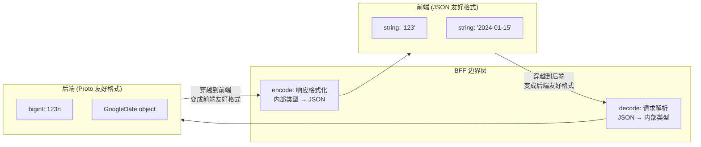

**Codec 的本质**:

- **decode**: 外部输入 (JSON) → 内部类型 (用于请求解析)，数据穿越到后端变成**后端友好格式**
- **encode**: 内部类型 → 外部输出 (JSON) (用于响应格式化)，数据穿越到前端变成**前端友好格式**

> ⚠️ **Codec 生效的前提**:
> - **decode 自动生效**: 当使用 `c.req.valid('json')` / `c.req.valid('query')` 时，Zod 会自动调用 decode 转换
> - **encode 需要手动调用**: 返回响应时，必须手动调用 `Schema.encode(data)` 进行转换，框架不会自动 encode

#### 3.3.1 内置 Codec 示例

**zId - BigInt 与 String 转换**:

```typescript
// packages/schemas/src/shared/id.ts
// 问题: JSON 不支持 BigInt，gRPC 使用 int64/bigint
export const zId = z.codec(
  z.coerce.string().regex(/^-?\d+$/),  // 外部: JSON string（前端友好）
  z.bigint(),                          // 内部: JS bigint（后端友好）
  {
    encode: (value) => value.toString(),  // bigint -> "123"（返回给前端）
    decode: (value) => BigInt(value),     // "123" -> 123n（传给后端）
  }
);
```

**zDate - 日期格式转换**:

```typescript
// packages/schemas/src/shared/date.ts
// 问题: 前端使用 ISO 字符串，后端使用 Google Date 对象
const DateString = z.string().regex(/^\d{4}-\d{1,2}-\d{1,2}$/);
const GoogleDate = z.object({
  year: z.number(),
  month: z.number().min(1).max(12),
  day: z.number().min(1).max(31),
});

export const zDate = z.codec(DateString, GoogleDate, {
  encode: (value) => `${value.year}-${value.month}-${value.day}`,  // 返回给前端
  decode: (value) => {
    const [year, month, day] = value.split('-').map(Number);
    return { year, month, day };  // 传给后端
  },
}).openapi('MoeDate');
```

#### 3.3.2 手写 Codec 示例：时间戳转换

```typescript
// packages/schemas/src/shared/timestamp.ts
import { z } from '@hono/zod-openapi';

// 后端 Protobuf Timestamp
const ProtoTimestamp = z.object({
  seconds: z.bigint(),
  nanos: z.number(),
});

// 前端 ISO 字符串
const ISOString = z.string().datetime();

export const zTimestamp = z.codec(ISOString, ProtoTimestamp, {
  encode: (ts) => {
    const ms = Number(ts.seconds) * 1000 + Math.floor(ts.nanos / 1000000);
    return new Date(ms).toISOString();
  },
  decode: (iso) => {
    const date = new Date(iso);
    const ms = date.getTime();
    return {
      seconds: BigInt(Math.floor(ms / 1000)),
      nanos: (ms % 1000) * 1000000,
    };
  },
}).openapi('Timestamp');
```

#### 3.3.3 反例：不应该转换的类型 (Money)

> ⚠️ **警告**: 金额类型 (Money) 是典型的**不应该**使用 Codec 转换的例子，因为转换会导致精度丢失。

```typescript
// ❌ 错误示例：Money 转换会丢失精度，不要这样做！
const zMoneyBad = z.codec(
  z.number(),  // 前端用 cents: 1999
  MoneyObject, // 后端用 { units: 19n, nanos: 990000000 }
  {
    encode: (money) => Number(money.units) * 100 + Math.round(money.nanos / 10000000),
    // ⚠️ 精度丢失! nanos 的精度是 10^-9，转换为分会丢失
    decode: (cents) => ({
      units: BigInt(Math.floor(cents / 100)),
      nanos: (cents % 100) * 10000000,
      // ⚠️ 无法还原原始的 nanos 精度
    }),
  }
);

// ✅ 正确做法：保持 Money 对象原样，只转换其中的 bigint 字段
export const MoneySchema = z.object({
  currencyCode: z.string(),
  units: zId,  // 只转换 bigint -> string
  nanos: z.number(),
}).openapi('Money');
```

**原则**: Codec 应该用于**无损转换**的场景，如 bigint ↔ string、Date ↔ string。对于有精度要求的类型，应保持原始结构。

#### 3.3.4 Route 的返回值与 Codec 编码

**重要**: Route 定义中的响应 Schema 对应的是**外部类型（Input）**，即前端看到的 JSON 格式。当你的数据包含 Codec Schema（如 `zId`、`zDate`）时，返回值需要是内部类型，因此**必须调用 encode** 进行转换。

**建议**: 所有返回都加上对应 Schema 的 encode，这样能够保障输出符合协议。

**decode - 自动生效**:

```typescript
app.openapi(route, async (c) => {
  // ✅ c.req.valid() 会自动调用 decode
  // 前端传入 { customerId: "123" }，这里拿到的是 { customerId: 123n }
  const { customerId } = c.req.valid('json');
  // customerId 的类型是 bigint，已经被 zId 的 decode 自动转换
});
```

**encode - 需要手动调用**:

```typescript
// server/routes/pet/getVaccineRecord.ts
app.openapi(route, async (c) => {
  // 从后端服务获取数据 (内部类型: bigint, GoogleDate 等)
  const vaccineRecord = await c.callService(
    BusinessPetVaccineRecordServiceClient,
    'getPetVaccineRecord',
    { id: params.vaccineRecordId },
  );

  // ⚠️ 必须手动调用 Schema.encode() 将内部类型转换为 JSON 格式
  // 框架不会自动 encode！
  return c.json(
    GetVaccineRecordResponseSchema.encode({
      ...vaccineRecord,
      // id: 123n           -> "123"
      // expiryDate: {...}  -> "2024-12-31"
      vaccineName,
    }),
    HTTP_CODE.SUCCESS,  // ⚠️ 必须传第二个参数！
  );
});
```

> **重要**: 
> 1. **encode 不会自动调用**，必须根据返回的数据结构，使用对应的 Schema 调用 `.encode()`
> 2. `c.json(result, HTTP_CODE.SUCCESS)` 必须传入第二个参数（HTTP 状态码），确保类型正确映射
> 3. **建议所有响应都使用 encode**，即使当前 Schema 不包含 Codec，这样可以保证输出一定符合协议

**不同响应使用不同 Schema encode**:

```typescript
app.openapi(route, async (c) => {
  const { type } = c.req.valid('query');
  
  if (type === 'simple') {
    // 简单响应使用 SimpleResponseSchema
    return c.json(SimpleResponseSchema.encode(simpleData), HTTP_CODE.SUCCESS);
  }
  
  // 详细响应使用 DetailResponseSchema
  return c.json(DetailResponseSchema.encode(detailData), HTTP_CODE.SUCCESS);
});
```

#### 3.3.5 Schema 的 parse/encode 行为详解

Schema 在解析和编码数据时有特定的行为规则，理解这些行为对于正确使用 Schema 至关重要。

**核心行为**:

| 方法 | 用途 | 数据校验 | Codec 转换 | 默认 Strip |
|------|------|----------|-----------|-----------|
| `.parse(data)` | 解析输入数据 | ✅ 严格校验 | ✅ decode | ✅ 移除多余字段 |
| `.safeParse(data)` | 安全解析（不抛异常） | ✅ 严格校验 | ✅ decode | ✅ 移除多余字段 |
| `.encode(data)` | 编码输出数据 | ✅ 严格校验 | ✅ encode | ✅ 移除多余字段 |

**1. 数据校验**

parse/encode 都会**严格检查数据是否符合 Schema 定义**。如果数据不符合协议，会抛出 `ZodError`：

```typescript
const UserSchema = z.object({
  name: z.string(),
  age: z.number().min(0),
}).openapi('User');

// ✅ 正常通过
UserSchema.parse({ name: 'Alice', age: 25 });

// ❌ 抛出 ZodError: age 不能为负数
UserSchema.parse({ name: 'Alice', age: -1 });

// ❌ 抛出 ZodError: name 应为 string
UserSchema.parse({ name: 123, age: 25 });
```

**2. 默认 Strip 行为：自动过滤多余字段**

Zod Schema 默认会**自动移除未在 Schema 中定义的字段**。这是一个非常有用的特性，可以确保输出数据严格符合协议定义。

```typescript
const CustomerResponseSchema = z.object({
  id: zId,
  name: z.string(),
  email: z.string(),
}).openapi('CustomerResponse');

// 后端返回了很多字段，但协议只需要 id、name、email
const backendData = {
  id: 123n,
  name: 'Alice',
  email: 'alice@example.com',
  // 以下字段不在协议中定义
  internalFlag: true,
  sensitiveData: 'secret',
  debugInfo: { ... },
};

// 使用 encode 时，多余字段会被自动过滤掉
const response = CustomerResponseSchema.encode(backendData);
// 结果: { id: "123", name: "Alice", email: "alice@example.com" }
// ✅ internalFlag、sensitiveData、debugInfo 被自动移除
```

**Strip 行为的实际应用场景**:

```typescript
app.openapi(route, async (c) => {
  // 从后端获取完整数据（可能包含敏感字段）
  const fullCustomerData = await c.callService(
    CustomerServiceClient,
    'getCustomer',
    { id: customerId },
  );
  // fullCustomerData 可能包含: id, name, email, passwordHash, internalNotes, ...

  // 通过 encode，只返回协议定义的字段
  // 自动过滤掉 passwordHash、internalNotes 等敏感/多余字段
  return c.json(
    CustomerResponseSchema.encode(fullCustomerData),
    HTTP_CODE.SUCCESS,
  );
});
```

**3. 使用 .strict() 禁止多余字段**

如果希望在存在多余字段时**直接报错**而非静默过滤，可以使用 `.strict()`：

```typescript
const StrictSchema = z.object({
  name: z.string(),
}).strict().openapi('StrictSchema');

// ❌ 抛出 ZodError: 存在未知字段 'extra'
StrictSchema.parse({ name: 'Alice', extra: 'field' });
```

**建议**: 一般情况下使用默认的 strip 行为即可，无需特别配置 `.strict()`。默认行为既能保证数据符合协议，又具有良好的前向兼容性。

#### 3.3.6 为什么不推荐 Transform

| 特性 | Codec | Transform |
|------|-------|-----------|
| 方向 | 双向 (encode + decode) | 单向 (仅 decode) |
| 响应格式化 | 支持 `.encode()` | **不支持** |
| OpenAPI 导出 | 导出外部类型（无 transform） | 导出 transform 后的类型 |
| 前端使用 | ✅ 前端传入原始类型 | ❌ 前端需要传入 transform 后的类型 |
| 推荐程度 | ✅ 推荐 | ❌ 不推荐 |

**不推荐使用 Transform 的原因**: 

1. Transform 无法使用 `encode()`，无法在响应时进行数据转换
2. **Schema strip 问题**: 导出给前端的 Schema 需要 strip 掉 post process 部分（如 transform），否则前端使用 transform 后的值传给 BFF 会导致校验失败。例如 `z.string().transform(v => parseInt(v))` 导出给前端应该只是 `z.string()`，但 transform 后类型变成了 number，前端传 number 给 BFF 就无法通过校验

**建议所有需要双向转换的场景都使用 Codec**。

**默认值的正确处理方式**:

```typescript
// ❌ 不推荐：使用 transform 处理默认值
export const CreateContactRequest = z.object({
  email: z.string().optional().transform(val => val || ''),
  tags: z.array(zId).optional().transform(val => val || []),
});

// ✅ 推荐：使用 .default() 方法
export const CreateContactRequest = z.object({
  email: z.string().default(''),
  tags: z.array(zId).default([]),
}).openapi('CreateContactRequest');
```

### 3.4 Built-in Schema

预定义的常用 Schema，位于 `packages/schemas/src/built-in/` 和 `shared/`:

| Schema | 位置 | 用途 |
|--------|------|------|
| `zId` | `shared/id.ts` | BigInt ID，自动 string ↔ bigint 转换 |
| `zDate` | `shared/date.ts` | 日期，string ↔ GoogleDate 转换 |
| `zE164Phone` | `shared/e164Phone.ts` | E.164 格式电话号码 |
| `zPaginationRequest/Response` | `built-in/pagination.ts` | 分页请求/响应 |
| `zJsonObject` | `built-in/json-object.ts` | JSON 对象类型 |
| `zStringList` | `built-in/string-list.ts` | 字符串数组包装 |
| `zResponseError` | `shared/error.ts` | 标准错误响应格式（无 data 字段） |
| `HTTP_CODE` | `shared/code.ts` | HTTP 状态码枚举 |

### 3.5 Schema 定义规范

#### 3.5.1 文件组织

Schema 文件可以按两种方式组织：

```typescript
// 方式一：单文件 (简单领域)
packages/schemas/src/customer.schema.ts

// 方式二：文件夹 (复杂领域，推荐)
packages/schemas/src/customer/
├── request.schema.ts
├── response.schema.ts
└── index.ts  // 统一导出
```

#### 3.5.2 使用 .openapi() 注册 Schema

> **重要**: 如果想要在生成的 OpenAPI 中有对应的具名类型及 Schema，**必须**在定义时加上 `.openapi('SchemaName')`。

```typescript
// packages/schemas/src/customer.schema.ts
import { z } from '@hono/zod-openapi';
import { zId } from './shared/id';

// ✅ 正确：添加 .openapi() 注册
export const GetCustomerRequest = z.object({
  customerId: zId.openapi({ description: '客户 ID' }),
}).strict().openapi('GetCustomerRequest');  // 👈 必须添加

export const CustomerDetailResponse = z.object({
  id: zId,
  name: z.string(),
  email: z.string().email(),
}).openapi('CustomerDetailResponse', {
  description: '客户详情响应',  // 第二个参数传入 OpenAPI 元数据
});

// ❌ 错误：没有 .openapi()，不会生成具名类型
export const BadSchema = z.object({
  id: zId,
});
```

#### 3.5.3 避免 TypeA & {...} 类型问题

当使用 `SchemaA.extend({...})` 时，生成的类型会是 `TypeA & { ... }` 的交叉类型。如果想要生成一个**全新的独立类型**，需要使用 `z.object(SchemaA.shape).extend({...})`:

```typescript
// 原始 Schema
const BaseCustomer = z.object({
  id: zId,
  name: z.string(),
}).openapi('BaseCustomer');

// ❌ 这样会生成 BaseCustomer & { email: string }
const CustomerWithEmailBad = BaseCustomer.extend({
  email: z.string(),
}).openapi('CustomerWithEmail');

// ✅ 这样会生成独立的新类型 CustomerWithEmail
const CustomerWithEmailGood = z.object({
  ...BaseCustomer.shape,  // 拷贝 shape
}).extend({
  email: z.string(),
}).openapi('CustomerWithEmail');
```

#### 3.5.4 Schema 定义位置规范

> **重要**: 所有 Schema 都应该在 `packages/schemas/` 包内定义和派生，Route 文件内**不应该**再定义、派生或修改 Schema。

**原因**：BFF 的核心设计是**同构 Schema**，前端可以从 `@moego/bff-schemas` 包直接导入 Schema 进行复用（如表单校验）。如果在 Route 文件中修改或派生 Schema，虽然生成的 OpenAPI Client 会包含修改后的版本，但从 `@moego/bff-schemas` 导入的 Schema 仍是原始版本，导致**同一个 Schema 在不同引入方式下表现不一致**。

```typescript
// ❌ 错误：在 Route 文件中派生 Schema
// server/routes/customer/createCustomer.ts
import { CreateCustomerRequest } from '@moego/bff-schemas';
const ModifiedRequest = CreateCustomerRequest.extend({
  referralCode: z.string().optional(),  // Route 中新增字段
}).openapi('CreateCustomerRequest');

// 问题：
// - OpenAPI Client 生成的类型包含 referralCode
// - 但前端从 @moego/bff-schemas 导入的 CreateCustomerRequest 没有 referralCode
// - 前端复用 Schema 做表单校验时，行为与实际 API 不一致！

// ✅ 正确：在 schemas 包中定义，Route 直接使用
// packages/schemas/src/customer.schema.ts
export const CreateCustomerRequest = z.object({
  name: z.string().min(1, '客户名称不能为空'),
  email: z.string().email('请输入有效的邮箱'),
  referralCode: z.string().optional(),  // 在源头定义
}).openapi('CreateCustomerRequest');

// server/routes/customer/createCustomer.ts
import { CreateCustomerRequest } from '@moego/bff-schemas';
// 直接使用，不做任何修改
```

**同构一致性保证**：

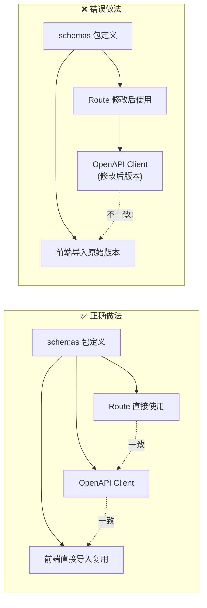

### 3.6 Zod 便捷方法：协议拓展与复用

Zod 自带许多便捷方法，可以方便地拓展或增强已有协议。基于同构 Schema 协议，甚至可以做到**定义一套协议，前端表单校验规则复用，报错消息复用**。

#### 3.6.1 协议拓展

```typescript
// 基础协议
const BaseUserSchema = z.object({
  name: z.string().min(1, '姓名不能为空'),
  email: z.string().email('邮箱格式不正确'),
}).openapi('BaseUser');

// 拓展协议 - 新增字段
const CreateUserSchema = z.object({
  ...BaseUserSchema.shape,
  password: z.string().min(8, '密码至少 8 位'),
}).openapi('CreateUser');

// 拓展协议 - 部分字段可选
const UpdateUserSchema = BaseUserSchema.partial().openapi('UpdateUser');

// 拓展协议 - 选取部分字段
const UserSummarySchema = BaseUserSchema.pick({ name: true }).openapi('UserSummary');

// 拓展协议 - 排除部分字段
const PublicUserSchema = BaseUserSchema.omit({ email: true }).openapi('PublicUser');
```

#### 3.6.2 前端表单校验复用

```typescript
// @moego/bff-schemas 中定义
export const CreateCustomerSchema = z.object({
  name: z.string()
    .min(1, '客户名称不能为空')
    .max(100, '客户名称不能超过 100 个字符'),
  email: z.string()
    .email('请输入有效的邮箱地址'),
  phone: z.string()
    .regex(/^\+?[1-9]\d{1,14}$/, '请输入有效的手机号'),
}).openapi('CreateCustomer');

// 前端直接复用校验规则和错误消息
import { CreateCustomerSchema } from '@moego/bff-schemas/customer.schema';

function CustomerForm() {
  const handleSubmit = (data: unknown) => {
    const result = CreateCustomerSchema.safeParse(data);
    if (!result.success) {
      // 错误消息与 BFF 定义完全一致
      const errors = result.error.flatten().fieldErrors;
      // { name: ['客户名称不能为空'], email: ['请输入有效的邮箱地址'] }
      setFormErrors(errors);
      return;
    }
    // 提交数据
    submitToApi(result.data);
  };
}
```

#### 3.6.3 常用 Zod 方法速查

| 方法 | 用途 | 示例 |
|------|------|------|
| `.extend({})` | 添加新字段 | `Base.extend({ newField: z.string() })` |
| `.partial()` | 所有字段变可选 | `Base.partial()` |
| `.required()` | 所有字段变必填 | `Base.required()` |
| `.pick({})` | 选取部分字段 | `Base.pick({ name: true })` |
| `.omit({})` | 排除部分字段 | `Base.omit({ password: true })` |
| `.merge()` | 合并两个 Schema (不推荐) | 使用 .extend() 代替 |
| `.refine()` | 自定义校验 | `z.string().refine(v => v.length > 0)` |
| `.transform()` | 数据转换（不推荐） | 使用 Codec 代替 |
| `.default()` | 设置默认值 | `z.string().default('')` |
| `.optional()` | 字段可选 | `z.string().optional()` |

#### 3.6.4 派生 Schema 最佳实践：优先使用 pick

当从已有 Schema（特别是从 Proto 生成的 Schema）派生新 Schema 时，**优先使用 `.pick()` 而非 `.omit()`**。

**原因**：使用 `omit` 排除字段时，如果源 Schema 新增了字段，派生的 Schema 会自动包含这些新字段，可能导致意外的协议变更。而 `pick` 明确指定需要的字段，不受源 Schema 变化的影响。

```typescript
// 假设后端 Proto 生成的 Schema
const CustomerFromProto = z.object({
  id: zId,
  name: z.string(),
  email: z.string(),
  phone: z.string(),
}).openapi('CustomerFromProto');

// ❌ 不推荐：使用 omit
// 如果后端 Proto 新增了 internalNotes 字段，这个 Schema 会自动包含它
const CustomerPublicBad = CustomerFromProto.omit({ 
  email: true,  // 只排除 email
}).openapi('CustomerPublic');

// ✅ 推荐：使用 pick
// 明确指定需要的字段，不受源 Schema 变化影响
const CustomerPublicGood = CustomerFromProto.pick({
  id: true,
  name: true,
  phone: true,
}).openapi('CustomerPublic');
```

**场景说明**：

| 方法 | 源 Schema 新增字段时 | 适用场景 |
|------|---------------------|---------|
| `.pick()` | ✅ 派生 Schema 不变 | 需要稳定的 API 协议 |
| `.omit()` | ⚠️ 派生 Schema 自动包含新字段 | 确实需要"排除特定字段，其余全要"的场景 |

**建议**：在 BFF 层派生 Schema 时，默认使用 `pick` 明确指定字段，确保协议稳定性。

### 3.7 createSharedSchema 与客户端复用

使用 `createSharedSchema()` 标记的 Schema 会在生成的客户端中直接导入源 Schema，而非重新生成：

```typescript
// packages/schemas/src/customer.schema.ts
import { createSharedSchema } from './utils/createSharedSchema';

export const CustomerBasicInfo = createSharedSchema(
  'CustomerBasicInfo',
  z.object({ ... }),
);

// 生成的客户端会直接:
// import { CustomerBasicInfo } from '@moego/bff-schemas/customer.schema';
```

### 3.8 createNativeEnum：BFF 层自定义枚举

当需要定义 BFF 层特有的枚举（非来自 proto）时：

```typescript
// packages/schemas/src/appointment.schema.ts
import { createNativeEnum } from './utils/createNativeEnum';

export enum ClientPortalAppointmentTypeEnum {
  UPCOMING = 'UPCOMING',
  PAST = 'PAST',
  CANCELED = 'CANCELED',
}

export const ClientPortalAppointmentType = createNativeEnum(
  'ClientPortalAppointmentType',
  ClientPortalAppointmentTypeEnum,
);

// 前端从 openapi 包导入枚举:
// import { ClientPortalAppointmentTypeEnum } from '@moego/bff-openapi';
```

### 3.9 前端类型导入规范

> **重要**: 所有前端需要使用的类型都会从 `@moego/bff-openapi` 包导出，前端应该从 openapi 包引入类型。

```typescript
// ✅ 正确：从 openapi 包导入
import { 
  CustomerDetailResponse,
  GetCustomerRequest,
  ClientPortalAppointmentTypeEnum,
} from '@moego/bff-openapi';

// ❌ 不推荐：直接从 schemas 包导入（除非需要运行时验证）
import { CustomerDetailResponse } from '@moego/bff-schemas/customer.schema';
```

---

## 4. 路由定义

### 4.1 路由路径规则与 Namespace

BFF 路由路径遵循 `/moego.bff/{realm}/{namespace?}/{method}` 规则：

```
/moego.bff/{realm}/{namespace}/{method}
     │        │        │          │
     │        │        │          └── 方法名 (生成 client.method)
     │        │        └── 可选命名空间 (生成 client.$ns.method)
     │        └── 领域名 (对应一个 client)
     └── BFF 前缀
```

**Namespace 转换规则**:

| 路由 Path | 生成的 Alias | 前端调用方式 |
|-----------|-------------|-------------|
| `/listRefund` | `listRefund` | `client.listRefund()` |
| `/client/payOrder` | `$client.payOrder` | `client.$client.payOrder()` |
| `/ob/getCompanyLeadSetting` | `$ob.getCompanyLeadSetting` | `client.$ob.getCompanyLeadSetting()` |

**Namespace 使用场景**:

Namespace 专门用于区分不同的接入端：

- `$client` - C 端 (Consumer/用户端) 专用接口
- `$ob` - Online Booking 端专用接口

**设计原则**:

- 顶层方法 (`client.xxx()`) 通常是 B 端 (Business/商家端) 接口
- 带 Namespace 的方法 (`client.$client.xxx()`) 是对应接入端的专属接口

### 4.2 Route 创建

使用 `@hono/zod-openapi` 的 `createRoute` 函数定义路由：

```typescript
import { createRoute } from '@hono/zod-openapi';
import { ABCSAuthMiddleware } from '#/middleware/auth-biz.middleware';
import { createJsonRequest, createJsonResponse } from '#/utils/hono-route';
import { HTTP_CODE, zResponseError } from '@moego/bff-schemas';

const createCustomerRoute = createRoute({
  method: 'post',
  path: '/createCustomer',
  middleware: [...ABCSAuthMiddleware],
  request: createJsonRequest(CreateCustomerRequest),
  responses: {
    ...createJsonResponse(HTTP_CODE.SUCCESS, CreateCustomerResponse, '创建客户成功'),
    // ⚠️ 必须定义错误响应
    ...createJsonResponse(HTTP_CODE.BAD_REQUEST, zResponseError, '请求参数错误'),
    ...createJsonResponse(HTTP_CODE.NOT_FOUND, zResponseError, '资源不存在'),
    ...createJsonResponse(HTTP_CODE.INTERNAL_SERVER_ERROR, zResponseError, '服务器错误'),
  },
});

// 实现路由处理
app.openapi(createCustomerRoute, async (c) => {
  const body = c.req.valid('json');
  // ... 业务逻辑
  
  // ⚠️ 必须传第二个参数 HTTP_CODE.SUCCESS，并使用 encode
  return c.json(CreateCustomerResponse.encode(response), HTTP_CODE.SUCCESS);
});
```

> **重要**: 
> 1. 路由定义必须包含错误响应，使用 `zResponseError` 作为错误响应 Schema（该 Schema 没有 data 字段）
> 2. `c.json()` 必须传入第二个参数（HTTP 状态码），确保类型正确映射
> 3. 建议使用 `Schema.encode()` 包装返回值，确保输出符合协议

### 4.3 增强路由创建器

为了简化特定场景的路由创建，BFF 提供了几个增强的路由创建器：

#### 4.3.1 createClientSideRoute - C 端路由

用于创建 C 端（Consumer/用户端）专用路由，自动注入 `ClientInfo2BusinessInfoMiddleware` 中间件和 `CustomerQuerySchema`。

```typescript
// server/utils/create-client-side-route.ts
import { createClientSideRoute } from '#/utils/create-client-side-route';

// 使用方式与标准 createRoute 完全一致
const getCustomerInfoRoute = createClientSideRoute({
  method: 'get',
  path: '/client/getInfo',  // C 端路由通常在 /client/ 命名空间下
  responses: {
    ...createJsonResponse(HTTP_CODE.SUCCESS, CustomerInfoResponse, '获取成功'),
  },
});

// 自动效果：
// 1. 自动添加 ClientInfo2BusinessInfoMiddleware 中间件
// 2. 自动合并 CustomerQuerySchema 到 query 参数
// 3. 可在 handler 中直接使用 c._sessionInfo 获取解析后的客户信息
```

**自动处理**:
- 从 query 参数中提取 `businessId`、`customerId` 等信息
- 自动将 C 端身份信息转换为 BFF 可用的 session 信息

#### 4.3.2 createBrandedAppSideRoute - 品牌 App 路由

用于创建品牌 App 专用路由，自动注入 `BrandedAppAccountAuthMiddleware` 中间件和 `BrandedAppAccountBodySchema`。

```typescript
// server/utils/create-branded-app-side-route.ts
import { createBrandedAppSideRoute } from '#/utils/create-branded-app-side-route';

const brandedAppRoute = createBrandedAppSideRoute({
  method: 'post',
  path: '/branded/getAppConfig',
  request: createJsonRequest(GetAppConfigRequest),  // 可选，会自动合并
  responses: {
    ...createJsonResponse(HTTP_CODE.SUCCESS, AppConfigResponse, '获取成功'),
  },
});

// 自动效果：
// 1. 自动添加 BrandedAppAccountAuthMiddleware 中间件
// 2. 自动合并 BrandedAppAccountBodySchema 到 body 参数
// 3. 可在 handler 中直接使用品牌 App 的身份信息
```

**使用场景**:
- 宠物店的品牌 App（白标应用）
- 需要特殊的品牌身份验证逻辑

### 4.4 辅助函数

位于 `server/utils/hono-route.ts`，简化路由定义：

| 函数 | 用途 |
|------|------|
| `createJsonRequest(schema)` | 创建 JSON 请求体定义 |
| `createQueryRequest(schema)` | 创建 Query 参数定义 |
| `createFormRequest(schema)` | 创建 Form 表单定义 |
| `createJsonResponse(code, schema, description)` | 创建 JSON 响应定义 |
| `createHtmlResponse(code, description)` | 创建 HTML 响应定义 |

### 4.5 路由文件结构

每个领域的路由组织方式：

```
server/routes/payment/
├── index.ts                    # 路由入口，挂载所有子路由
├── listRefundByBusiness.ts     # B 端: 按业务查询退款
├── listRefundByCustomer.ts     # B 端: 按客户查询退款
└── client/                     # C 端命名空间
    ├── payOrder.ts             # C 端: 支付订单
    ├── getPaymentSetting.ts    # C 端: 获取支付设置
    └── ...
```

---

## 5. 中间件与鉴权

### 5.1 鉴权中间件

BFF 提供多层级的鉴权中间件：

```typescript
// 四级鉴权中间件组合
export const ABCSAuthMiddleware = [
  AccountAuthMiddleware,   // Account 级别
  BusinessAuthMiddleware,  // Business 级别
  CompanyAuthMiddleware,   // Company 级别
  StaffAuthMiddleware,     // Staff 级别
] as const;  // 注意: as const 是必须的，用于类型推断

// 按需组合使用
export const AccountAuthMiddleware = [AccountAuthMiddleware] as const;
export const ABAuthMiddleware = [AccountAuthMiddleware, BusinessAuthMiddleware] as const;
```

**鉴权信息来源**: 从请求头获取（由网关注入）

**在路由中使用**:

```typescript
const route = createRoute({
  method: 'post',
  path: '/createCustomer',
  middleware: [...ABCSAuthMiddleware],  // 需要完整的四级鉴权
  // ...
});

app.openapi(route, async (c) => {
  // 可以安全地访问 session 信息
  const { accountId, businessId, companyId, staffId } = c._sessionInfo;
  // ...
});
```

### 5.2 链路追踪增强中间件

`EnhanceTraceMiddleware` 用于增强 Datadog APM 的链路追踪信息，提供更丰富的请求上下文。

```typescript
// server/middleware/enhance-trace.middleware.ts
export const EnhanceTraceMiddleware = createMiddleware(async (c, next) => {
  const traceHelper = new TraceHelper();
  c.traceHelper = traceHelper;
  const span = traceHelper.activeSpan();
  
  if (span) {
    // 设置操作名称和资源信息
    span.setOperationName(`bff.handle.${c.req.method.toLowerCase()}`);
    span.setTag('resource.name', `${c.req.method} ${requestPath}`);
    span.setTag('resource.realm', resourceRealm);
    
    // 记录请求信息
    span.setTag('request.method', c.req.method);
    span.setTag('request.url', c.req.url);
    span.setTag('request.body', await c.req.text());
    
    // 记录当前进程 ID（用于多进程调试）
    span.setTag('cluster.id', process.pid);
  }
  
  await next();
  
  if (span) {
    // 记录响应信息
    span.setTag('http.status_code', res.status);
    span.setTag('response.body', resText);
    
    // 非预期错误标记
    if (c.res.status >= 400 && !IGNORE_ERROR_CODES.includes(c.res.status)) {
      span.setTag('error', new LogicException(resText, c.res.status));
    }
  }
});
```

**追踪的关键信息**:

| 标签 | 说明 |
|------|------|
| `resource.name` | 资源名称，格式为 `METHOD /path` |
| `resource.realm` | 领域名称，如 `customer`、`payment` |
| `cluster.id` | Worker 进程 ID，用于多进程调试 |
| `request.body` | 请求体内容 |
| `response.body` | 响应体内容 |
| `http.status_code` | HTTP 状态码 |

### 5.3 其他中间件

| 中间件 | 文件 | 职责 |
|--------|------|------|
| `ErrorMiddleware` | `error-wrap.middleware.ts` | 全局错误处理（详见错误处理章节） |
| `SvcMethodInvokerMiddleware` | `svc-method-invoker.middleware.ts` | 注入 gRPC 调用方法 |
| `EnhanceTraceMiddleware` | `enhance-trace.middleware.ts` | 链路追踪增强 |

---

## 6. 错误处理

### 6.1 错误类型

BFF 定义了三种主要的错误类型：

```typescript
// server/common/error.ts

// 业务逻辑错误 - 可预期的业务异常
export class LogicException extends Error {
  constructor(
    public code: number,
    public message: string,
    public data?: unknown,
  ) {
    super(message);
  }
}

// 服务调用错误 - gRPC 调用失败
export class SvcInvokeException extends Error {
  constructor(
    public code: Code,        // gRPC 错误码
    public message: string,
    public details?: unknown,
  ) {
    super(message);
  }
}

// HTTP 错误 - 使用 Hono 内置的 HTTPException
import { HTTPException } from 'hono/http-exception';
```

### 6.2 全局错误处理中间件

`ErrorMiddleware` 是 BFF 的全局错误处理器，负责将各种错误类型转换为统一的 HTTP 响应格式。

```typescript
// server/middleware/error-wrap.middleware.ts
export const ErrorMiddleware: ErrorHandler = (err, c) => {
  const span = tracer.scope().active();
  const traceId = span?.context().toTraceId();
  
  // 记录错误日志，包含完整上下文
  logger.error(err.message || 'BFF error', {
    error: { name, message, stack, cause, code },
    request: { url, method, body },
    trace_id: traceId,
    span_id: spanId,
  });
  
  // 根据错误类型返回对应的 HTTP 响应
  if (err instanceof HTTPException) {
    return c.json({ code: err.status, message: err.message }, err.status);
  }
  
  if (err instanceof LogicException) {
    return c.json({ code: statusCode, message: err.message }, statusCode);
  }
  
  if (err instanceof SvcInvokeException) {
    // gRPC 错误码映射为 HTTP 状态码
    const httpCode = RpcCode2HttpCode[err.code] ?? HTTP_CODE.INTERNAL_SERVER_ERROR;
    return c.json({ code: err.code, message: err.rawMessage }, httpCode);
  }
  
  // 未知错误返回 500
  return c.json({ code: 500, message: 'Internal Server Error' }, 500);
};
```

**错误处理流程**:

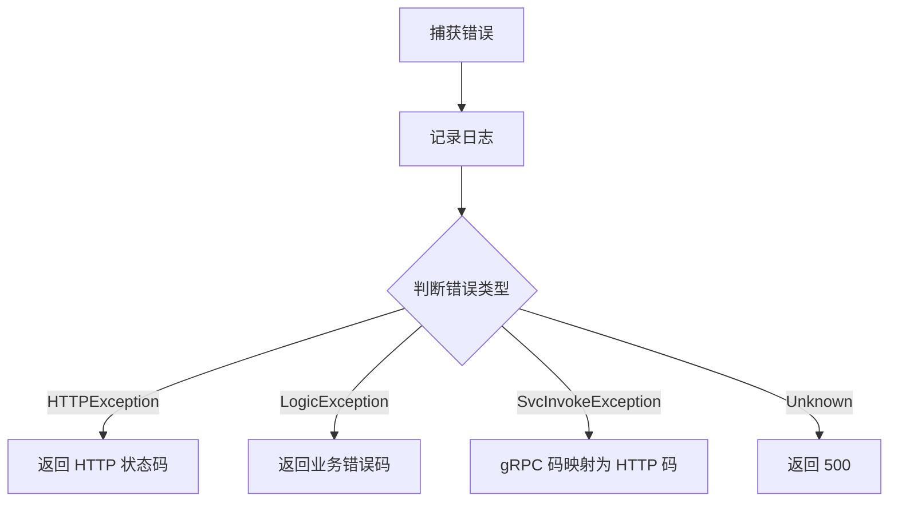

**业务错误码约定**:
- 业务错误码 > 100000 视为后端自定义错误
- 标准 gRPC 错误码会被映射为对应的 HTTP 状态码

### 6.3 错误响应格式

使用 `zResponseError` 作为统一的错误响应格式：

```typescript
// zResponseError 结构（无 data 字段）
{
  code: number,      // 错误码
  message: string,   // 错误信息
}
```

### 6.4 gRPC Code 到 HTTP Code 映射

```typescript
export const RpcCode2HttpCode: Record<Code, HTTP_CODE> = {
  [Code.OK]: HTTP_CODE.SUCCESS,
  [Code.InvalidArgument]: HTTP_CODE.BAD_REQUEST,
  [Code.NotFound]: HTTP_CODE.NOT_FOUND,
  [Code.PermissionDenied]: HTTP_CODE.FORBIDDEN,
  [Code.Unauthenticated]: HTTP_CODE.UNAUTHORIZED,
  [Code.Internal]: HTTP_CODE.INTERNAL_SERVER_ERROR,
};
```

### 6.5 忽略特定错误的追踪

某些错误（如 401 未授权）不需要在链路追踪中标记为错误。BFF 提供了两种方式来控制错误追踪：

#### 6.5.1 全局配置忽略的状态码

```typescript
const IGNORE_ERROR_CODES = [
  HTTP_CODE.UNAUTHORIZED,  // 401 不记录错误
];

// 在 EnhanceTraceMiddleware 中
if (c.res.status >= 400 && !IGNORE_ERROR_CODES.includes(c.res.status)) {
  span.setTag('error', ...);
}
```

#### 6.5.2 使用 traceHelper 动态忽略错误

在路由处理中，可以使用 `c.traceHelper.escapeError()` 来动态标记当前请求的错误不需要记录到链路追踪：

```typescript
// server/utils/base/trace-helper.ts
export class TraceHelper {
  public shouldEscapeError = false;
  
  /**
   * 如果希望 trace 中不记录错误，可以调用这个方法
   */
  escapeError() {
    this.shouldEscapeError = true;
  }
}
```

**使用示例**:

```typescript
app.openapi(route, async (c) => {
  const [err, result] = await c.invokeSvcMethod(
    SomeServiceClient,
    'someMethod',
    request,
  );
  
  if (err) {
    // 某些预期的业务错误不需要记录到 trace
    if (err.code === Code.NotFound) {
      // 标记这个错误不需要在 trace 中记录
      c.traceHelper.escapeError();
      return c.json({ code: 404, message: '资源不存在' }, HTTP_CODE.NOT_FOUND);
    }
    
    // 其他错误正常抛出，会被记录到 trace
    throw err;
  }
  
  return c.json(ResponseSchema.encode(result), HTTP_CODE.SUCCESS);
});
```

**适用场景**:

| 场景 | 是否使用 escapeError | 原因 |
|------|---------------------|------|
| 用户未登录 (401) | ✅ 使用 | 预期行为，不是真正的错误 |
| 资源不存在 (404) | 视情况 | 如果是正常的查询场景可以忽略 |
| 参数校验失败 (400) | ❌ 不使用 | 可能是前端 bug，需要追踪 |
| 服务器内部错误 (500) | ❌ 不使用 | 需要追踪和告警 |

---

## 7. 调用后端服务

### 7.1 服务调用方式

BFF 通过 `SvcMethodInvokerMiddleware` 注入的方法调用后端 gRPC 服务：

```typescript
// 方式一：自动抛出异常（推荐）
const customer = await c.callService(
  CustomerServiceClient,
  'getCustomer',
  { id: customerId },
);
// 调用失败会自动抛出 SvcInvokeException

// 方式二：手动处理错误
const [err, customer] = await c.invokeSvcMethod(
  CustomerServiceClient,
  'getCustomer',
  { id: customerId },
);
if (err) {
  // 自定义错误处理
  if (err.code === Code.NotFound) {
    return c.json({ code: 404, message: '客户不存在' }, 404);
  }
  throw err;
}
```

### 7.2 服务客户端来源

服务客户端从 `@moego/api-node` 或 `@moego/api-node-v2` 导入：

```typescript
import { CustomerServiceClient } from '@moego/api-node-v2/backend/service/customer/v2/customer_service_connect';
import { AccountServiceClient } from '@moego/api-node/serviceClient';
```

### 7.3 请求上下文传递

调用后端服务时，BFF 会自动传递以下上下文信息：

- 链路追踪 ID (trace-id)
- 用户身份信息 (account-id, business-id 等)
- 灰度环境标识

---

## 8. 产物输出

BFF 构建后产出三种主要产物：

### 8.1 Runtime Server

**部署形式**: Docker 镜像，运行于 K8S 集群

**配置**:
- 端口: 8080
- 健康检查: `GET /`
- 基础路径: `/moego.bff`

### 8.2 @moego/bff-schemas

**内容**: 所有 Zod Schema 的 TypeScript 源码

**发布方式**: NPM 包（内部 Registry）

**特点**: 直接发布 TS 源码，支持前端直接导入进行运行时校验

### 8.3 @moego/bff-openapi

**内容**: 
- OpenAPI YAML 规范文件
- 类型安全的 API Client
- **Strip 后的 Schema**（无 transform 等 post process）
- 从 Proto 导入的枚举类型

**发布方式**: NPM 包（内部 Registry）

#### 8.3.1 OpenAPI 生成流程详解

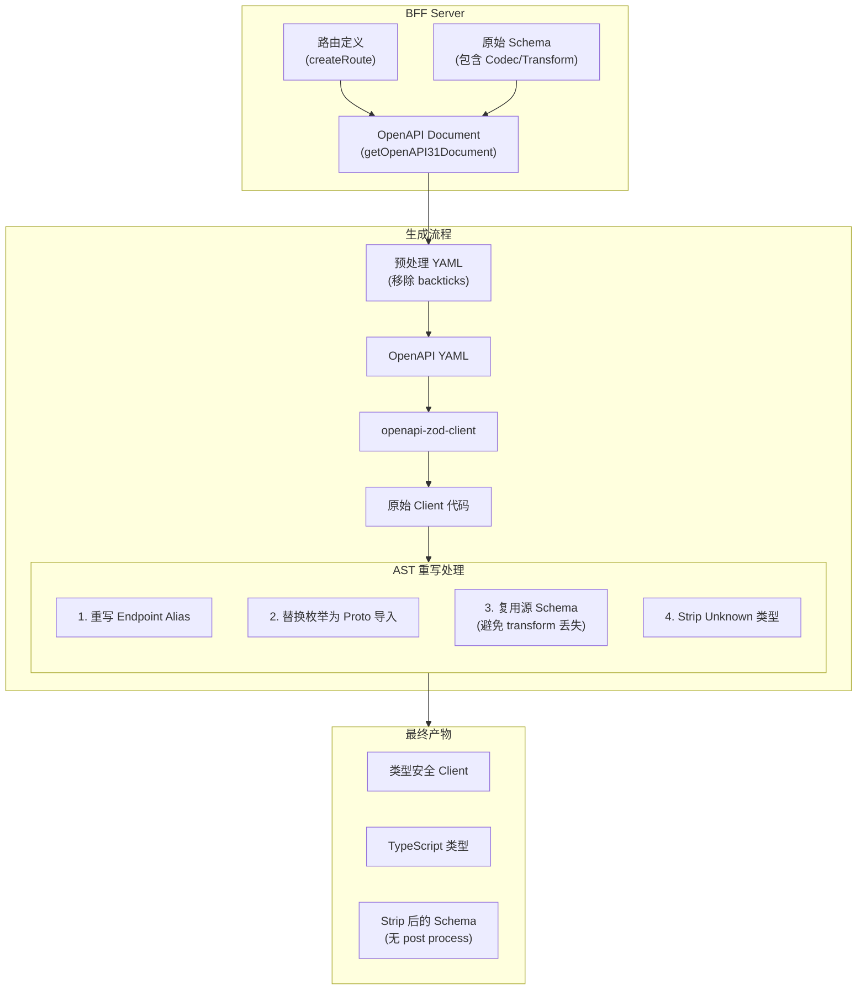

**关键步骤说明**:

1. **OpenAPI 文档生成**: 从路由定义中提取 Schema，生成 OpenAPI 3.1 规范文档
2. **YAML 预处理**: 移除 description 中的特殊字符（如反引号），避免生成代码语法错误
3. **Client 代码生成**: 使用 `openapi-zod-client` 从 YAML 生成初始客户端代码
4. **AST 重写**: 对生成的代码进行 AST 级别的优化和修正

**Schema Strip 机制**:

生成给前端的 Schema 会自动 strip 掉 post process 部分（如 `transform`），原因是：

```typescript
// 原始 Schema (BFF 内部使用)
const InternalSchema = z.string().transform(v => parseInt(v));
// 类型: string -> number

// 导出给前端的 Schema (经过 OpenAPI 转换)
const ExportedSchema = z.string();
// 类型: string

// 为什么需要 strip？
// 如果前端拿到 transform 后的类型 (number)，传给 BFF 会校验失败
// 因为 BFF 的原始 Schema 期望的输入是 string
```

#### 8.3.2 循环引用类型的 OpenAPI 生成

在 BFF Schema 中，我们使用 getter 来处理循环引用（详见 [3.2.3 循环引用处理](#323-循环引用处理zlazy-的必要性)）。但 `@asteasolutions/zod-to-openapi` 库原生不支持 getter 形式的循环引用，因此我们通过 **pnpm patch** 对该库进行了扩展。

**核心问题**:

```typescript
// BFF 中的递归类型定义
export const zJsonObject = z.object({
  get additionalProperties() {
    return zJsonValue;  // 循环引用
  },
}).openapi('JsonObject');

export const zJsonValue = z.union([
  z.string(),
  z.number(),
  z.boolean(),
  z.null(),
  zJsonObject,  // 循环引用
  z.array(zJsonValue),  // 自引用
]).openapi('JsonValue');
```

如果没有正确处理，`zod-to-openapi` 会进入无限递归（`Maximum call stack size exceeded`），或生成自引用的 `$ref` 而没有实际定义：

```yaml
# ❌ 错误的生成结果
JsonObject:
  $ref: '#/components/schemas/JsonObject'  # 自引用，没有定义！
```

**Patch 解决方案**:

我们通过 patch `@asteasolutions/zod-to-openapi` 来支持 getter 循环引用。核心思路是：

1. **使用 `refId` 而非对象引用**：因为 getter 每次调用都会返回新实例
2. **在 `generateSchemaWithRef` 中统一检测循环**：使用 `processingSchemaIds` 集合
3. **ZodLazy 不参与循环检测**：直接展开内部 schema，循环检测交给后续流程

```typescript
// patches/@asteasolutions__zod-to-openapi.patch (核心逻辑)

// 步骤 1: 定义两个集合追踪 schema 处理状态
const registeredSchemaIds = new Set();  // 已注册的 schema（首次遇到）
const processingSchemaIds = new Set();  // 正在处理中的 schema（检测循环）

// 步骤 2: generateSchemaWithRef - 循环引用检测的核心
generateSchemaWithRef(zodSchema) {
  const refId = Metadata.getRefId(zodSchema);
  
  // 如果当前 schema 正在处理中，说明遇到了循环引用
  if (refId && processingSchemaIds.has(refId)) {
    return { $ref: this.generateSchemaRef(refId) };  // 返回 $ref
  }
  
  // 标记为正在处理
  if (refId) {
    processingSchemaIds.add(refId);
  }
  
  // 生成 schema 定义
  const result = this.generateSimpleSchema(zodSchema);
  
  // 处理完成后移除标记
  if (refId) {
    processingSchemaIds.delete(refId);
  }
  
  // 保存定义（关键：第一次遇到时保存完整定义）
  if (refId && this.schemaRefs[refId] === undefined) {
    this.schemaRefs[refId] = result;  // 保存完整定义
    return { $ref: this.generateSchemaRef(refId) };  // 返回引用
  }
  
  return result;
}

// 步骤 3: ZodLazy 处理 - 不参与循环检测
if (isZodType(zodSchema, 'ZodLazy')) {
  const refId = Metadata.getRefId(zodSchema);
  registeredSchemaIds.add(refId);  // 标记已注册
  
  const innerSchema = zodSchema._def.getter();
  if (!Metadata.getRefId(innerSchema)) {
    innerSchema.openapi(refId);  // 确保内部 schema 有 refId
  }
  
  // 直接展开，循环检测交给 generateSchemaWithRef
  return mapItem(innerSchema);
}
```

**工作流程示例**（JsonObject & JsonValue）:

```mermaid
flowchart TB
    Start["处理 zJsonValue"] --> Check1{"processingSchemaIds<br/>has 'JsonValue'?"}
    Check1 -->|No| Mark1["add 'JsonValue'<br/>to processingSchemaIds"]
    Mark1 --> Process1["处理 union 分支"]
    Process1 --> Branch1["处理 zJsonObject"]
    Branch1 --> Check2{"processingSchemaIds<br/>has 'JsonObject'?"}
    Check2 -->|No| Mark2["add 'JsonObject'"]
    Mark2 --> Process2["处理 additionalProperties<br/>(getter 返回 zJsonValue)"]
    Process2 --> Check3{"processingSchemaIds<br/>has 'JsonValue'?"}
    Check3 -->|Yes| Ref1["返回 $ref JsonValue"]
    Ref1 --> Done1["JsonObject 定义完成"]
    Done1 --> Remove1["remove 'JsonObject'<br/>from processingSchemaIds"]
    Remove1 --> Continue["继续处理 union 其他分支"]
    Continue --> Array["处理 z.array(zJsonValue)"]
    Array --> Check4{"processingSchemaIds<br/>has 'JsonValue'?"}
    Check4 -->|Yes| Ref2["返回 $ref JsonValue"]
    Ref2 --> Done2["JsonValue 定义完成"]
    Done2 --> Remove2["remove 'JsonValue'"]
    
    style Check3 fill:#f96,stroke:#333,stroke-width:2px
    style Ref1 fill:#9f6,stroke:#333,stroke-width:2px
```

**最终生成的 OpenAPI YAML**:

```yaml
components:
  schemas:
    JsonValue:
      oneOf:
        - type: string
        - type: number
        - type: boolean
        - type: 'null'
        - $ref: '#/components/schemas/JsonObject'  # ✅ 引用
        - type: array
          items:
            $ref: '#/components/schemas/JsonValue'  # ✅ 自引用
    
    JsonObject:
      type: object
      additionalProperties:
        $ref: '#/components/schemas/JsonValue'  # ✅ 引用
```

**Patch 的关键点**:

| 设计点 | 说明 | 原因 |
|-------|------|------|
| 使用 `refId` 检测 | 而非对象引用 | getter 每次返回新实例，对象引用无效 |
| `processingSchemaIds` | 追踪正在处理的 schema | 检测循环引用的核心机制 |
| `registeredSchemaIds` | 追踪已注册的 schema | 判断是否首次遇到 |
| ZodLazy 直接展开 | 不在 ZodLazy 层检测循环 | 循环检测统一在 `generateSchemaWithRef` 中进行 |
| 第一次保存完整定义 | `schemaRefs[refId] = result` | 确保递归类型有实际定义，不是自引用 `$ref` |

**常见问题排查**:

| 错误现象 | 可能原因 | 解决方法 |
|---------|---------|---------|
| `Maximum call stack size exceeded` | 循环引用未被检测到 | 检查 `processingSchemaIds` 是否正确添加/移除 |
| `export type JsonObject = JsonObject;` | 生成的定义是自引用 `$ref` | 确保第一次遇到时保存完整定义到 `schemaRefs` |
| 缺少某个类型的定义 | `registeredSchemaIds` 逻辑问题 | 检查 ZodLazy 是否正确标记 `registeredSchemaIds` |

**调试技巧**:

```typescript
// 在 patch 中添加日志（开发时）
generateSchemaWithRef(zodSchema) {
  const refId = Metadata.getRefId(zodSchema);
  console.log(`[generateSchemaWithRef] refId=${refId}, processing=${Array.from(processingSchemaIds)}`);
  
  if (refId && processingSchemaIds.has(refId)) {
    console.log(`  → Circular reference detected, returning $ref`);
    return { $ref: this.generateSchemaRef(refId) };
  }
  // ...
}
```

#### 8.3.3 字符串转义处理

在 OpenAPI 生成过程中，description 字段可能包含特殊字符（如反引号 `` ` ``），这些字符在生成的 TypeScript 代码中会导致语法错误。

**问题示例**:

```typescript
// Schema 定义中的 description
z.string().openapi({ 
  description: 'Use format `YYYY-MM-DD`'  // 包含反引号
});

// 生成的 OpenAPI YAML
description: Use format `YYYY-MM-DD`

// openapi-zod-client 生成的代码
z.string().describe("Use format `YYYY-MM-DD`")  // ❌ 语法错误！模板字符串未闭合
```

**解决方案**:

在生成 OpenAPI Client 之前，预处理 YAML 内容，移除 description 中的反引号：

```typescript
// scripts/openapi/lib.ts
export function preprocessOpenAPIYaml(yamlContent: string): string {
  const lines = yamlContent.split('\n');
  return lines.map(line => {
    // 如果是 description 行，移除反引号
    if (line.trim().startsWith('description:')) {
      return line.replace(/`/g, '');
    }
    return line;
  }).join('\n');
}

// scripts/openapi/generate.ts
const yamlContent = fs.readFileSync(yamlPath, 'utf-8');
const processedYaml = preprocessOpenAPIYaml(yamlContent);  // 预处理
// 使用 processedYaml 生成 client
```

**为什么在 YAML 阶段处理？**

| 方案 | 说明 | 问题 |
|------|------|------|
| Schema 定义时转义 | 在 `.openapi({ description })` 时转义 | 需要修改所有 Schema，维护成本高 |
| YAML 预处理（✅采用）| 生成 YAML 后、生成 Client 前处理 | 集中处理，不影响 Schema 定义 |
| Client 生成后重写 | 对生成的 TS 代码进行 AST 重写 | 过于复杂，正则表达式难以准确匹配 |

#### 8.3.4 Patch 维护指南

**查看当前 Patch**:

```bash
cat patches/@asteasolutions__zod-to-openapi.patch
```

**修改 Patch**:

```bash
# 1. 进入 patch 编辑模式
pnpm patch @asteasolutions/zod-to-openapi

# 2. 系统会提示编辑路径，如：
# /Users/xxx/Projects/moego-bff/node_modules/.pnpm_patches/@asteasolutions/zod-to-openapi@8.1.0

# 3. 编辑该路径下的文件（通常是 dist/index.cjs）

# 4. 提交修改
pnpm patch-commit '/path/to/patched/package'
```

**测试 Patch**:

```bash
# 生成 OpenAPI，检查是否有循环引用错误
pnpm generate:openapi fulfillment

# 检查生成的 YAML 是否正确
cat packages/openapi/docs/openapi.fulfillment.yaml | grep -A 10 "JsonObject:"

# 检查生成的 Client 类型是否正确
grep "export type JsonObject" packages/openapi/clients/client.fulfillment.ts
```

**Patch 失效排查**:

| 症状 | 可能原因 | 解决方法 |
|------|---------|---------|
| `Maximum call stack size exceeded` | Patch 未生效或循环检测失败 | 确认 patch 文件存在，重新安装依赖 |
| `JsonObject = JsonObject` | 首次遇到时未保存完整定义 | 检查 `schemaRefs[refId] = result` 逻辑 |
| Patch 修改后未生效 | pnpm 缓存问题 | `rm -rf node_modules && pnpm i` |

#### 8.3.5 生成产物结构

```
packages/openapi/
├── docs/                        # OpenAPI YAML 文件
│   ├── openapi.customer.yaml
│   ├── openapi.payment.yaml
│   └── ...
├── clients/                     # 各领域的 Client 实现
│   ├── client.customer.ts       # 包含类型、Schema、Client
│   ├── client.payment.ts
│   └── ...
├── client-utils.ts              # Client 工具函数
└── index.ts                     # 统一导出
```

**Client 文件内容**:

```typescript
// clients/client.customer.ts

// 1. 枚举导出 (从 Proto 导入)
export { CustomerType } from '@moego/api-node-v2/backend/proto/customer/v2/metadata_pb';

// 2. 类型定义
export type CustomerDetailResponse = {
  id: string;  // bigint 已转换为 string
  name: string;
  // ...
};

// 3. Zod Schema (strip 后，无 transform)
export const CustomerDetailResponseSchema = z.object({
  id: z.string().regex(/^-?\d+$/),  // 而非 zId (含 Codec)
  name: z.string(),
});

// 4. Client Factory
export const customerClientFactory = (fetcher: Fetcher) => {
  return createApiClient(endpoints, { fetcher });
};
```

#### 8.3.6 生成命令与选项

**生成所有领域的 OpenAPI**:

```bash
pnpm generate:openapi
```

**生成指定领域的 OpenAPI**:

```bash
# 单个领域
pnpm generate:openapi customer

# 多个领域
pnpm generate:openapi customer payment order
```

**生成流程详解**:

```bash
# scripts/openapi/generate.ts 执行流程

1. 📝 从路由定义生成 OpenAPI Document
   └─ 使用 @hono/zod-openapi 的 getOpenAPI31Document()

2. 🔧 生成 YAML 文档
   ├─ 写入 packages/openapi/docs/openapi.{realm}.yaml
   └─ 预处理：移除 description 中的特殊字符

3. 🎨 生成 TypeScript Client
   ├─ 使用 openapi-zod-client 从 YAML 生成
   └─ 写入 packages/openapi/clients/client.{realm}.ts

4. ✨ AST 重写优化
   ├─ 重写 endpoint alias (namespace 转换)
   ├─ 替换枚举为 Proto 导入
   ├─ 复用源 Schema（createSharedSchema）
   └─ Strip 无效类型

5. 📦 更新索引文件
   └─ 更新 packages/openapi/index.ts
```

**常见生成选项**:

| 场景 | 命令 | 说明 |
|------|------|------|
| 开发时频繁测试 | `nr generate:openapi customer` | 只生成一个领域，速度快 |
| Schema 大改后 | `nr generate:openapi` | 全量生成，确保一致性 |
| CI/CD 发布前 | `nr generate:openapi` | 全量生成并发布 |
| 调试 Patch | `nr generate:openapi fulfillment` | fulfillment 包含复杂的递归类型 |

### 8.4 Client 端运行时检查机制

BFF 的 OpenAPI Client 内置了**运行时类型校验机制**，可以在请求发送前和响应接收后进行数据校验，实现**质量左移**——在真正消费到不正确的类型之前就感知到问题。

#### 8.4.1 运行时校验流程

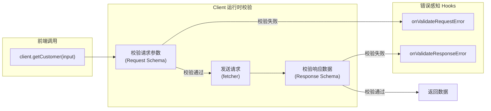

#### 8.4.2 配置运行时校验 Hooks

在创建 Client 时，可以传入 `onValidateRequestError` 和 `onValidateResponseError` 两个 hooks，用于感知校验错误：

```typescript
import { createCustomerClient } from '@moego/bff-openapi';
import type { ClientOptions, validateHooksMeta } from '@moego/bff-openapi/client-utils';

// 配置运行时校验 hooks
const clientOptions: ClientOptions = {
  /**
   * 请求参数校验失败时触发
   * @param error - Zod 校验错误
   * @param meta - 包含 realm、bffMethod、path 等上下文信息
   * @returns 返回 true 则跳过校验继续请求，返回 false 则抛出异常
   */
  onValidateRequestError: (error, meta) => {
    // 上报到监控系统
    reportToSentry({
      type: 'BFF_REQUEST_VALIDATION_ERROR',
      realm: meta.realm,        // 领域，如 'customer'
      method: meta.bffMethod,   // 方法名，如 'getCustomer'
      path: meta.path,          // 完整路径
      error: error.flatten(),   // 格式化后的错误
    });
    
    console.error(`[BFF] 请求参数校验失败: ${meta.path}`, error);
    
    // 返回 false 抛出异常，阻止请求发送
    return false;
  },

  /**
   * 响应数据校验失败时触发
   * @param error - Zod 校验错误
   * @param meta - 包含 realm、bffMethod、path 等上下文信息
   * @returns 返回 true 则跳过校验返回原始数据，返回 false 则抛出异常
   */
  onValidateResponseError: (error, meta) => {
    // 上报到监控系统（这通常意味着 BFF 返回了不符合协议的数据）
    reportToSentry({
      type: 'BFF_RESPONSE_VALIDATION_ERROR',
      realm: meta.realm,
      method: meta.bffMethod,
      path: meta.path,
      error: error.flatten(),
    });

    console.error(`[BFF] 响应数据校验失败: ${meta.path}`, error);

    // 开发环境抛出异常，生产环境可以选择继续
    if (process.env.NODE_ENV === 'development') {
      return false; // 抛出异常
    }
    return true; // 生产环境跳过校验，返回原始数据
  },
};

// 创建 Client 时传入配置
const customerClient = createCustomerClient(fetcher, clientOptions);
```

#### 8.4.3 Hook 参数详解

**validateHooksMeta 结构**:

```typescript
type validateHooksMeta = {
  realm: string;      // 领域名称，如 'customer'、'payment'
  bffMethod: string;  // BFF 方法名，如 'getCustomer'、'createOrder'
  path: string;       // 完整的 API 路径，如 '/moego.bff/customer/getCustomer'
};
```

**ZodError 常用方法**:

```typescript
onValidateResponseError: (error, meta) => {
  // 获取格式化的错误信息
  const flatErrors = error.flatten();
  // { fieldErrors: { name: ['Required'], age: ['Expected number'] }, formErrors: [] }

  // 获取所有错误的详细信息
  const issues = error.issues;
  // [{ code: 'invalid_type', path: ['name'], message: 'Required' }, ...]

  // 格式化为易读的错误消息
  const formatted = error.format();

  return false;
},
```

#### 8.4.4 质量左移的价值

**传统问题**：前端直接消费后端返回的数据，如果数据结构不符合预期，错误会在 UI 渲染时才暴露（如 `Cannot read property 'xxx' of undefined`）。

**运行时校验的优势**:

| 阶段 | 传统方式 | 运行时校验 |
|------|---------|-----------|
| 错误发现 | 渲染/使用数据时 | 请求/响应时立即发现 |
| 错误信息 | `Cannot read property` | 具体的字段校验失败信息 |
| 问题定位 | 需要排查整个链路 | 直接知道是哪个接口、哪个字段 |
| 监控告警 | 难以自动化 | 可以接入监控系统自动告警 |

**实际场景示例**:

```typescript
// BFF 协议定义了 customer.birthDate 为必填
const CustomerSchema = z.object({
  id: zId,
  name: z.string(),
  birthDate: zDate,  // 必填
});

// 但后端某次更新后，birthDate 变成了可选
// 如果没有运行时校验，前端可能会在使用时才发现问题：
// formatDate(customer.birthDate)  // ❌ TypeError: Cannot read property 'year' of undefined

// 有了运行时校验，在响应返回时就会触发 onValidateResponseError:
// "birthDate: Required" - 立即知道是这个字段缺失了
```

#### 8.4.5 推荐配置策略

```typescript
const clientOptions: ClientOptions = {
  onValidateRequestError: (error, meta) => {
    // 请求参数错误通常是前端 bug，应该修复
    reportError('REQUEST_VALIDATION', error, meta);
    // 开发环境严格模式：抛出异常
    return process.env.NODE_ENV === 'production';
  },

  onValidateResponseError: (error, meta) => {
    // 响应校验错误可能是 BFF 问题，需要上报但不一定阻断
    reportError('RESPONSE_VALIDATION', error, meta);
    // 生产环境容错：返回原始数据，但已经上报了告警
    return true;
  },
};
```

### 8.5 让前端感知 BFF 更新

> **重要**: 如果想要前端感知到 BFF 的更新，需要运行 `pnpm generate:openapi` 更新 OpenAPI，CI 会使用新的 OpenAPI 发包。

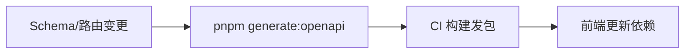

### 8.6 前端使用

```typescript
// 从 openapi 包导入 Client 和类型
import { 
  createCustomerClient,
  CustomerDetailResponse,  // 类型
  GetCustomerRequest,      // 类型
  CustomerTypeEnum,        // 枚举
} from '@moego/bff-openapi';

const customerClient = createCustomerClient(fetcher);
const customer = await customerClient.getCustomer({ customerId: '123' });
```

---

## 9. 多进程与集群调度

### 9.1 Cluster 架构

BFF 使用 Node.js 的 Cluster 模块实现多进程架构，充分利用多核 CPU 性能。

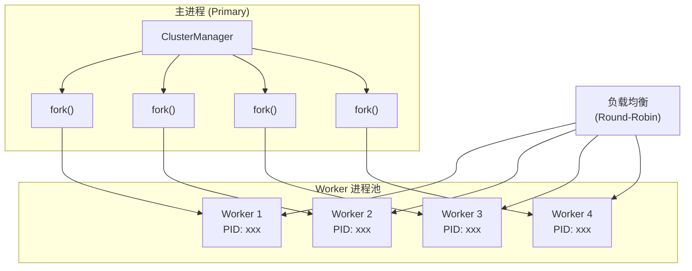

### 9.2 ClusterManager 实现

```typescript
// server/cluster.ts
export class ClusterManager {
  private static instance: ClusterManager;

  public init(task: () => Promise<void>) {
    if (isDev) {
      // 开发环境直接运行，方便调试
      return task();
    }
    
    if (cluster.isPrimary) {
      this.initCluster();
    } else {
      this.initWorker(task);
    }
  }

  private initCluster() {
    // 限制最多 4 个 Worker，避免资源浪费
    const numCPUs = Math.min(availableParallelism(), 4);
    
    // 创建 Worker 进程
    for (let i = 0; i < numCPUs; i++) {
      this.forkWorker();
    }
    
    // 监听 Worker 退出，自动重启
    cluster.on('exit', (worker, code, signal) => {
      logger.info(`worker ${worker.process.pid} died`);
      this.forkWorker();  // 自动重启
    });
  }
}
```

### 9.3 Worker 监控

每个 Worker 进程都有完整的生命周期监控：

```typescript
private monitorWorker(worker: Worker) {
  worker.on('online', () => {
    logger.info(`Worker ${worker.process.pid} is online`);
  });
  
  worker.on('error', (error) => {
    logger.error(`Worker ${worker.process.pid} error: ${error}`);
  });
  
  worker.on('disconnect', () => {
    logger.info(`Worker ${worker.process.pid} disconnected`);
  });
  
  worker.on('uncaughtException', (error) => {
    logger.error(`Worker ${worker.process.pid} uncaughtException: ${error}`);
  });
}
```

### 9.4 链路追踪与进程 ID

在链路追踪中记录进程 ID，方便多进程环境下的问题定位：

```typescript
// enhance-trace.middleware.ts
span.setTag('cluster.id', process.pid);
```

这样在 Datadog APM 中可以看到每个请求是由哪个 Worker 处理的。

### 9.5 开发环境 vs 生产环境

| 环境 | 进程模式 | 原因 |
|------|---------|------|
| 开发环境 | 单进程 | 方便调试、热重载 |
| 生产环境 | 多进程 (最多 4 个) | 利用多核、故障隔离 |

---

## 10. 本地开发

### 10.1 环境准备

**必需条件**:
- Node.js 23+
- pnpm 9+
- AWS CLI（用于访问内部资源）

```bash
# 安装依赖
pnpm i

# 启动开发服务器
pnpm dev
```

### 10.2 创建新领域/路由

> **推荐**: 使用 `pnpm cr` 创建新路由

```bash
pnpm cr
# 或
pnpm create-route
```

向导会询问领域名称、路由方法名、HTTP 方法等，并自动生成对应的路由文件和 Schema 文件。

### 10.3 连接 K8S 集群调试

```bash
pnpm connect
```

### 10.4 API 文档

每个领域的路由都自动生成 API 文档，访问：

```
http://localhost:8080/moego.bff/{realm}/docs
```

---

## 11. CI/CD 与版本管理

### 11.1 更新后端 API

> **重要**: 所有需要更新后端 API 的行为都应该通过 `pnpm update-api` 来实现，因为脚本封装了逻辑并且会提示更新 zod & openapi。

```bash
# 更新后端 API 依赖（推荐方式）
pnpm update-api

# 脚本会自动提示你运行：
# - pnpm generate:zod      # 更新 Zod Schema
# - pnpm generate:openapi  # 更新 OpenAPI Client
```

### 11.2 常用命令

| 命令 | 说明 |
|------|------|
| `pnpm dev` | 启动开发服务器 |
| `pnpm build` | 构建生产版本 |
| `pnpm update-api` | **更新后端 API 依赖（推荐）** |
| `pnpm generate:zod` | 从 Proto 生成 Zod Schema |
| `pnpm generate:openapi` | 生成所有领域的 OpenAPI 文档和客户端 |
| `pnpm generate:openapi customer` | 仅生成指定领域的 OpenAPI |
| `pnpm generate:openapi customer payment` | 生成多个指定领域的 OpenAPI |
| `pnpm patch <package>` | 创建或修改 npm 包的 patch |
| `pnpm patch-commit <path>` | 提交 patch 修改 |
| `pnpm cr` | 创建新路由（交互式） |
| `pnpm connect` | 连接 K8S 集群调试 |

**命令执行顺序建议**:

```bash
# 更新后端 API 后的完整流程
pnpm update-api           # 1. 更新 @moego/api-node-v2 等依赖
pnpm generate:zod         # 2. 重新生成 Zod Schema
pnpm generate:openapi     # 3. 重新生成 OpenAPI Client

# 只修改了 BFF Schema 或路由
pnpm generate:openapi     # 直接重新生成 OpenAPI
```

### 11.3 CI/CD 流程

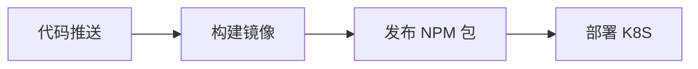

---

## 12. 能力边界

### 12.1 BFF 适合做的事情

| 场景 | 说明 |
|------|------|
| 接口聚合与编排 | 将多个后端服务调用聚合为一个前端 API |
| 数据格式转换 | 使用 Codec 转换前后端数据格式差异 |
| 统一鉴权 | 在 BFF 层统一处理认证和授权 |
| 协议转换 | gRPC → REST，使前端可以直接调用 |
| 响应裁剪 | 只返回前端需要的字段，减少传输量 |

### 12.2 BFF 不适合做的事情

| 场景 | 原因 | 建议 |
|------|------|------|
| 复杂业务逻辑 | BFF 应保持轻量 | 下沉到后端服务 |
| 数据持久化 | BFF 无状态设计 | 使用专门的数据服务 |
| 重计算任务 | 影响响应性能 | 使用后端服务或异步任务 |
| 文件存储 | BFF 是无状态的 | 使用对象存储服务 |

### 12.3 最佳实践

1. **保持 BFF 轻量**: 复杂逻辑应下沉到后端服务
2. **使用 Codec 而非 Transform**: 确保双向转换能力
3. **使用 `.default()` 设置默认值**: 而非 `.transform()`
4. **添加 `.openapi('SchemaName')`**: 确保生成具名类型
5. **定义完整的错误响应**: 使用 `zResponseError`
6. **服务封装放 services/**: 工具函数放 utils/
7. **通过 update-api 更新 API**: 确保流程完整
8. **c.json() 传入状态码**: 确保类型正确映射
9. **响应使用 Schema.encode()**: 确保输出符合协议
10. **复用 Schema 进行前端校验**: 利用同构优势

---

## 附录

### A. 常见问题

**Q: 如何添加新的领域（realm）？**

A: 推荐使用 `pnpm cr` 交互式创建，会自动生成所需的文件结构。

**Q: Schema 修改后如何让前端感知？**

A: 运行 `pnpm generate:openapi`，CI 会发布新版本的 @moego/bff-openapi。

**Q: 为什么生成的类型是 TypeA & {...}？**

A: 因为使用了 `SchemaA.extend()`，改用 `z.object(SchemaA.shape).extend()` 可生成独立类型。

**Q: 前端应该从哪里导入类型？**

A: 从 `@moego/bff-openapi` 包导入，不要直接从 `@moego/bff-schemas` 导入。

**Q: 为什么不推荐使用 transform？**

A: Transform 是单向的，无法 encode，且导出给前端的 Schema 会丢失 transform 逻辑。使用 Codec 代替。

**Q: 如何调试多进程问题？**

A: 在 Datadog APM 中通过 `cluster.id` 标签筛选特定 Worker 的请求。

**Q: C 端路由和 B 端路由有什么区别？**

A: C 端路由使用 `createClientSideRoute`，自动注入客户身份解析中间件；B 端路由使用标准 `createRoute`。

**Q: 生成 OpenAPI 时遇到 "Maximum call stack size exceeded" 错误？**

A: 这通常是循环引用类型处理有问题。检查 `@asteasolutions/zod-to-openapi` 的 patch 是否正确应用（`cat patches/@asteasolutions__zod-to-openapi.patch`）。如果 patch 存在但仍报错，尝试 `rm -rf node_modules && pnpm i` 重新安装。

**Q: 生成的客户端类型出现 `export type JsonObject = JsonObject`？**

A: 这说明 OpenAPI YAML 中生成的是自引用的 `$ref` 而非完整定义。检查 patch 中 `generateSchemaWithRef` 的 `schemaRefs[refId] = result` 逻辑是否正确执行。

**Q: 如何验证 OpenAPI 生成是否正确？**

A: 
```bash
# 1. 检查 YAML 定义
cat packages/openapi/docs/openapi.customer.yaml | grep -A 10 "JsonObject:"

# 2. 检查生成的类型
grep "export type JsonObject" packages/openapi/clients/client.customer.ts

# 3. 确保没有自引用
# ✅ 正确：type JsonObject = { [key: string]: JsonValue }
# ❌ 错误：type JsonObject = JsonObject
```

**Q: 修改了 Schema，但前端没有感知到变化？**

A: 需要运行 `pnpm generate:openapi` 重新生成 OpenAPI，然后 CI 会发布新版本的 `@moego/bff-openapi` 包。前端需要更新该包的版本才能获取最新类型。

**Q: 生成的客户端代码中 `.describe()` 包含特殊字符导致语法错误？**

A: 检查 `scripts/openapi/lib.ts` 中的 `preprocessOpenAPIYaml` 函数是否正确移除了 description 中的特殊字符（如反引号）。

### B. 相关链接

- [BFF 使用指南](../README.md)
- [Hono 文档](https://hono.dev/)
- [Zod 文档](https://zod.dev/)
- [@hono/zod-openapi](https://github.com/honojs/middleware/tree/main/packages/zod-openapi)
- [Connect RPC](https://connectrpc.com/)
