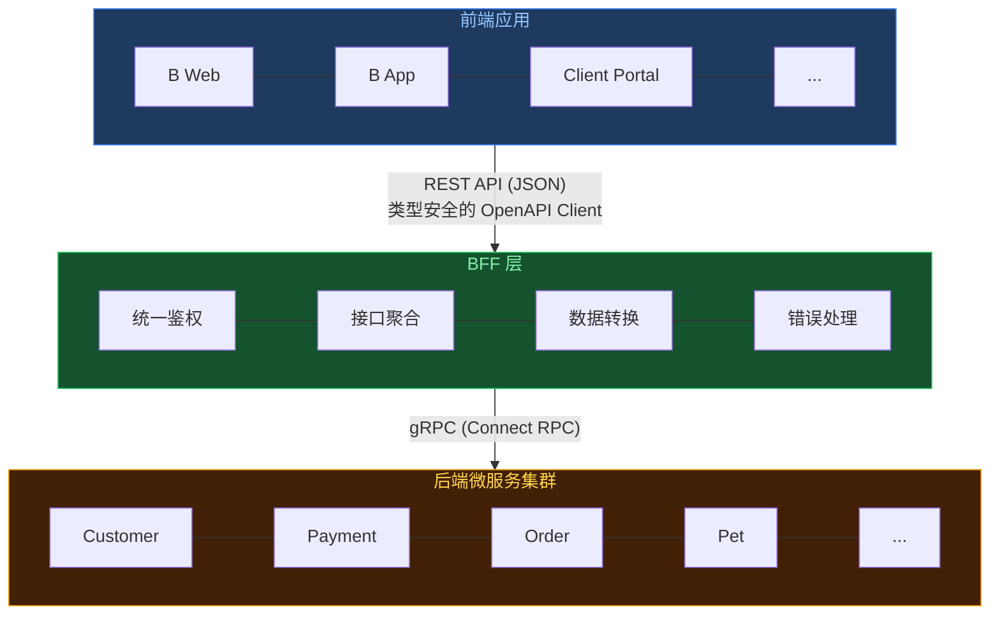
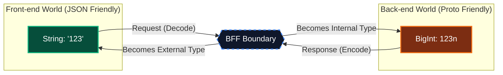
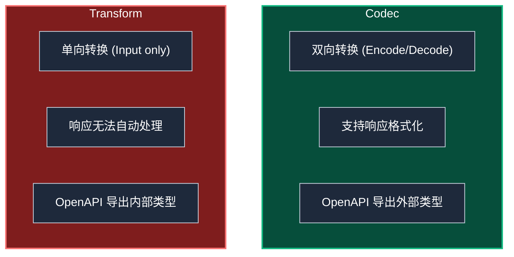
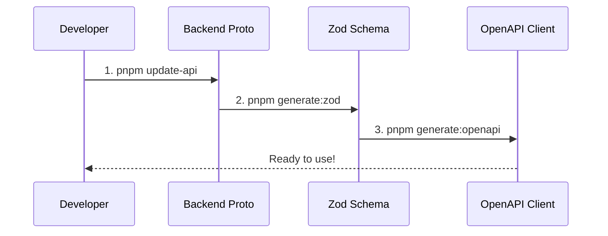
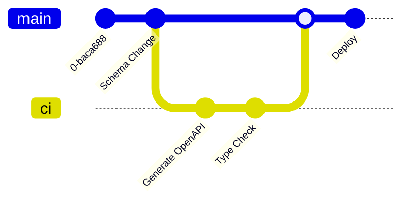
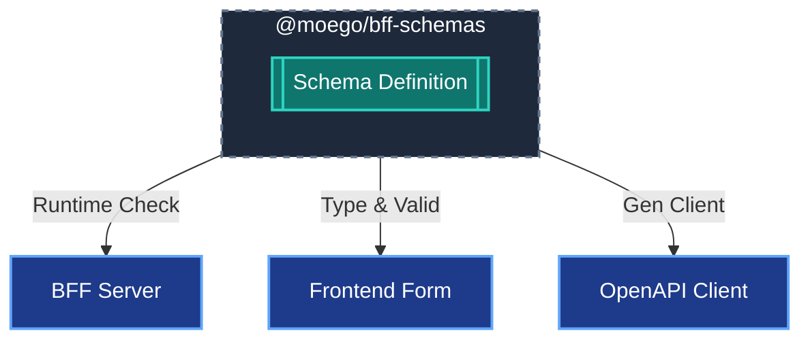
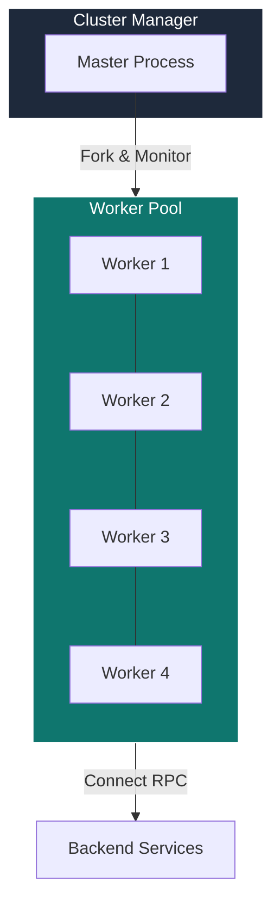

---layout: cover
highlighter: shiki
css: unocss
colorSchema: dark
transition: fade-out
mdc: true
glowSeed: 4
title: 现代化 BFF 架构：类型安全的端到端实践

addons:
  - tldraw
---

<h2>Modernized BFF Architecture</h2>
<h5 class="text-gray-500">类型安全的端到端实践</h5>
<p class="text-gray-500 text-s">
Doctor Wu / 2025-12-26
</p>

<!--
大家好，今天我要分享的是现代化 BFF 架构的实践经验。
在微服务时代，BFF 层作为前后端的桥梁，如何做到类型安全、高效开发，是我们今天要探讨的主题。
-->

---
layout: intro
class: pl-35
glowSeed: 14
---

## Doctor Wu

<div class="[&>*]:important-leading-10 opacity-80">

{MoeGo} 前端工程师<br>
{Vue} {VueUse} 核心团队成员<br>

</div>

<div my-10 w-max flex="~ gap-1" items-center justify-center>
  <div i-ri-user-3-line op50 ma text-xl />
  <div><a href="https://doctorwu.me" target="_blank" class="border-none! font-300">doctorwu.me</a></div>
  <div i-ri-github-line op50 ma text-xl ml4/>
  <div><a href="https://github.com/Doctor-wu" target="_blank" class="border-none! font-300">Doctor-wu</a></div>
</div>


<!--
我是 Doctor Wu，目前在 MoeGo 负责前端基础设施建设。
同时也是 Vue 和 VueUse 的核心团队成员。
今天分享的 BFF 方案是我们团队在生产环境中实践的经验总结。
-->

---
layout: center
---

## 议题概览

<div grid="~ cols-2 gap-4" class="w-140 mx-auto mt-10">

<div class="p-6 rounded-lg bg-blue-500/10 border-2 border-blue-500/30">
  <div class="text-xl mb-2">📝 端到端类型安全</div>
  <div class="text-sm opacity-50">Proto → Zod → OpenAPI</div>
</div>

<div class="p-6 rounded-lg bg-green-500/10 border-2 border-green-500/30">
  <div class="text-xl mb-2">🔄 Codec 机制</div>
  <div class="text-sm opacity-50">边界数据双向转换</div>
</div>

<div class="p-6 rounded-lg bg-yellow-500/10 border-2 border-yellow-500/30">
  <div class="text-xl mb-2">⚡ 开发效率</div>
  <div class="text-sm opacity-50">自动化工具链</div>
</div>

<div class="p-6 rounded-lg bg-red-500/10 border-2 border-red-500/30">
  <div class="text-xl mb-2">🚨 错误处理</div>
  <div class="text-sm opacity-50">RESTful 风格的创新</div>
</div>

</div>

<!--
今天的分享分为四个核心部分：
1. 端到端类型安全：从后端到前端的类型一致性保障
2. Codec 机制：边界数据的优雅转换方案
3. 开发效率：自动化工具链带来的效率提升
4. 错误处理：RESTful 风格的错误码映射与链路追踪
-->

---
layout: fact
---

## 什么是 BFF？
Backend for Frontend

<!--
在开始之前，我们先明确一下 BFF 的定义。
BFF 是 Backend for Frontend 的缩写，它是一个专门为前端服务的中间层。
-->

---

## BFF 整体架构

<div class="flex justify-center mt-14">



</div>

<!--
这是 BFF 在整个系统中的位置。
核心链路：前端通过类型安全的 OpenAPI Client 调用 BFF，BFF 通过 gRPC 聚合后端微服务。
关键点在于中间的 BFF 层充当了“胶水”和“翻译官”的角色，同时负责了类型安全和协议转换。
-->

---
layout: center
---

## 方案对比

<div class="grid grid-cols-3 gap-4 mt-8 text-left">

<div class="p-4 border-2 border-gray-500/30 rounded-lg opacity-60">
  <div class="text-xl font-bold mb-4">🏛️ 传统方案</div>
  <div class="text-sm font-mono mb-2">Node.js + Swagger</div>
  <ul class="text-sm list-disc pl-4 space-y-2">
    <li>手动编写文档</li>
    <li>文档代码不同步</li>
    <li>类型主要靠文档约定</li>
    <li><span class="text-red-400">痛点：维护成本高，信赖度低</span></li>
  </ul>
</div>

<div class="p-4 border-2 border-yellow-500/30 rounded-lg opacity-80">
  <div class="text-xl font-bold mb-4">🚧 内部 Legacy</div>
  <div class="text-sm font-mono mb-2">API-v3 (Proto -> TS)</div>
  <ul class="text-sm list-disc pl-4 space-y-2">
    <li>Proto 直转 TS 类型</li>
    <li>需要重复编写 Proto</li>
    <li>类型是 number, 实际返回 null</li>
    <li><span class="text-yellow-400">痛点：运行时类型不安全</span></li>
  </ul>
</div>

<div class="p-4 border-2 border-green-500/50 rounded-lg bg-green-500/10">
  <div class="text-xl font-bold mb-4 text-green-400">✨ 现有架构</div>
  <div class="text-sm font-mono mb-2">Schema-First</div>
  <ul class="text-sm list-disc pl-4 space-y-2">
    <li>Proto -> Zod -> OpenAPI</li>
    <li>端到端类型完全一致</li>
    <li>运行时自动校验</li>
    <li><span class="text-green-400">优势：类型绝对安全，开发高效</span></li>
  </ul>
</div>

</div>

<!--
我们来做一个横向对比：
1. 传统方案：靠文档堆砌，容易过时，前后端对着 Swagger 扯皮。
2. 我们内部的上一代方案 (API-v3)：虽然用了 Proto 生成 TS，但类型转换生硬，比如 Optional 字段在 JSON 里可能是 undefined，但在 TS 定义里可能是 null，导致大量的 NPE。
3. 现在的架构：Schema-First，从源头保证一致性，运行时强校验，彻底解决类型信任问题。
-->

---
layout: fact
---

## End-to-End Type Safety

端到端类型安全

<!--
这一部分是整个分享的高潮，我们通过代码的演进，来展示类型是如何从后端流动到前端的。
-->

---

## 类型演进之旅

<div mt-10></div>
````md magic-move {lines: true}
```protobuf
// 1. 后端定义 (Source of Truth)
// authn_service.proto
message LoginRequest {
  string email = 1;
  string password = 2;
}

message LoginResponse {
  string session_token = 1;
  UserProfile user = 2;
}
```

```typescript
// 2. 生成 TS 类型 (api-node-v2)
/**
 * Login RPC 的请求消息。
 *
 * @generated from message backend.proto.authn.v1.LoginRequest
 */
export type LoginRequest = Message<"backend.proto.authn.v1.LoginRequest"> & {
  /**
   * 用户的电子邮件地址。
   *
   * @generated from field: string email = 1;
   */
  email: string;

  /**
   * 用户的密码。
   *
   * @generated from field: string password = 2;
   */
  password: string;
}
```

```typescript
// 3. 自动生成 Zod Schema (BFF Layer)
// 经过 ts-to-zod + ast-grep 转换
export const zLoginRequest = z.object({
    /**
     * 用户的电子邮件地址。
     *
     * @generated from field: string email = 1;
     */
    email: z.string().openapi({ description: `用户的电子邮件地址。` }),
    /**
     * 用户的密码。
     *
     * @generated from field: string password = 2;
     */
    password: z.string().openapi({ description: `用户的密码。` }),
}).openapi('LoginRequest');

// 运行时自动校验 + OpenAPI 元数据
```

```typescript
// 4. BFF 路由定义 (Server Implementation)
// login.ts
export const loginRoute = createRoute({
  method: 'post',
  path: '/login',
  request: createJsonRequest(zLoginRequest),
  responses: {
    ...createJsonResponse(HTTP_CODE.SUCCESS, zLoginResponse, 'Login success'),
  },
});
```

```typescript
// 5. 生成的前端 Client (Fully Typed)
// 开发者直接调用，享受完整类型提示

const res = await BFFLoginClient.login({
  email: "doctorwu@moego.pet",
  password: "password123",
});

// ^? const res: LoginResponse
```
````

<!--
我们来看这一段 Magic Move：
1. 起点：后端的 Proto 文件，定义了最原始的数据结构。
2. 转换：通过 protobuf-es 生成了基础的 TypeScript 类型。
3. 进化：通过我们的工具链，自动生成了带有校验逻辑的 Zod Schema。
4. 应用：在 BFF 路由定义中直接使用这个 Schema，绑定了输入输出。
5. 终局：前端通过生成的 Client 直接调用，这里大家可以看到鼠标悬停时的类型提示（Twoslash），完全保留了所有字段信息。
-->

---
layout: fact
---

## Quality Shift Left
质量左移

<!--
除了编译时的类型检查，运行时的校验也同样重要。
我们引入了 "Quality Shift Left"（质量左移）的概念。
-->

---

## 运行时检查：拒绝 NPE

<div mt-10></div>
````md magic-move {lines: true}
```typescript
// packages/client-utils/src/client.ts
const client = createClient({
  baseUrl: '/api',
  // ⚡️ 运行时自动检查不符合 Schema 的响应
  onValidateResponseError: ({ error, request, response }) => {
    // 当返回检验不通过时, 触发 hooks
  }
});
```

```typescript
// packages/client-utils/src/client.ts
const client = createClient({
  baseUrl: '/api',
  // ⚡️ 运行时自动检查不符合 Schema 的响应
  onValidateResponseError: ({ error, request, response }) => {
    console.error('Data Integrity Error!', error);
    
    // 1. 上报 Sentry / Datadog
    reportError(error);
    
    // return true 表示不中止请求
    return true;
  }
});
```
````

<v-clicks>

- **🛡️ 自动识别**：只要后端返回的数据与 Schema 不符, 立马触发 hooks
- **📊 监控告警**：第一时间发现后端 API 的非兼容性变更
- **🚫 拒绝 NPE**：从源头杜绝 "Cannot read property of undefined"

</v-clicks>

<!--
我们在 Client 初始化时配置了 onValidateResponseError 钩子。
一旦后端返回的数据不符合 Schema 定义（比如缺少必填字段），Client 会立即抛出异常并上报监控。
这意味着我们不需要等到用户点击按钮报错时才发现问题，而是在数据到达前端的那一刻就拦截住了。
-->

---
layout: fact
---

## {AstGrep}
Transform & Rewrite

<!--
实现了类型安全和运行时校验后，我们面临的一个巨大挑战是：
如何把成千上万个 Proto message 自动转换为 Zod Schema？
这时候，ast-grep 登场了。
-->

---

## Regex vs Ast-Grep

<div class="grid grid-cols-2 gap-8 mt-10">

<div class="opacity-60">
  <div class="text-xl mb-4">👎 Regex (文本匹配)</div>
  <code class="block bg-black/30 p-2 rounded text-red-300">
    /message\s+(\w+)\s*{/g
  </code>
  <ul class="mt-4 text-sm list-disc pl-4">
    <li>脆弱，极其依赖格式</li>
    <li>无法理解上下文</li>
    <li>处理嵌套结构就是噩梦</li>
  </ul>
</div>

<div>
  <div class="text-xl mb-4 text-green-400">👍 AST-Grep (结构化匹配)</div>
  <code class="block bg-black/30 p-2 rounded text-green-300">
    rule:<br>
      &nbsp;&nbsp; kind: class_declaration<br>
      &nbsp;&nbsp; has:<br>
      &nbsp;&nbsp;&nbsp;&nbsp; field: { name: z.lazy }<br>
  </code>
  <ul class="mt-4 text-sm list-disc pl-4">
    <li>精准，基于语法树</li>
    <li>上下文感知</li>
    <li>像 jQuery 一样操作代码</li>
  </ul>
</div>

</div>

<!--
传统的正则表达式在处理复杂的嵌套代码时非常脆弱。
AST-Grep 允许我们基于抽象语法树 (AST) 进行搜索和替换，就像用 CSS 选择器操作 DOM 一样简单精准。
-->

---

## Ast-Grep: Context-Aware Search

<div mt-4></div>
````md magic-move
```typescript
// Before: 只有注释
const UserSchema = z.object({
  /** 用户昵称 */
  nickname: z.string(),

  /** 注册时间 */
  createdAt: zDate,
});
```

```typescript
// After: 自动根据注释生成 .openapi()
const UserSchema = z.object({
  /** 用户昵称 */
  nickname: z.string()
    .openapi({ description: "用户昵称" }),

  /** 注册时间 */
  createdAt: zDate
    .openapi({ description: "注册时间" }),
});
```
<!-- Right: Implementation (Process) -->
```typescript {1-11|12-18}
// 1. Capture: Fild fields following comments
root.findAll({
  rule: {
    kind: 'pair',          // Target: Field
    pattern: '$PAIR',
    follows: {             // Relation
      kind: 'comment',
      pattern: '$COMMENT',
    },
  },
});

// 2. Replace: Append .openapi()
node.replace(
  `${pair}.openapi({ 
      description: "${comment}" 
  })`
);
```
````

<!--
这是我们在生成 Schema 时的真实场景。
为了让生成的 OpenAPI 文档包含字段注释，我们需要找到位于字段定义上方的注释块。
利用 ast-grep 的 follows (Relation) 规则，我们可以轻松匹配到"紧跟在注释之后"的字段，并提取注释内容自动填充到 description 中。
-->
---
layout: full
---

<iframe 
  src="https://ast-grep.github.io/playground.html#eyJtb2RlIjoiQ29uZmlnIiwibGFuZyI6InR5cGVzY3JpcHQiLCJxdWVyeSI6IiRDOiAkVCA9IHJlbGF0aW9uc2hpcCgkJCRBLCB1c2VsaXN0PVRydWUsICQkJEIpIiwicmV3cml0ZSI6IiRDOiBMaXN0WyRUXSA9IHJlbGF0aW9uc2hpcCgkJCRBLCB1c2VsaXN0PVRydWUsICQkJEIpIiwic3RyaWN0bmVzcyI6InNtYXJ0Iiwic2VsZWN0b3IiOiIiLCJjb25maWciOiJpZDogem9kLWNvbW1lbnRcbmxhbmd1YWdlOiBUeXBlU2NyaXB0XG5ydWxlOlxuICBraW5kOiBwYWlyXG4gIHBhdHRlcm46ICRQQUlSXG4gIGZvbGxvd3M6XG4gICAga2luZDogY29tbWVudFxuICAgIHBhdHRlcm46ICRDT01NRU5UXG5cbiAgICAiLCJzb3VyY2UiOiJleHBvcnQgY29uc3QgelRpY2tldENvbW1lbnQgPSB6Lm9iamVjdCh7XG4gIC8qKlxuICAgKiBJRFxuICAgKi9cbiAgaWQ6IHpJZCxcbiAgLyoqXG4gICAqIOWkh+azqOWGheWuuVxuICAgKi9cbiAgbm90ZTogei5zdHJpbmcoKSxcbiAgLyoqXG4gICAqIOWIm+W7uuS6ulxuICAgKi9cbiAgY3JlYXRlQnk6IHoubnVtYmVyKCksXG4gIC8qKlxuICAgKiDliJvlu7rml7bpl7RcbiAgICovXG4gIGNyZWF0ZVRpbWU6IHpUaW1lc3RhbXBNaWxsaXNlY29uZHMsXG4gIC8qKlxuICAgKiDmm7TmlrDkurpcbiAgICovXG4gIHVwZGF0ZUJ5OiB6Lm51bWJlcigpLFxuICAvKipcbiAgICog5pu05paw5pe26Ze0XG4gICAqL1xuICB1cGRhdGVUaW1lOiB6VGltZXN0YW1wTWlsbGlzZWNvbmRzLFxuICAvKipcbiAgICog5Lia5YqhSURcbiAgICovXG4gIGJ1c2luZXNzSWQ6IHpJZCxcbiAgLyoqXG4gICAqIOmihOe6puaXpeacn1xuICAgKi9cbiAgYXBwb2ludG1lbnREYXRlOiB6LnN0cmluZygpLFxuICAvKipcbiAgICog6aKE57qm57uT5p2f5pel5pyfXG4gICAqL1xuICBhcHBvaW50bWVudEVuZERhdGU6IHouc3RyaW5nKCksXG4gIC8qKlxuICAgKiDmk43kvZzogIXlkI1cbiAgICovXG4gIG9wZXJhdG9yRmlyc3ROYW1lOiB6LnN0cmluZygpLFxuICAvKipcbiAgICog5pON5L2c6ICF5aeTXG4gICAqL1xuICBvcGVyYXRvckxhc3ROYW1lOiB6LnN0cmluZygpLFxuICAvKipcbiAgICog5pON5L2c6ICF5aS05YOPXG4gICAqL1xuICBvcGVyYXRvckF2YXRhcjogei5zdHJpbmcoKSxcbiAgLyoqXG4gICAqIOaTjeS9nOiAheminOiJsuS7o+eggVxuICAgKi9cbiAgb3BlcmF0b3JDb2xvckNvZGU6IHouc3RyaW5nKCksXG59KS5vcGVuYXBpKCdUaWNrZXRDb21tZW50Jyk7In0=" 
  style="width: 165%; height: 170%; transform: scale(0.6); transform-origin: top left;"
></iframe>

<style>
.slidev-layout {
  padding:0!important;
}
</style>

---

## 攻克难点：循环引用的自动化处理

<div class="mt-4">

````md magic-move {lines: true}
```typescript
// 1. 旧方案：z.lazy 定义
// ❌ 类型 infer 失效，必须手动断言
export const zServiceInstanceImpl = z.lazy(() =>
  z.object({
    serviceInstanceId: zId,
    name: z.string(),
    addons: z.array(zServiceInstanceImpl),
  })
) as unknown as z.ZodSchema<ServiceInstanceImpl>;
```

```typescript
// 2. 痛点：尝试扩展字段 (Extend)
// ❌ 必须 unwrap + 多重断言 + 手写 Interface
const zExtended = ((zServiceInstanceImpl as any)
  .unwrap() as z.ZodObject)
  .extend({
    extra: z.string()
  }) as unknown as z.ZodType<ExtendedType>;
```

```typescript
// 3. 改造 Phase 1：转换字段为 Getter
export const zServiceInstanceImpl = z.lazy(() =>
  z.object({
    serviceInstanceId: zId,
    name: z.string(),
    // 自动转换为 getter 形式
    get addons() {
      return z.array(zServiceInstanceImpl);
    },
  })
) as unknown as z.ZodSchema<ServiceInstanceImpl>;
```

```typescript
// 4. 改造 Phase 2：移除 z.lazy 包装
// ✅ 恢复 z.object，能够自动推断类型
export const zServiceInstanceImpl = z.object({
  serviceInstanceId: zId,
  name: z.string(),
  // ✅ 利用 getter 延迟求值 (Zod 4+)
  get addons() {
    return z.array(zServiceInstanceImpl);
  },
});
```

```typescript
// 5. 收益：扩展字段变得无比简单
// ✅ 直接 extend，类型完美保留
const zExtended = zServiceInstanceImpl.extend({
  extra: z.string(),
  // 覆盖 getter 以支持新的递归类型
  get addons() {
    return z.array(zExtended); 
  }
});
```
````

<v-clicks>

- **Defect**: 旧方案 `z.lazy` 导致类型推断失效，维护成本高
- **Pain**: 扩展字段需要 `unwrap` 和大量手写类型断言
- **Phase 1**: 识别循环引用字段，自动转换为 `getter` 形式
- **Phase 2**: 移除外层 `z.lazy` 包装，恢复 `z.infer` 自动推断能力
- **Benefit**: 扩展 Schema 就像扩展普通对象一样简单

</v-clicks>

</div>


---

## 两阶段转换策略
Two-Phase Transformation Strategy

<TwoPhaseVisualizer />

<!--
我们可以将转换过程分为两个阶段：
1. 字段转换：利用 ast-grep 检测循环引用字段，将其转换为 getter。
2. 包装移除：检测包含 getter 的 lazy 包装，安全地移除 z.lazy，恢复类型推断。
-->

---

## 核心实现：AST-Grep 脚本

<div mt-4></div>
```typescript {|3-9|10-15|16-24}
// scripts/sync-models-to-zod.ts

// 1. 深度检测循环引用
function containsSelfReference(node: SgNode, schemaName: string): boolean {
  return node.findAll({
    rule: { pattern: schemaName } // 查找所有对自身的引用
  }).length > 0;
}

// 2. 转换字段 (Rule)
if (containsSelfReference(fieldValue, schemaName)) {
  //主要逻辑：将 value 包装进 getter
  replaceField(field, `get ${fieldName}() { return ${originalValue}; }`);
}

// 3. 移除 Lazy (Rule)
root.findAll({ rule: { pattern: 'z.lazy($FUNC)' } }).forEach(node => {
  if (node.text().includes('get ')) {
    // 如果包含 getter，说明循环引用已处理，可以安全移除 lazy
    const objectBody = node.getMatch('FUNC').find('z.object($_)');
    node.replace(objectBody.text()); 
  }
});
```

<!--
这是核心脚本的伪代码：
我们利用 ast-grep 的 findAll 能力，能够深度遍历 AST，准确判断字段是否包含自引用。
一旦检测到，就将其转换为 getter。
最后，再次扫描整个文件，如果发现 lazy 内部已经有了 getter，就可以安全地把 lazy 壳拆掉。
-->


---

## Codec 机制：双向转换
The Bridge between JSON and Proto

<CodecVisualizer />

<!--
BFF 作为前后端的边界层，需要处理数据格式的差异。
我们引入了 Codec 机制：
前端看到的也是 JSON string ("123")，后端看到的是 bigint (123n)。
Codec 在边界处自动完成 encode/decode，就像心脏的瓣膜一样，保证血液（数据）流向正确。
-->

---

## Codec 代码实战

````md magic-move
```typescript
// 问题：JSON 不支持 BigInt，直接返回会导致精度丢失
{
  "id": 123456789012345678901234567890 // ❌ 
}
```

```typescript
// 解决方案：zId Codec
export const zId = z.codec(
  // External (Frontend): string
  z.string().regex(/^\d+$/), 
  
  // Internal (Backend): bigint
  z.bigint(),
  
  {
    encode: (val) => val.toString(), // 123n -> "123"
    decode: (val) => BigInt(val),    // "123" -> 123n
  }
);
```
````

<!--
这是具体的代码实现：
z.codec 接受两个 Schema：外部（Frontend）和内部（Backend）。
并定义 encode/decode 函数。
这样我们就在 Schema 层面屏蔽了底层的类型差异。
-->

## Codec 概念：双向转换



<!--
Codec 提供双向转换能力：
- decode：外部输入（JSON string）→ 内部类型（bigint）用于请求解析
- encode：内部类型（bigint）→ 外部输出（JSON string）用于响应格式化
它在 Frontend、BFF 和 Backend 之间起到桥梁作用。
-->

---

## 内置 Codec: zId

````md magic-move
```typescript
// 问题：JSON 不支持 BigInt
{
  "id": 123456789012345678901234567890  // ❌ 精度丢失
}
```

```typescript
// 解决方案：Codec
export const zId = z.codec(
  z.coerce.string().regex(/^-?\d+$/),  // 外部：JSON string
  z.bigint(),                          // 内部：JS bigint
  {
    encode: (value) => value.toString(),  // bigint → "123"
    decode: (value) => BigInt(value),     // "123" → 123n
  }
);
```
````

<!--
zId 是我们的第一个内置 Codec。
问题是 JSON 不支持 BigInt，大数值会精度丢失。
我们的解决方案是：
- 外部用 string 表示
- 内部用 bigint 计算
- Codec 自动处理双向转换
-->

---

## 内置 Codec: zDate

```typescript
// 问题：前端 ISO 字符串 vs 后端 GoogleDate
const DateString = z.string().regex(/^\d{4}-\d{1,2}-\d{1,2}$/);
const GoogleDate = z.object({
  year: z.number(),
  month: z.number().min(1).max(12),
  day: z.number().min(1).max(31),
});

export const zDate = z.codec(DateString, GoogleDate, {
  encode: (value) => `${value.year}-${value.month}-${value.day}`,
  decode: (value) => {
    const [year, month, day] = value.split('-').map(Number);
    return { year, month, day };
  },
}).openapi('MoeDate');
```

<!--
zDate 是第二个内置 Codec。
问题是前端习惯用 ISO 字符串（2024-01-01），后端 gRPC 用 GoogleDate 对象。
Codec 自动处理两种格式的转换，开发者不需要关心底层细节。
-->

---

## Route 中的 Codec 使用

````md magic-move
```typescript
app.openapi(route, async (c) => {
  // ✅ decode 自动生效
  const { customerId } = c.req.valid('json');
  // customerId 已经是 bigint 类型
  
  const result = await c.callService(
    CustomerServiceClient,
    'getCustomer',
    { id: customerId }  // 直接使用 bigint
  );
  
  return c.json(result, HTTP_CODE.SUCCESS);
});
```

```typescript
app.openapi(route, async (c) => {
  // ✅ decode 自动生效
  const { customerId } = c.req.valid('json');
  // customerId 已经是 bigint 类型
  
  const result = await c.callService(
    CustomerServiceClient,
    'getCustomer',
    { id: customerId }  // 直接使用 bigint
  );
  
  // ⚠️ encode 需要手动调用
  return c.json(
    ResponseSchema.encode(result),  // bigint → string
    HTTP_CODE.SUCCESS
  );
});
```
````

<!--
在 Route 中使用 Codec：
1. decode 是自动的：请求进来时自动将 string 转为 bigint
2. encode 需要手动调用：响应时需要显式调用 .encode() 将 bigint 转为 string
这样设计是为了让开发者明确知道什么时候发生了数据转换。
-->

---

## Codec vs Transform



<!--
为什么选择 Codec 而不是 Transform？
Codec 的优势：
1. 双向转换，支持 encode 和 decode
2. 响应格式化支持，有 .encode() 方法
3. OpenAPI 导出的是外部类型（前端看到的是 string）
4. 前端使用友好，传入原始类型即可
Transform 只有单向转换，无法满足我们的需求。
-->

---
layout: fact
---

## Development Efficiency
自动化工具链

<!--
第三个核心优势是开发效率。
自动化工具链带来的效率提升是巨大的。
-->

---

## 自动化工作流



<!--
我们的自动化工作流非常简单：
1. pnpm update-api：更新后端 Proto
2. pnpm generate:zod：重新生成 Zod Schema
3. pnpm generate:openapi：重新生成 OpenAPI Client
整个流程仅需 2 分钟！
-->

---

## 创建新路由

```bash
$ pnpm cr  # 交互式创建

? 请输入 realm 名称: customer
? 请输入 route 名称: get-customer-detail
? 请选择 HTTP 方法: GET

✅ 已创建 Schema 文件：packages/bff-schemas/src/customer/get-customer-detail.ts
✅ 已创建 Route 文件：server/routes/customer/get-customer-detail.ts
✅ 已注册到路由索引：server/routes/customer/index.ts

🎉 新路由创建完成！
```

<!--
创建新路由也很简单，运行 pnpm cr 命令：
1. 交互式输入 realm 名称、route 名称、HTTP 方法
2. 自动生成 Schema 文件
3. 自动生成 Route 文件
4. 自动注册到路由索引
整个过程不到 1 分钟。
-->

---

## CI/CD 流程



<!--
我们的 CI/CD 流程也很完善：
1. Schema 变更后提交代码
2. CI 自动执行 generate:openapi
3. 自动发布 npm 包 @moego/bff-openapi
4. 前端更新依赖后立即感知变更
这样前端可以第一时间知道 API 的变化。
-->

---

## 开发效率对比

<tldraw document="doc-development-efficiency-comparison" class="h-90 w-[85%]" doc="tldraw/doc-development-efficiency-comparison.json"></tldraw>

<!--
让我们看看具体的效率对比：
后端 API 更新：传统方案 30 分钟，我们的方案 2 分钟
新增接口：传统方案 20 分钟，我们的方案 5 分钟
类型不一致检测：传统方案运行时报错，我们的方案编译时就发现
效率提升 10 倍！
-->


layout: fact
---

## 同构 Schema 哲学 (Isomorphic Schema)
Single Source of Truth

<!--
最后单独谈谈我们的同构 Schema 哲学。
我们把 Schema 放在一个独立的 npm 包中。
-->

---

## 真正的全栈类型复用



<!--
这个独立的 Schema 包 (@moego/bff-schemas) 被三方引用：
1. BFF Server：用于请求体校验。
2. Frontend：直接用于 React Hook Form / VeeValidate 表单校验。
3. SDK 生成：用于生成 OpenAPI Client。
做到了一处修改，处处生效。
-->

---
layout: fact
---

## 错误处理：RPC vs RESTful
RESTful 风格错误处理

<div class="grid grid-cols-2 gap-8 mt-8">

<div class="p-4 border border-red-500/30 bg-red-500/5 rounded-lg">
  <div class="text-xl font-bold mb-4 text-red-400">Legacy: RPC Style</div>
  <div class="font-mono text-sm bg-black/30 p-2 rounded mb-2">HTTP 200 OK</div>
  <pre class="text-xs text-gray-400">
{
  "code": 50001,
  "msg": "Invalid Password",
  "data": null
}
  </pre>
  <ul class="text-sm mt-4 list-disc pl-4 text-gray-400">
    <li>监控无法自动识别错误</li>
    <li>网关层无法感知</li>
    <li>前端需手动判断 code</li>
  </ul>
</div>

<div class="p-4 border border-green-500/30 bg-green-500/5 rounded-lg">
  <div class="text-xl font-bold mb-4 text-green-400">Current: RESTful Style</div>
  <div class="font-mono text-sm bg-black/30 p-2 rounded mb-2">HTTP 400 Bad Request</div>
  <pre class="text-xs text-gray-400">
{
  "error": {
    "code": "INVALID_PASSWORD",
    "docs": "..."
  }
}
  </pre>
  <ul class="text-sm mt-4 list-disc pl-4 text-gray-400">
    <li>🚫 Datadog 自动标红</li>
    <li>✅ 网关自动拦截</li>
    <li>✅ 语义清晰标准</li>
  </ul>
</div>

</div>

<!--
我们从以前的 RPC 风格（永远返回 200）迁移到了标准的 RESTful 风格。
最大的好处是可观测性的提升：
监控系统（Datadog）天然只能识别 HTTP 状态码，
RESTful 风格让我们能直接利用基础设施的能力，自动统计错误率，进行链路追踪。
-->

---

## 实践：错误码映射 (Mapping)

```typescript
// packages/schemas/src/shared/code.ts
export const RpcCode2HttpCode: Record<RPCStrandErrCode, HTTP_CODE> = {
  [RPCStrandErrCode.OK]: HTTP_CODE.SUCCESS,               // 0 → 200
  [RPCStrandErrCode.InvalidArgument]: HTTP_CODE.BAD_REQUEST,  // 3 → 400
  [RPCStrandErrCode.NotFound]: HTTP_CODE.NOT_FOUND,       // 5 → 404
  [RPCStrandErrCode.PermissionDenied]: HTTP_CODE.FORBIDDEN, // 7 → 403
  [RPCStrandErrCode.Unauthenticated]: HTTP_CODE.UNAUTHORIZED, // 16 → 401
  // ...
};

// authn/utils.ts
export const CommonAuthnErrors = {
  // 业务错误映射
  [ErrorCode.EMAIL_PASSWORD_MISMATCH]: { 
    httpCode: HTTP_CODE.BAD_REQUEST, 
    message: 'Invalid email or password.' 
  },
};
```

<!--
我们维护了两层映射：
1. 基础映射：标准 gRPC 错误码 -> HTTP 状态码
2. 业务映射：特定业务错误码 -> HTTP 状态码 + 友好文案
-->

---

## 实践：全局中间件 (Middleware)

```typescript {all|4-7|all}
// server/middleware/error-wrap.middleware.ts
export const ErrorMiddleware: ErrorHandler = (err, c) => {
  // 1. 记录链路追踪
  span?.setTag('error', err);
  
  // 2. gRPC 错误 → HTTP 错误
  if (err instanceof SvcInvokeException) {
    const grpcStatus = err.code;
    
    // 优先匹配业务错误，否则回退到标准映射
    return c.json({
      code: grpcStatus,
      message: err.rawMessage,
      }, RpcCode2HttpCode[grpcStatus] ?? HTTP_CODE.INTERNAL_SERVER_ERROR);
  }
};
```

<!--
全局中间件负责最终的转换和记录。
span.setTag 让 Datadog 能够追踪到这个错误。
-->

---
layout: fact
---

## 与后端大仓的错误码协作
RESTful 风格的创新

<!--
我们的 BFF 和后端大仓合作制定了错误码的规范。
后端大仓定义服务的业务错误码，BFF 消费业务错误码，返回对应的 HTTP Status Code 和用户友好的报错文案。
相比于 RPC 风格永远返回 200，更加贴合 RESTful 风格。
-->

---

## 错误码映射规范

```typescript
// packages/schemas/src/shared/code.ts
export const RpcCode2HttpCode: Record<RPCStrandErrCode, HTTP_CODE> = {
  [RPCStrandErrCode.OK]: HTTP_CODE.SUCCESS,               // 0 → 200
  [RPCStrandErrCode.InvalidArgument]: HTTP_CODE.BAD_REQUEST,  // 3 → 400
  [RPCStrandErrCode.NotFound]: HTTP_CODE.NOT_FOUND,       // 5 → 404
  [RPCStrandErrCode.PermissionDenied]: HTTP_CODE.FORBIDDEN, // 7 → 403
  [RPCStrandErrCode.Unauthenticated]: HTTP_CODE.UNAUTHORIZED, // 16 → 401
  [RPCStrandErrCode.ResourceExhausted]: HTTP_CODE.TOO_MANY_REQUESTS, // 8 → 429
  [RPCStrandErrCode.Unimplemented]: HTTP_CODE.NOT_IMPLEMENTED, // 12 → 501
  [RPCStrandErrCode.Internal]: HTTP_CODE.INTERNAL_SERVER_ERROR, // 13 → 500
  [RPCStrandErrCode.Unavailable]: HTTP_CODE.SERVICE_UNAVAILABLE, // 14 → 503
  // ... 完整映射
};
```

<!--
我们定义了完整的 gRPC 错误码到 HTTP 状态码的映射表。
这样 BFF 就可以将后端的 gRPC 错误转换为标准的 HTTP 错误码。
-->

---

## 错误类型体系

<tldraw document="doc-error-handling-architecture" class="h-80 w-[85%]" doc="tldraw/doc-error-handling-architecture.json"></tldraw>

<!--
我们的错误类型体系包括：
1. LogicException：业务逻辑错误，带有可选的错误码
2. SvcInvokeException：gRPC 服务调用错误，包含 gRPC code 和原始消息
这些错误都会被全局错误处理中间件捕获并统一处理。
-->

---

## 全局错误处理中间件

```typescript{all|5-8|10-22|all}
// server/middleware/error-wrap.middleware.ts
export const ErrorMiddleware: ErrorHandler = (err, c) => {
  // 记录链路追踪
  span?.setTag('error', err);
  
  // gRPC 错误 → HTTP 错误
  if (err instanceof SvcInvokeException) {
    const grpcStatus = err.code;
    
    // 业务错误码（> 100000）→ 500
    if (grpcStatus > MIN_BIZ_ERROR_CODE) {
      return c.json({
        code: grpcStatus,
        message: err.rawMessage,
      }, HTTP_CODE.INTERNAL_SERVER_ERROR);
    }
    
    // 标准 gRPC 错误码 → 对应 HTTP 状态码
    return c.json({
      code: grpcStatus,
      message: err.rawMessage,
    }, RpcCode2HttpCode[grpcStatus] ?? HTTP_CODE.INTERNAL_SERVER_ERROR);
  }
  
  // 其他错误处理...
};
```

<!--
全局错误处理中间件的逻辑：
1. 记录链路追踪信息
2. 判断 gRPC 错误类型
3. 业务错误码（大于 100000）统一返回 500
4. 标准 gRPC 错误码映射到对应的 HTTP 状态码
5. 返回格式化的 JSON 响应
-->

---

## 错误处理：RPC vs RESTful

<div class="grid grid-cols-2 gap-8 mt-8">

<div class="p-4 border border-red-500/30 bg-red-500/5 rounded-lg">
  <div class="text-xl font-bold mb-4 text-red-400">传统 RPC 风格 (Legacy)</div>
  <div class="font-mono text-sm bg-black/30 p-2 rounded mb-2">HTTP 200 OK</div>
  <pre class="text-xs text-gray-400">
{
  "code": 50001,
  "msg": "Invalid Password",
  "data": null
}
  </pre>
  <ul class="text-sm mt-4 list-disc pl-4 text-gray-400">
    <li>监控无法自动识别错误</li>
    <li>网关层无法感知</li>
    <li>前端需手动判断 code</li>
  </ul>
</div>

<div class="p-4 border border-green-500/30 bg-green-500/5 rounded-lg">
  <div class="text-xl font-bold mb-4 text-green-400">RESTful 风格 (Current)</div>
  <div class="font-mono text-sm bg-black/30 p-2 rounded mb-2">HTTP 400 Bad Request</div>
  <pre class="text-xs text-gray-400">
{
  "error": {
    "code": "INVALID_PASSWORD",
    "docs": "..."
  }
}
  </pre>
  <ul class="text-sm mt-4 list-disc pl-4 text-gray-400">
    <li>🚫 Datadog 自动标红</li>
    <li>✅ 网关自动拦截</li>
    <li>✅ 语义清晰标准</li>
  </ul>
</div>

</div>

<!--
我们从以前的 RPC 风格（永远返回 200）迁移到了标准的 RESTful 风格。
最大的好处是可观测性的提升：
监控系统（Datadog）天然只能识别 HTTP 状态码，
RESTful 风格让我们能直接利用基础设施的能力，自动统计错误率，进行链路追踪。
-->

---

## 全链路错误追踪 Implementation

```typescript
// authn/utils.ts
export const CommonAuthnErrors = {
  // 映射：RPC Error Code -> HTTP Status
  [ErrorCode.EMAIL_PASSWORD_MISMATCH]: { 
    httpCode: HTTP_CODE.BAD_REQUEST, 
    message: 'Invalid email or password.' 
  },
  [ErrorCode.ACCOUNT_FROZEN]: { 
    httpCode: HTTP_CODE.FORBIDDEN, 
    message: 'Account frozen.' 
  },
};

// Route Handler
if (err) {
  // 自动查找映射，抛出对应 HTTP 异常
  handleAuthnServiceError(c, err, CommonAuthnErrors);
}
```

<!--
实现上，我们维护了一个映射表。
当捕获到后端的 gRPC 错误时，根据 Error Code 查找配置，
自动转换为对应的 HTTP 状态码和前端友好的错误信息。
这既保留了后端的精确错误码，又适配了 Web 标准。
-->


## 架构与 DevOps
Infrastructure & Efficiency

<div class="flex justify-center mt-8">



</div>

<!--
除了代码层面的设计，基础设施也至关重要。
我们实现了基于 Node.js Cluster 的多进程架构，充分利用服务器的多核性能。
-->

---

## 极致的研发效能
Automated Pipelines

<div class="grid grid-cols-2 gap-8 mt-10">

<div class="p-4 bg-blue-500/10 rounded-lg">
  <div class="text-xl font-bold mb-2">🚀 Rapid Route Creation</div>
  <div class="text-sm opacity-70">
    <code class="block mt-2 bg-black/30 p-2 rounded">pnpm create:route user/login</code>
    <ul class="list-disc pl-4 mt-2 space-y-1">
      <li>自动生成文件结构</li>
      <li>自动注册路由</li>
      <li>自动生成测试模版</li>
    </ul>
  </div>
</div>

<div class="p-4 bg-purple-500/10 rounded-lg">
  <div class="text-xl font-bold mb-2">🔄 Auto-Update Pipeline</div>
  <div class="text-sm opacity-70">
    <code class="block mt-2 bg-black/30 p-2 rounded">GitHub Actions Trigger</code>
    <ul class="list-disc pl-4 mt-2 space-y-1">
      <li>监听后端 Proto 变更</li>
      <li>自动运行 generate:zod</li>
      <li>自动发布 npm 包</li>
      <li>Slack 通知变更</li>
    </ul>
  </div>
</div>

</div>

<!--
为了进一步提升效率，我们构建了完整的自动化流水线。
1. 只需要一个命令，就能生成标准的路由模版，包含测试用例。
2. 后端 Proto 一更新，CI 流水线会自动触发，生成新的 Schema 包并发布，前端无感升级。
-->


## Recap: 核心收益

<div class="grid grid-cols-2 gap-4 mt-8">

<div class="p-4 border-l-4 border-blue-400 bg-gray-500/10">
  <div class="text-lg font-bold">1. 端到端类型安全</div>
  <div class="text-sm opacity-60">Proto → Zod → Client，100% 类型一致</div>
</div>

<div class="p-4 border-l-4 border-green-400 bg-gray-500/10">
  <div class="text-lg font-bold">2. 质量左移</div>
  <div class="text-sm opacity-60">运行时校验 + 编译时检查，拒绝 NPE</div>
</div>

<div class="p-4 border-l-4 border-yellow-400 bg-gray-500/10">
  <div class="text-lg font-bold">3. 优雅的转换</div>
  <div class="text-sm opacity-60">ast-grep 驱动 + Codec 机制 + getter 延迟求值</div>
</div>

<div class="p-4 border-l-4 border-red-400 bg-gray-500/10">
  <div class="text-lg font-bold">4. 标准化运维</div>
  <div class="text-sm opacity-60">RESTful 错误规范 + 自动化流水线</div>
</div>

</div>

<!--
最后总结一下今天分享的四个核心点：
1. 极致的类型安全
2. 质量保障体系
3. 优雅的代码转换技术
4. 标准化的运维规范
希望这些实践能给大家带来一些启发。
-->


---
layout: center
class: text-center
---

# Q & A

<div class="mt-10">
  <div class="text-4xl mb-4">🙋‍♂️</div>
  <div class="text-xl opacity-70">欢迎提问与交流</div>
</div>

<!--
感谢大家的聆听！现在是 Q&A 时间，欢迎提问。
-->

---
layout: center
class: text-center
---

# Thank you!

<div class="mt-5 space-y-4">
  <section text-s text-gray-400 text-sm>
    Created with <logos-slidev ml-2 /> Slidev
  </section>
  <div class="text-sm opacity-50 mt-8">
  Slides: https://github.com/Doctor-wu/talks/2025/moegobff_sz</div>
</div>
