<h2>Modernized BFF Architecture</h2>
<h5 class="text-gray-500">类型安全的端到端实践</h5>
<p class="text-gray-500 text-s">
Doctor Wu / 2025-01-09
</p>

<!--
大家好，今天我要分享的是现代化 BFF 架构的实践经验。
在微服务时代，BFF 层作为前后端的桥梁，如何做到类型安全、高效开发，是我们今天要探讨的主题。
-->

---
layout: center
---

## 议题概览

<div grid="~ cols-2 gap-4" class="w-140 mx-auto mt-10">

<div class="p-6 rounded-lg bg-blue-500/10 border-2 border-blue-500/30">
  <div class="text-xl mb-2">📝 端到端类型安全</div>
  <div class="text-sm opacity-50">Proto → Zod → OpenAPI</div>
</div>

<div class="p-6 rounded-lg bg-green-500/10 border-2 border-green-500/30">
  <div class="text-xl mb-2">🔄 Codec 机制</div>
  <div class="text-sm opacity-50">数据穿越边界实现双向转换</div>
</div>

<div class="p-6 rounded-lg bg-yellow-500/10 border-2 border-yellow-500/30">
  <div class="text-xl mb-2">⚡ 开发效率</div>
  <div class="text-sm opacity-50">自动化工具链</div>
</div>

<div class="p-6 rounded-lg bg-red-500/10 border-2 border-red-500/30">
  <div class="text-xl mb-2">🚨 错误处理</div>
  <div class="text-sm opacity-50">RESTful 风格的错误处理</div>
</div>

</div>

<!--
今天的分享分为四个核心部分：
1. 端到端类型安全：从后端到前端的类型一致性保障
2. Codec 机制：边界数据的优雅转换方案
3. 开发效率：自动化工具链带来的效率提升
4. 错误处理：RESTful 风格的错误码映射与链路追踪
-->

---
layout: fact
---

## 什么是 BFF？
Backend for Frontend

<!--
在开始之前，我们先明确一下 BFF 的定义。
BFF 是 Backend for Frontend 的缩写，它是一个专门为前端服务的中间层。
-->

---

## BFF 的核心价值

<div class="grid grid-cols-2 gap-6 mt-8">

<div class="p-5 rounded-lg bg-gradient-to-br from-blue-500/20 to-blue-600/5 border border-blue-500/30">
  <div class="text-2xl mb-3">🎯 专属定制</div>
  <div class="text-sm opacity-80 leading-relaxed">
    为特定前端量身定制 API，不同终端（Web/App/小程序）可以有不同的 BFF 实例，满足各自的数据需求
  </div>
</div>

<div class="p-5 rounded-lg bg-gradient-to-br from-green-500/20 to-green-600/5 border border-green-500/30">
  <div class="text-2xl mb-3">🔗 聚合编排</div>
  <div class="text-sm opacity-80 leading-relaxed">
    一次请求聚合多个微服务数据，减少前端请求次数，降低网络延迟，提升用户体验
  </div>
</div>

<div class="p-5 rounded-lg bg-gradient-to-br from-yellow-500/20 to-yellow-600/5 border border-yellow-500/30">
  <div class="text-2xl mb-3">🛡️ 解耦屏障</div>
  <div class="text-sm opacity-80 leading-relaxed">
    隔离后端服务变更，后端微服务演进不影响前端，BFF 作为缓冲层吸收变化
  </div>
</div>

<div class="p-5 rounded-lg bg-gradient-to-br from-purple-500/20 to-purple-600/5 border border-purple-500/30">
  <div class="text-2xl mb-3">🔐 统一安全</div>
  <div class="text-sm opacity-80 leading-relaxed">
    集中处理认证鉴权、限流熔断、日志追踪，让前端无需关心复杂的安全细节
  </div>
</div>

</div>

<!--
BFF 的核心价值可以概括为四点：
1. 专属定制：不同终端有不同的数据展示需求，BFF 可以为每个前端定制最合适的 API
2. 聚合编排：一个页面可能需要调用多个微服务，BFF 在服务端聚合，大幅减少前端请求
3. 解耦屏障：后端服务重构、拆分、合并时，BFF 充当缓冲层，前端代码无需改动
4. 统一安全：认证、鉴权、限流这些横切关注点在 BFF 统一处理，避免前端重复实现
-->

---

## 微服务架构下的挑战

<div class="mt-6 flex justify-center">

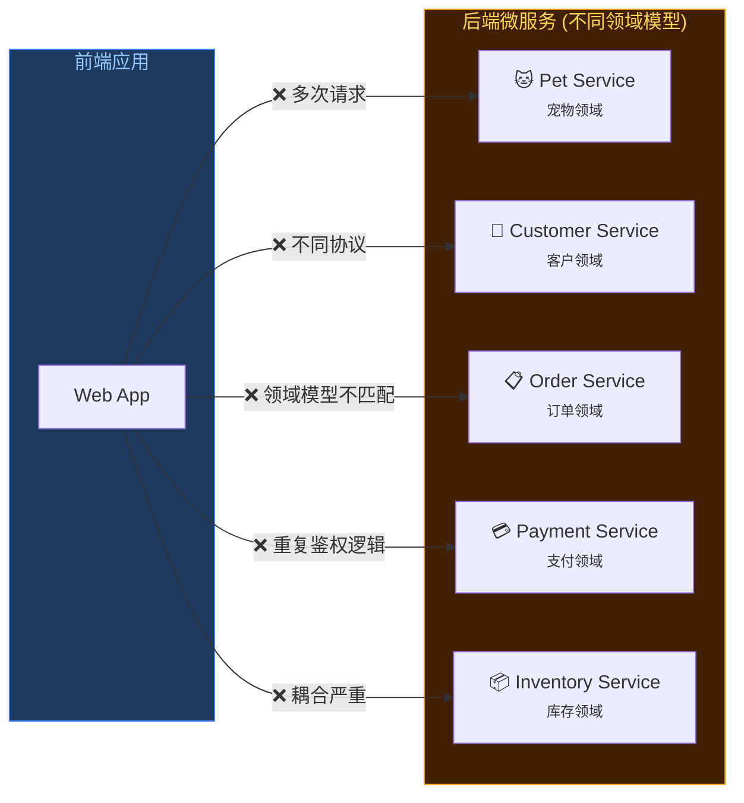

</div>

<div class="grid grid-cols-3 gap-4 mt-4 text-sm">
  <div class="p-3 bg-red-500/10 rounded border border-red-500/30">
    <span class="text-red-400 font-bold">N+1 请求问题</span>
    <div class="opacity-70 mt-1">一个页面发起数十个请求</div>
  </div>
  <div class="p-3 bg-red-500/10 rounded border border-red-500/30">
    <span class="text-red-400 font-bold">领域模型泄露</span>
    <div class="opacity-70 mt-1">前端被迫理解后端实现</div>
  </div>
  <div class="p-3 bg-red-500/10 rounded border border-red-500/30">
    <span class="text-red-400 font-bold">协议碎片化</span>
    <div class="opacity-70 mt-1">gRPC/REST/GraphQL 混杂</div>
  </div>
</div>

<!--
在微服务架构下，前端直连后端会面临诸多挑战：
1. N+1 请求问题：展示一个订单详情页，可能需要调用订单、客户、支付、宠物等多个服务
2. 领域模型泄露：每个微服务有自己的领域模型，前端需要理解所有后端的数据结构
3. 协议碎片化：有的服务用 gRPC，有的用 REST，前端需要适配多种协议
这些问题在团队规模变大、服务数量增多时会急剧恶化。
-->

---

## BFF: 微服务架构的桥梁

<div class="mt-4 flex justify-center">

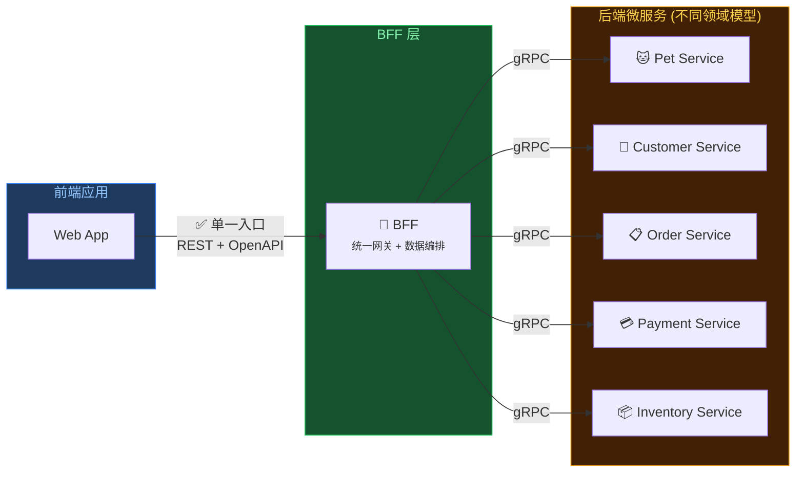

</div>

<div class="grid grid-cols-3 gap-4 mt-2 text-sm">
  <div class="p-3 bg-green-500/10 rounded border border-green-500/30">
    <span class="text-green-400 font-bold">✓ 请求聚合</span>
    <div class="opacity-70 mt-1">BFF 并发调用，前端单次请求</div>
  </div>
  <div class="p-3 bg-green-500/10 rounded border border-green-500/30">
    <span class="text-green-400 font-bold">✓ 模型转换</span>
    <div class="opacity-70 mt-1">领域模型 → 视图模型</div>
  </div>
  <div class="p-3 bg-green-500/10 rounded border border-green-500/30">
    <span class="text-green-400 font-bold">✓ 协议统一</span>
    <div class="opacity-70 mt-1">对外 REST，对内 gRPC</div>
  </div>
</div>

<!--
引入 BFF 后，架构变得清晰：
1. 请求聚合：BFF 在服务端并发调用多个微服务，前端只需要一次请求
2. 模型转换：BFF 将后端领域模型转换为前端友好的视图模型，前端不再关心后端实现
3. 协议统一：对前端暴露标准的 REST API，内部使用高性能的 gRPC 通信
BFF 就像一座桥梁，连接了前端的体验需求和后端的领域边界。
-->

---

## 多领域模型下的 BFF 定位

<div class="flex justify-center mt-6">

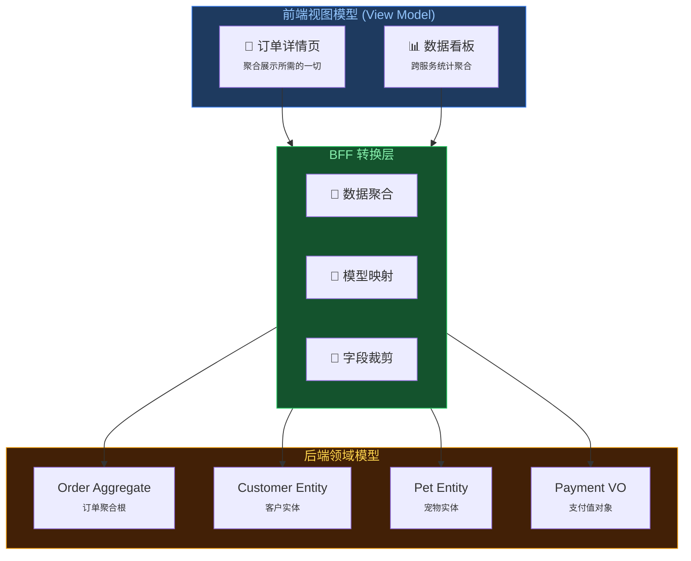

</div>

<div class="text-center mt-4 text-lg">
  <span class="text-green-400">BFF 是 DDD 领域边界与前端体验之间的</span>
  <span class="text-yellow-400 font-bold">「防腐层」</span>
</div>

<!--
在 DDD 驱动的微服务架构中，每个服务都有自己的限界上下文和领域模型。
但前端关心的是用户体验，需要的是视图模型。
BFF 作为「防腐层」，完成两个世界的翻译：
- 将后端严谨的领域模型转换为前端友好的视图模型
- 保护前端不受后端领域演进的影响
- 保护后端不被前端的频繁需求变更所干扰
这就是 BFF 在多领域模型架构中的核心定位。
-->

---
layout: center
---

## 方案对比

<div class="grid grid-cols-3 gap-4 mt-8 text-left">

<div class="p-4 border-2 border-gray-500/30 rounded-lg opacity-60">
  <div class="text-xl font-bold mb-4">🏛️ 传统方案</div>
  <div class="text-sm font-mono mb-2">Node.js + Swagger</div>
  <ul class="text-sm list-disc pl-4 space-y-2">
    <li>手动编写文档</li>
    <li>文档代码不同步</li>
    <li>类型主要靠文档约定</li>
    <li><span class="text-red-400">痛点：维护成本高，信赖度低</span></li>
  </ul>
</div>

<div class="p-4 border-2 border-yellow-500/30 rounded-lg opacity-80">
  <div class="text-xl font-bold mb-4">🚧 内部 Legacy</div>
  <div class="text-sm font-mono mb-2">API-v3 (Proto -> TS)</div>
  <ul class="text-sm list-disc pl-4 space-y-2">
    <li>Proto 直转 TS 类型</li>
    <li>需要重复编写 Proto</li>
    <li>类型是 number, 实际返回 null</li>
    <li><span class="text-yellow-400">痛点：类型不安全, 重复协议编写</span></li>
  </ul>
</div>

<div class="p-4 border-2 border-green-500/50 rounded-lg bg-green-500/10">
  <div class="text-xl font-bold mb-4 text-green-400">✨ 现有架构</div>
  <div class="text-sm font-mono mb-2">Schema-First</div>
  <ul class="text-sm list-disc pl-4 space-y-2">
    <li>Proto -> Zod -> OpenAPI</li>
    <li>端到端类型完全一致</li>
    <li>运行时自动校验</li>
    <li><span class="text-green-400">优势：类型绝对安全，开发高效</span></li>
  </ul>
</div>

</div>

<!--
我们来做一个横向对比：
1. 传统方案：靠文档堆砌，容易过时，前后端对着 Swagger 扯皮。
2. 我们内部的上一代方案 (API-v3)：虽然用了 Proto 生成 TS，但类型转换生硬，比如 Optional 字段在 JSON 里可能是 undefined，但在 TS 定义里可能是 null，导致大量的 NPE。
3. 现在的架构：Schema-First，从源头保证一致性，运行时强校验，彻底解决类型信任问题。
-->

---

## 历史包袱

<div class="grid grid-cols-2 gap-6 mt-6">

<div>

### 🔄 字段裁剪 → 重写协议

```protobuf
// 后端 Proto（包含内部字段）
message Pet {
  int64 id = 1;
  string name = 2;
  string internal_notes = 3;   // 内部备注
  int64 cost_price = 4;        // 成本价（敏感）
  string supplier_id = 5;      // 供应商ID
}
```

```protobuf
// BFF 需要裁剪敏感字段，必须重写
message BffPetResponse {
  int64 id = 1;
  string name = 2;
  // 不能暴露 internal_notes, cost_price...
}
```

<div class="text-sm text-red-400 mt-2">
⚠️ 每次字段变更都要同步修改两边 Proto
</div>

</div>

<div>

### 🔄 协议同步容易遗漏

```protobuf
// 后端 pet.proto（已更新）
message Pet {
  int64 id = 1;
  string name = 2;
  string vaccination_date = 3;  // 新增 ✅
}
```

```protobuf
// BFF bff_pet.proto（忘记同步）
message BffPetResponse {
  int64 id = 1;
  string name = 2;
  // vaccination_date 哪去了？❌
}
```

<div class="text-sm text-red-400 mt-2">
⚠️ 同步流程繁琐，协议多了容易漏
</div>

</div>

</div>

<!--
API-v3 架构的第一个问题是字段裁剪导致重写协议。
后端 Proto 可能包含敏感字段，比如成本价、供应商信息、内部备注，这些不能暴露给前端。
BFF 需要裁剪这些字段，就必须重新定义一套 Proto，无法直接复用后端的定义。

第二个问题是协议同步流程繁琐。
后端加了字段，BFF 的 Proto 要手动同步更新，步骤多了自然容易漏。
简化流程才能从根本上减少遗漏的可能。
-->

---

## Proto → TypeScript 的概念鸿沟

<div class="mt-6">

| Proto 概念 | 生成的 TypeScript | 实际 JSON | 问题 |
|-----------|------------------|-----------|------|
| `message Pet pet = 1` | `pet: Pet` | `null` | **message 默认 optional，TS 却显示必有** |
| `int64 id = 1` | `id: string` | `"12345..."` | **大整数只能用 string，JSON 不支持** |
| ... | ... | ... | **还有很多类似的概念差异** |

</div>

<div class="mt-8 p-4 bg-red-500/10 border border-red-500/30 rounded-lg">
  <div class="text-red-400 font-bold mb-2">💥 核心矛盾</div>
  <div class="text-sm">
    Proto 是为 <span class="text-yellow-400">二进制 RPC</span> 设计的，TypeScript 是为 <span class="text-blue-400">JSON REST</span> 设计的。<br/>
    两者的类型系统存在根本性差异，机械转换必然产生「概念鸿沟」。
  </div>
</div>

<!--
这是 API-v3 最致命的问题：Proto 和 TypeScript 之间存在概念鸿沟。

最典型的两个例子：
1. Proto 的 message 字段默认是 optional 的，但生成的 TS 类型显示是必有的，前端直接访问就会 NPE
2. Proto 的 int64 生成 string，因为 JSON 不支持大整数，这个 Schema 方案也一样，没办法

类似的差异还有很多，这些都会导致前端拿到的类型定义和实际运行时数据不匹配。
-->

---

## 真实案例：线上 NPE 事故

<div class="grid grid-cols-2 gap-6 mt-6">

<div>

### 类型定义

```typescript
// Proto 生成的类型定义
interface GetPetResponse {
  pet: Pet;          // 看起来一定有值
  owner: Customer;   // 看起来一定有值
}

interface Pet {
  id: number;
  vaccination: Vaccination; // 嵌套 message
}
```

```typescript
// 前端代码（相信类型定义）
const { pet, owner } = await getPet(id);

// 💥 运行时: Cannot read 'id' of undefined
console.log(pet.id);

// 💥 运行时: Cannot read 'date' of null
console.log(pet.vaccination.date);
```

</div>

<div>

### 实际 JSON 响应

```json
{
  "pet": null,
  "owner": null
}
```

或者

```json
{
  "pet": {
    "id": 123,
    "vaccination": null
  }
}
```

<div class="mt-4 p-3 bg-yellow-500/10 border border-yellow-500/30 rounded">
  <div class="text-yellow-400 font-bold text-sm">问题根源</div>
  <div class="text-xs mt-1 opacity-80">
    Proto 的 message 字段默认是 optional，<br/>
    但生成的 TS 类型没有体现这一点
  </div>
</div>

</div>

</div>

<!--
这是我们线上真实发生过的事故。

Proto 生成的类型定义显示 pet 和 owner 一定有值，但实际 JSON 响应里可能是 null。
前端开发者相信类型定义，直接访问 pet.id，结果线上 NPE。

更隐蔽的是 birthDate 字段，类型是 number，但实际可能是 null。
这种 bug 在开发和测试环境不一定能发现，往往到了线上才暴露。

Proto 的 message 字段默认是 optional 的，这个语义在转成 TypeScript 时丢失了。
-->

---

## 我们需要什么？

<div class="grid grid-cols-2 gap-8 mt-8">

<div class="space-y-4">

<div class="p-4 bg-red-500/10 border border-red-500/30 rounded-lg">
  <div class="text-red-400 font-bold">❌ 不要</div>
  <ul class="text-sm mt-2 space-y-1 opacity-80">
    <li>重复编写协议定义</li>
    <li>机械的类型转换</li>
    <li>运行时类型与定义不符</li>
    <li>Proto 概念泄露到前端</li>
  </ul>
</div>

</div>

<div class="space-y-4">

<div class="p-4 bg-green-500/10 border border-green-500/30 rounded-lg">
  <div class="text-green-400 font-bold">✅ 需要</div>
  <ul class="text-sm mt-2 space-y-1 opacity-80">
    <li>单一数据源，自动同步</li>
    <li>灵活的字段级转换能力</li>
    <li>运行时校验保证类型安全</li>
    <li>前端友好的 JSON 类型系统</li>
  </ul>
</div>

</div>

</div>

<div class="text-center mt-8">
  <div class="text-2xl">👇</div>
  <div class="text-xl text-green-400 font-bold mt-2">Schema-First 架构</div>
  <div class="text-sm opacity-60 mt-1">用 Zod Schema 作为 BFF 层的协议定义语言</div>
</div>

<!--
总结一下我们的诉求：
不要重复编写协议，不要机械转换，不要运行时和类型定义不符，不要把 Proto 概念泄露给前端。

我们需要的是：
单一数据源自动同步，灵活的字段级转换，运行时校验，以及前端友好的类型系统。

这就引出了我们的解决方案：Schema-First 架构，用 Zod Schema 作为 BFF 层的协议定义语言。
-->

---
layout: fact
---

## Schema Based Protocol

基于 Zod Schema 的协议定义

<!--
这一部分是整个分享的高潮，我们通过代码的演进，来展示类型是如何从后端流动到前端的。
-->

---

## 类型演进: 登录协议制定

<div mt-10></div>
````md magic-move {lines: true}
```protobuf
// 1. 后端定义 (Source of Truth)
// authn_service.proto
message LoginRequest {
  string email = 1;
  string password = 2;
}

message LoginResponse {
  string session_token = 1;
  UserProfile user = 2;
}
```

```typescript
// 2. 编写 Zod Schema
export const zLoginRequest = z.object({
  email: z.string(),
  password: z.string(),
});

export const zLoginResponse = z.object({
  sessionToken: z.string(),
  user: z.object({...}),
});
```

```typescript
// 3. BFF 路由定义 (Server Implementation)
// login.ts
export const loginRoute = createRoute({
  method: 'post',
  path: '/login',
  request: createJsonRequest(zLoginRequest),
  responses: {
    ...createJsonResponse(HTTP_CODE.SUCCESS, zLoginResponse, 'Login success'),
  },
});
```

```typescript
// 4. 前端 Client (Fully Typed)
// 开发者直接调用，享受完整类型提示

const res = await BFFLoginClient.login({
//    ^? const res: LoginResponse
  email: "doctorwu@moego.pet",
  password: "password123",
});

```
````

<!--
我们先看最朴素的实现方式：
1. 起点：后端的 Proto 文件，定义了最原始的数据结构。
2. 手写：对照 Proto，手动编写 Zod Schema。虽然简单，但能工作。
3. 应用：在 BFF 路由中使用这个 Schema，绑定输入输出。
4. 终局：前端通过 Client 调用，享受类型提示。

看起来不错对吧？但这里埋下了一个隐患，我们稍后会回来解决。
-->

---
layout: fact
---

## 这样就够了吗?
---

## 痛点：手写 Schema 的代价

<div class="mt-8">


````md magic-move {lines: true}
```typescript
// 手写版本看起来很简单...
export const zLoginRequest = z.object({
  email: z.string(),
  password: z.string(),
});
```

```typescript
// 但实际项目中，Proto 定义远比这复杂
// 一个真实的 LoginResponse 可能长这样：
export const zLoginResponse = z.object({
  sessionToken: z.string(),
  user: z.object({
    id: z.string(),
    email: z.string(),
    profile: z.object({
      firstName: z.string(),
      lastName: z.string(),
      avatar: z.string().optional(),
      // ... 20+ 个字段
    }),
    permissions: z.array(z.string()),
    createdAt: z.string(),
    // ... 还有更多
  }),
});
```

```typescript
// ❌ 问题1：Proto 字段更新了，Schema 忘记同步
// authn_service.proto 新增了 mfa_enabled 字段
message LoginResponse {
  string session_token = 1;
  UserProfile user = 2;
  bool mfa_enabled = 3;  // 新增！
}

// 但 Zod Schema 还是旧的...
// 运行时校验会失败，或者更糟——静默丢失数据
```

```typescript
// ❌ 问题2：200+ 个 Proto message，手写要写到什么时候？
// customer.proto: 45 个 message
// order.proto: 67 个 message  
// payment.proto: 38 个 message
// ...

// 估算：平均每个 message 10 分钟
// 200 个 × 10 分钟 = 33 小时纯手写
// 还不算后续维护...
```
````

</div>

<v-clicks>

- **同步问题**：Proto 更新后，手写的 Schema 容易遗漏
- **规模问题**：200+ 个 message，手写不现实
- **维护成本**：每次后端改动都要同步更新

</v-clicks>

<!--
现在让我们回到之前的 Login 例子。
手写一两个 Schema 还好，但真实项目中我们有 200+ 个 Proto message。
更要命的是，后端经常会新增字段，如果手写 Schema 忘记同步，轻则运行时报错，重则数据丢失。
这就是我们需要自动化的原因。
-->

---
layout: fact
---

## Automatic Schema Generation
Schema 自动化生成

<!--
既然手写不可行，那就让机器来帮我们生成。
接下来我们看看如何实现 Proto 到 Zod Schema 的自动化转换。
-->

---

## Callback：Login 的完整演进

<div mt-6></div>

现在让我们看看完整的自动化版本：

````md magic-move {lines: true}
```typescript
// 之前：手写版本 😰
export const zLoginRequest = z.object({
  email: z.string(),
  password: z.string(),
});
// 痛点：容易与 Proto 不同步、缺少文档
```

```protobuf
// 起点：Proto 定义 (Source of Truth)
message LoginRequest {
  // 用户的电子邮件地址
  string email = 1;
  // 用户的密码
  string password = 2;
}
```

```typescript
// Step 1: protobuf-es 生成 TS 类型
export type LoginRequest = Message<"backend.proto.authn.v1.LoginRequest"> & {
  /**
   * 用户的电子邮件地址。
   * @generated from field: string email = 1;
   */
  email: string;
  /**
   * 用户的密码。
   * @generated from field: string password = 2;
   */
  password: string;
}
```

```typescript
// Step 2: ts-to-zod + ast-grep 自动生成 ✨
export const zLoginRequest = z.object({
  /**
   * 用户的电子邮件地址。
   * @generated from field: string email = 1;
   */
  email: z.string(),
  /**
   * 用户的密码。
   * @generated from field: string password = 2;
   */
  password: z.string(),
}).openapi('LoginRequest');

// ✅ 自动同步 + 运行时校验 + OpenAPI 元数据
```

```typescript
// Step 3: BFF 路由直接引用生成的 Schema
import { zLoginRequest, zLoginResponse } from '@moego/bff-schemas';

export const loginRoute = createRoute({
  method: 'post',
  path: '/login',
  request: createJsonRequest(zLoginRequest),
  responses: createJsonResponse(HTTP_CODE.SUCCESS, zLoginResponse),
});

// ✅ Schema 即契约，路由定义零重复
```

```typescript
// Step 4: 前端享受完整类型提示
const res = await BFFLoginClient.login({
//    ^? const res: LoginResponse
  email: "doctorwu@moego.pet",
  password: "password123",
});

// ✅ 类型安全 + 运行时校验 + 零手写
```
````

<!--
让我们回顾整个演进过程：
1. 从手写的朴素 Schema 开始
2. 发现维护成本太高
3. 引入自动化：Proto → TS 类型 → Zod Schema
4. BFF 路由直接引用生成的 Schema，零重复定义
5. 最终：前端零手写，享受完整类型安全

这就是端到端类型安全的完整链路！
-->

---

## 派生 Schema：灵活组合

<div class="grid grid-cols-2 gap-6 mt-4">

<div class="p-4 border-2 border-green-500/30 rounded-lg bg-green-500/5">
  <div class="text-lg font-bold mb-3 text-green-400">✨ Zod Schema 派生</div>

```typescript
// 基于生成的 Schema 快速派生
const zCreateUser = zUser.omit({ 
  id: true, 
  createdAt: true 
});

const zUpdateUser = zUser.pick({ 
  name: true, 
  email: true 
}).partial();

const zUserWithPets = zUser.extend({ 
  pets: z.array(zPet) 
});
```

  <div class="text-xs mt-3 text-green-300">✅ 一行代码，类型自动推导</div>
</div>

<div class="p-4 border-2 border-red-500/30 rounded-lg bg-red-500/5 opacity-70">
  <div class="text-lg font-bold mb-3 text-red-400">😵 Protobuf 对等实现</div>

```protobuf
// 需要手动定义每个变体...
message CreateUserRequest {
  string name = 1;
  string email = 2;
  // 手动复制，容易遗漏字段
}

message UpdateUserRequest {
  optional string name = 1;
  optional string email = 2;
  // 每个字段都要加 optional
}
```

  <div class="text-xs mt-3 text-red-300">❌ 重复定义，同步维护噩梦</div>
</div>

</div>

<v-click>
<div class="mt-4 text-center">
  <div class="inline-block px-4 py-2 bg-blue-500/10 border border-blue-500/30 rounded-lg text-sm">
    <span class="text-blue-400 font-bold">Zod Schema 优势：</span>
    <span class="opacity-70 ml-2">组合能力强 + 类型推导准确 + 永远与源 Schema 同步</span>
  </div>
</div>
</v-click>

<!--
这是 Zod Schema 相比 Protobuf 的一个巨大优势。

在 Protobuf 的世界里，如果你想要一个"创建用户"的请求体（不包含 id 和 createdAt），
你需要手动定义一个新的 message，手动复制字段。
如果原 message 新增了字段，你还得记得同步到所有变体。

而在 Zod 的世界里，一行 .omit() 就搞定了，类型自动推导，永远和原 Schema 保持同步。
这就是选择 Zod Schema 作为协议定义的核心原因之一：强大的组合和派生能力。
-->

---
layout: fact
---
## 还能更好吗?
---

## 新目标：让 OpenAPI 拥有字段描述

<div class="grid grid-cols-2 gap-6 mt-6">

<div class="p-4 border-2 border-gray-500/30 rounded-lg">
  <div class="text-lg font-bold mb-3 text-gray-400">📝 当前状态</div>
  <div class="text-xs opacity-60 mb-2">注释仅存在于代码中，OpenAPI 文档没有字段描述</div>

```typescript
export const zUserSchema = z.object({
  /** 用户昵称 */
  nickname: z.string(),
  /** 注册时间 */
  createdAt: zDate,
});
```

</div>

<div class="p-4 border-2 border-green-500/30 rounded-lg bg-green-500/5">
  <div class="text-lg font-bold mb-3 text-green-400">🎯 目标状态</div>
  <div class="text-xs opacity-60 mb-2">注释被提取到 .openapi() 中，生成的文档有描述</div>

```typescript
export const zUserSchema = z.object({
  /** 用户昵称 */
  nickname: z.string()
    .openapi({ description: "用户昵称" }),
  /** 注册时间 */
  createdAt: zDate
    .openapi({ description: "注册时间" }),
});
```

</div>

</div>

<v-click>
<div class="mt-6 text-center">
  <div class="inline-block px-4 py-2 bg-blue-500/10 border border-blue-500/30 rounded-lg">
    <span class="text-blue-400 font-bold">Goal:</span>
    <span class="opacity-70 ml-2">自动把注释转换为 OpenAPI description</span>
  </div>
</div>
</v-click>

<!--
在完成了 Proto 到 Zod 的自动转换后，我们遇到了一个新问题：
虽然 Proto 的注释已经保留到了生成的 TS 类型中，但 OpenAPI 文档里却没有字段描述。

我们的目标是：把这些注释自动提取出来，添加到每个字段的 .openapi() 调用中。
这样生成的 API 文档就会有完整的字段说明，大大提升可读性。
-->

---

## 如何实现？传统方案的困境

<div class="grid grid-cols-2 gap-6 mt-8">

<div class="p-4 border-2 border-yellow-500/30 rounded-lg bg-yellow-500/5">
  <div class="text-xl font-bold mb-3 text-yellow-400">🔧 方案一：正则表达式</div>
  <code class="block bg-black/30 p-2 rounded text-yellow-300 text-xs mb-3 break-all">
    /\/\*\*[\s\S]*?\*\/\s*(\w+):\s*(z\.\w+)/g
  </code>
  <ul class="text-sm list-disc pl-4 space-y-2 opacity-80">
    <li>无法准确匹配"紧邻"关系</li>
    <li>多行注释处理困难</li>
    <li>格式稍变就失效</li>
    <li class="text-yellow-300">嵌套结构？噩梦开始</li>
  </ul>
</div>

<div class="p-4 border-2 border-red-500/30 rounded-lg bg-red-500/5">
  <div class="text-xl font-bold mb-3 text-red-400">🏗️ 方案二：TS Compiler API</div>
  <ul class="text-sm list-disc pl-4 space-y-2 opacity-80">
    <li>完整的 AST 解析能力</li>
    <li>能理解代码结构</li>
    <li class="text-red-300">但 API 复杂，学习成本高</li>
    <li class="text-red-300">写个转换脚本要几百行</li>
  </ul>
  <div class="mt-4 text-center text-2xl">🤯</div>
</div>

</div>

<v-click>
<div class="mt-6 text-center">
  <div class="inline-block px-4 py-2 bg-cyan-500/10 border border-cyan-500/30 rounded-lg">
    <span class="opacity-70">有没有</span>
    <span class="text-cyan-400 font-bold mx-2">轻量又强大</span>
    <span class="opacity-70">的方案？</span>
  </div>
</div>
</v-click>

<!--
那么如何实现这个目标呢？

方案一：正则表达式。看看这个正则，是不是已经开始头疼了？
问题在于正则是基于文本匹配的，它无法理解代码的结构。
比如注释和字段之间的"紧邻"关系，多行注释的边界，嵌套的对象结构...
这些用正则处理都是噩梦。

方案二：TypeScript Compiler API。它确实能完整解析 AST，理解代码结构。
但问题是 API 太复杂了，光是遍历 AST、处理各种节点类型，就要写几百行代码。
杀鸡用牛刀，维护成本也很高。

有没有既能理解代码结构，又足够轻量的方案呢？
-->

---
layout: fact
---

## {AstGrep}
Grep & Rewrite

<!--
这时候，ast-grep 登场了！
它不是基于文本匹配，而是基于 AST（抽象语法树）来搜索和替换代码。
就像用 CSS 选择器操作 DOM 一样，ast-grep 让我们可以精准地定位代码结构。
-->

---

## Regex vs Ast-Grep

<div class="grid grid-cols-2 gap-8 mt-10">

<div class="opacity-60">
  <div class="text-xl mb-4">😭😵‍💫 Regex (文本匹配)</div>
  <code class="block bg-black/30 p-2 rounded text-red-300 h-25 items-center flex">
    /message\s+(\w+)\s*{/g
  </code>
  <ul class="mt-4 text-sm list-disc pl-4">
    <li>脆弱，极其依赖格式</li>
    <li>无法理解上下文</li>
    <li>处理嵌套结构就是噩梦</li>
  </ul>
</div>

<div>
  <div class="text-xl mb-4 text-green-400">✨😄 AST-Grep (结构化匹配)</div>
  <code class="block bg-black/30 p-2 rounded text-green-300">
    rule:<br>
      &nbsp;&nbsp; kind: class_declaration<br>
      &nbsp;&nbsp; has:<br>
      &nbsp;&nbsp;&nbsp;&nbsp; field: { name: z.lazy }<br>
  </code>
  <ul class="mt-4 text-sm list-disc pl-4">
    <li>精准，基于语法树</li>
    <li>上下文感知</li>
    <li>像 jQuery 一样操作代码</li>
  </ul>
</div>

</div>

<!--
传统的正则表达式在处理复杂的嵌套代码时非常脆弱。
AST-Grep 允许我们基于抽象语法树 (AST) 进行搜索和替换，就像用 CSS 选择器操作 DOM 一样简单精准。
-->

---

## Ast-Grep: Context-Aware Search

<div mt-4></div>
````md magic-move
```typescript
// Before: 只有注释
const UserSchema = z.object({
  /** 用户昵称 */
  nickname: z.string(),

  /** 注册时间 */
  createdAt: zDate,
});
```

```typescript
// After: 自动根据注释生成 .openapi()
const UserSchema = z.object({
  /** 用户昵称 */
  nickname: z.string()
    .openapi({ description: "用户昵称" }),

  /** 注册时间 */
  createdAt: zDate
    .openapi({ description: "注册时间" }),
});
```
<!-- Right: Implementation (Process) -->
```typescript {all|1-11|12-18|all}
// 1. Capture: Fild fields following comments
root.findAll({
  rule: {
    kind: 'pair',          // Target: Field
    pattern: '$PAIR',
    follows: {             // Relation
      kind: 'comment',
      pattern: '$COMMENT',
    },
  },
});

// 2. Replace: Append .openapi()
node.replace(
  `${pair}.openapi({ 
      description: "${comment}" 
  })`
);
```
````

<!--
这是我们在生成 Schema 时的真实场景。
为了让生成的 OpenAPI 文档包含字段注释，我们需要找到位于字段定义上方的注释块。
利用 ast-grep 的 follows (Relation) 规则，我们可以轻松匹配到"紧跟在注释之后"的字段，并提取注释内容自动填充到 description 中。
-->

---
layout: full
---

<iframe 
  src="https://ast-grep.github.io/playground.html#eyJtb2RlIjoiQ29uZmlnIiwibGFuZyI6InR5cGVzY3JpcHQiLCJxdWVyeSI6IiRDOiAkVCA9IHJlbGF0aW9uc2hpcCgkJCRBLCB1c2VsaXN0PVRydWUsICQkJEIpIiwicmV3cml0ZSI6IiRDOiBMaXN0WyRUXSA9IHJlbGF0aW9uc2hpcCgkJCRBLCB1c2VsaXN0PVRydWUsICQkJEIpIiwic3RyaWN0bmVzcyI6InNtYXJ0Iiwic2VsZWN0b3IiOiIiLCJjb25maWciOiJpZDogem9kLWNvbW1lbnRcbmxhbmd1YWdlOiBUeXBlU2NyaXB0XG5ydWxlOlxuICBraW5kOiBwYWlyXG4gIHBhdHRlcm46ICRQQUlSXG4gIGZvbGxvd3M6XG4gICAga2luZDogY29tbWVudFxuICAgIHBhdHRlcm46ICRDT01NRU5UXG5cbiAgICAiLCJzb3VyY2UiOiJleHBvcnQgY29uc3QgelRpY2tldENvbW1lbnQgPSB6Lm9iamVjdCh7XG4gIC8qKlxuICAgKiBJRFxuICAgKi9cbiAgaWQ6IHpJZCxcbiAgLyoqXG4gICAqIOWkh+azqOWGheWuuVxuICAgKi9cbiAgbm90ZTogei5zdHJpbmcoKSxcbiAgLyoqXG4gICAqIOWIm+W7uuS6ulxuICAgKi9cbiAgY3JlYXRlQnk6IHoubnVtYmVyKCksXG4gIC8qKlxuICAgKiDliJvlu7rml7bpl7RcbiAgICovXG4gIGNyZWF0ZVRpbWU6IHpUaW1lc3RhbXBNaWxsaXNlY29uZHMsXG4gIC8qKlxuICAgKiDmm7TmlrDkurpcbiAgICovXG4gIHVwZGF0ZUJ5OiB6Lm51bWJlcigpLFxuICAvKipcbiAgICog5pu05paw5pe26Ze0XG4gICAqL1xuICB1cGRhdGVUaW1lOiB6VGltZXN0YW1wTWlsbGlzZWNvbmRzLFxuICAvKipcbiAgICog5Lia5YqhSURcbiAgICovXG4gIGJ1c2luZXNzSWQ6IHpJZCxcbiAgLyoqXG4gICAqIOmihOe6puaXpeacn1xuICAgKi9cbiAgYXBwb2ludG1lbnREYXRlOiB6LnN0cmluZygpLFxuICAvKipcbiAgICog6aKE57qm57uT5p2f5pel5pyfXG4gICAqL1xuICBhcHBvaW50bWVudEVuZERhdGU6IHouc3RyaW5nKCksXG4gIC8qKlxuICAgKiDmk43kvZzogIXlkI1cbiAgICovXG4gIG9wZXJhdG9yRmlyc3ROYW1lOiB6LnN0cmluZygpLFxuICAvKipcbiAgICog5pON5L2c6ICF5aeTXG4gICAqL1xuICBvcGVyYXRvckxhc3ROYW1lOiB6LnN0cmluZygpLFxuICAvKipcbiAgICog5pON5L2c6ICF5aS05YOPXG4gICAqL1xuICBvcGVyYXRvckF2YXRhcjogei5zdHJpbmcoKSxcbiAgLyoqXG4gICAqIOaTjeS9nOiAheminOiJsuS7o+eggVxuICAgKi9cbiAgb3BlcmF0b3JDb2xvckNvZGU6IHouc3RyaW5nKCksXG59KS5vcGVuYXBpKCdUaWNrZXRDb21tZW50Jyk7In0=" 
  style="width: 165%; height: 170%; transform: scale(0.6); transform-origin: top left;"
></iframe>

<style>
.slidev-layout {
  padding:0!important;
}
</style>

---

## 新问题：循环引用导致类型失效

<div class="grid grid-cols-2 gap-6 mt-6">

<div class="p-4 border-2 border-yellow-500/30 rounded-lg bg-yellow-500/5">
  <div class="text-lg font-bold mb-3 text-yellow-400">🔄 什么是循环引用？</div>
  <div class="text-sm opacity-80 mb-3">Schema 中的字段引用了自身类型</div>

```typescript
// 服务实例包含子服务（套餐）
const zServiceInstance = z.object({
  id: zId,
  name: z.string(),
  // 👇 addons 是 ServiceInstance 数组
  addons: z.array(zServiceInstance), 
});
```

  <div class="text-xs mt-2 opacity-60">常见场景：树形结构、评论回复、组织架构...</div>
</div>

<div class="p-4 border-2 border-red-500/30 rounded-lg bg-red-500/5">
  <div class="text-lg font-bold mb-3 text-red-400">❌ 传统方案 z.lazy 的痛点</div>

```typescript
// 必须用 z.lazy 包装 + 手写类型断言
const zServiceInstance = z.lazy(() =>
  z.object({
    addons: z.array(zServiceInstance),
  })
) as unknown as z.ZodSchema<ServiceInstance>;
//              👆 类型推断完全失效！
```

  <div class="text-xs mt-3 space-y-1">
    <div class="text-red-300">• z.infer 失效，必须手写 Interface</div>
    <div class="text-red-300">• .extend() / .pick() 无法使用</div>
    <div class="text-red-300">• 派生 Schema 需要多重断言</div>
  </div>
</div>

</div>

<!--
在自动生成 Schema 的过程中，我们遇到了一个棘手的问题：循环引用。

什么是循环引用？比如"服务实例"包含"子服务"，子服务本身也是服务实例，形成了自引用。
树形结构、评论回复、组织架构等场景都会遇到。

传统的解决方案是用 z.lazy 包装，但这会导致类型推断完全失效，
你必须手写 Interface，而且刚才讲的 .extend() / .pick() 这些派生能力也全都用不了。
-->

---

## z.lazy 扩展之痛

```typescript
// 想要基于 zServiceInstance 扩展一个字段？
// ❌ 必须 unwrap + 多重断言 + 手写 Interface
const zExtended = ((zServiceInstance as any)
  .unwrap() as z.ZodObject<any>)
  .extend({
    extra: z.string()
  }) as unknown as z.ZodType<ExtendedServiceInstance>;

// 😱 这还只是扩展一个字段...
// 如果要 pick / omit / merge 呢？
```

<v-click>
<div class="mt-6 text-center">
  <div class="inline-block px-4 py-2 bg-cyan-500/10 border border-cyan-500/30 rounded-lg">
    <span class="opacity-70">我们需要一种方案：</span>
    <span class="text-cyan-400 font-bold mx-2">既能处理循环引用，又能保留类型推断</span>
  </div>
</div>
</v-click>

<!--
如果你想基于 z.lazy 包装的 Schema 做扩展，看看这段代码有多恐怖。
unwrap、多重类型断言、手写 Interface...
这还只是扩展一个字段，如果要做 pick、omit、merge 呢？

我们需要找到一种方案，既能处理循环引用，又能保留 Zod 的类型推断能力。
-->

---

## 💡 灵光一闪

<div class="mt-8 text-center">

<div class="text-xl opacity-70 mb-6">被 z.lazy 的类型问题困扰时，我突然想起...</div>

<div class="inline-block p-6 bg-cyan-500/10 border-2 border-cyan-500/30 rounded-xl">
  <div class="text-2xl mb-2">🤔</div>
  <div class="text-xl">Zod4 好像新支持了 <span class="text-cyan-400 font-bold">Getter 属性</span>？</div>
</div>

</div>

<v-click>

<div class="mt-8 text-center">
  <div class="text-lg opacity-60">不如试试看...</div>
</div>

</v-click>

<!--
被 z.lazy 的类型推断问题困扰了很久。
有一天，我突然想起来 Zod4 新支持了 Getter 属性语法。

虽然不确定能不能解决问题，但不如试试看...
-->

---

## 实验：渐进式改造

<div class="mt-4">

````md magic-move {lines: true}
```typescript
// 原来的写法：z.lazy + 普通属性
const zServiceInstance = z.lazy(() => z.object({
  id: z.string(),
  addons: z.array(zServiceInstance),
})) as unknown as z.ZodSchema<ServiceInstance>;
// ❌ 类型推断失效
```

```typescript
// 尝试 1：换成 Getter
const zServiceInstance = z.lazy(() => z.object({
  id: z.string(),
  get addons() { return z.array(zServiceInstance); },
})) as unknown as z.ZodSchema<ServiceInstance>;
// 🤔 试试看...
```

```typescript
// 尝试 1：换成 Getter
const zServiceInstance = z.lazy(() => z.object({
  id: z.string(),
  get addons() { return z.array(zServiceInstance); },
}));
// ✅ 类型推断正常了！不需要 as 断言！
```

```typescript
// 尝试 2：大胆一点，去掉 z.lazy？
const zServiceInstance = z.object({
  id: z.string(),
  get addons() { return z.array(zServiceInstance); },
});
// 🤔 没有 z.lazy 包装...
```

```typescript
// 尝试 2：大胆一点，去掉 z.lazy？
const zServiceInstance = z.object({
  id: z.string(),
  get addons() { return z.array(zServiceInstance); },
});
// 🎉 居然也可以！
```
````

</div>

<v-click>

<div class="mt-4 p-4 bg-green-500/10 border border-green-500/30 rounded-lg">
  <div class="grid grid-cols-3 gap-4 text-sm text-center">
    <div class="p-2 bg-green-500/10 rounded">
      <div class="text-green-400">✅ 类型推断</div>
      <div class="opacity-70">z.infer 正常</div>
    </div>
    <div class="p-2 bg-green-500/10 rounded">
      <div class="text-green-400">✅ 派生能力</div>
      <div class="opacity-70">.extend() 可用</div>
    </div>
    <div class="p-2 bg-green-500/10 rounded">
      <div class="text-green-400">✅ 运行时</div>
      <div class="opacity-70">校验正常</div>
    </div>
  </div>
</div>

</v-click>

<v-click>

<div class="mt-4 text-center">
  <div class="inline-block px-4 py-2 bg-yellow-500/10 border border-yellow-500/30 rounded-lg">
    <span class="text-yellow-400 font-bold">等等，为什么这样可以？🤔</span>
  </div>
</div>

</v-click>

<!--
让我们做个实验，渐进式地改造这段代码。

首先，把自引用字段换成 Getter... 类型推断正常了！

然后大胆一点，把 z.lazy 也去掉... 居然也可以！

类型推断正常，派生能力恢复，运行时校验也没问题。
但这就引出了一个问题：为什么这样可以？
-->

---
layout: fact
---

## 探究原理

为什么 Getter 可以，普通属性不行？

<!--
现在让我们来研究一下背后的原理。
为什么 Getter 可以解决循环引用的类型推断问题，而普通属性不行？
-->

---

## 普通属性：编译器的困境

<div class="grid grid-cols-2 gap-6">
<div class="mt-6">

```typescript
const zServiceInstance = z.object({
  id: z.string(),
  addons: z.array(zServiceInstance),
  //             ^^^^^^^^^^^^^^^^
});
```

</div>

<div class="mt-6 flex justify-center">

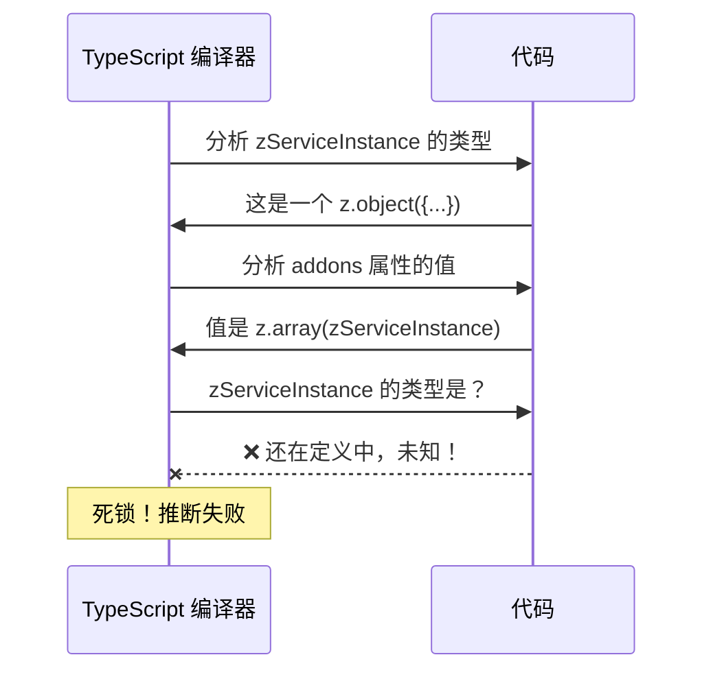

</div>
</div>

<!--
当编译器分析普通属性时，它必须立刻求出属性值的类型。

编译器问：addons 的类型是什么？
代码说：是 z.array(zServiceInstance)
编译器问：那 zServiceInstance 的类型是什么？
代码说：呃...还在定义中...

死锁了！编译器无法在定义一个变量的同时，读取这个变量的类型。
-->

---

## Function：编译器的特殊待遇

<div class="grid grid-cols-2 gap-6">
<div class="mt-6">

```typescript
const zServiceInstance = z.object({
  id: z.string(),
  get addons() { return z.array(zServiceInstance); },
  //  ^^^^^^ 这是一个函数定义
});
```

</div>

<div class="mt-6 flex justify-center">

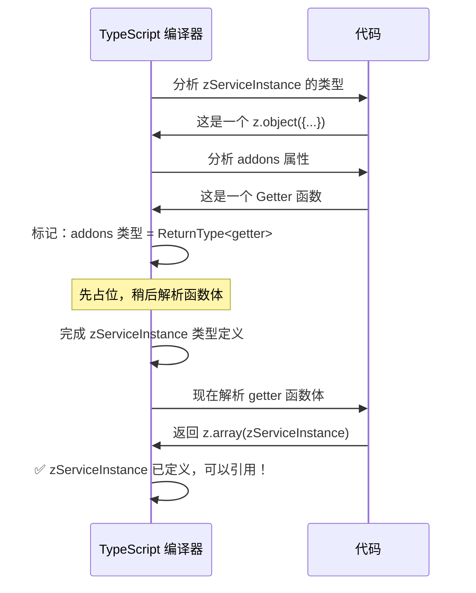

</div>
</div>

<!--
但 Getter 不一样，它是一个函数定义。

编译器看到 Getter 时，不会立刻分析函数体内部。
它先用 ReturnType 占个位：addons 的类型等于这个 getter 的返回类型。

等整个 zServiceInstance 定义完成后，编译器再回来解析 getter 函数体。
这时候 zServiceInstance 已经定义好了，可以正常引用！

这就是 Getter 的特殊待遇：延迟解析函数体。
-->

---

## 那 z.lazy 的箭头函数呢？

<div class="mt-4 text-center text-lg opacity-70">
z.lazy 外面不也包了一层箭头函数吗？为什么不能延迟？
</div>

<v-click>

<div class="mt-6 p-4 bg-yellow-500/10 border border-yellow-500/30 rounded-lg">
  <div class="text-yellow-400 font-bold mb-2">先看 z.lazy 的类型签名</div>

```typescript
// T 是我们要推导的目标类型
function lazy<T>(builder: () => T): ZodLazy<T> { ... }
```

  <div class="text-sm opacity-80 mt-3">
    TS 的任务：通过分析 <code>builder</code> 函数的<span class="text-yellow-400 font-bold">返回值</span>，推导出 <code>T</code> 是什么
  </div>
</div>

</v-click>

<v-click>

<div class="mt-4 p-4 bg-red-500/10 border border-red-500/30 rounded-lg">
  <div class="text-red-400 font-bold mb-2">问题来了</div>
  <div class="text-sm opacity-80">
    为了推导 <code>T</code>，TS 必须<span class="text-red-400 font-bold">深入分析</span>箭头函数内部的 <code>z.object({...})</code><br/>
    箭头函数只是<span class="text-red-400 font-bold">运行时延迟</span>，不是<span class="text-red-400 font-bold">类型推导延迟</span>！
  </div>
</div>

</v-click>

<!--
先看 z.lazy 的类型签名。

z.lazy 是一个泛型函数，T 是我们要推导的目标类型。
TS 的任务是：通过分析 builder 函数的返回值，解出 T 等于什么。

所以即使外面包了一层箭头函数，TS 还是要深入分析里面的内容。
箭头函数解决的是运行时的延迟执行问题，不是类型推导的延迟问题。
-->

---

## z.lazy 推导过程：求值依赖

<div class="grid grid-cols-2 gap-6">
<div class="mt-4">

```typescript
const zService = z.lazy(() => z.object({
  addons: z.array(zServiceInstance)
}));
```

<div class="mt-3 p-3 bg-red-500/10 border border-red-500/30 rounded-lg text-sm">
  <span class="text-red-400 font-bold">求值依赖</span>：要算出 T，先要知道参数类型；要知道参数类型，先要算出 T
</div>

</div>

<div class="mt-4 flex justify-center">

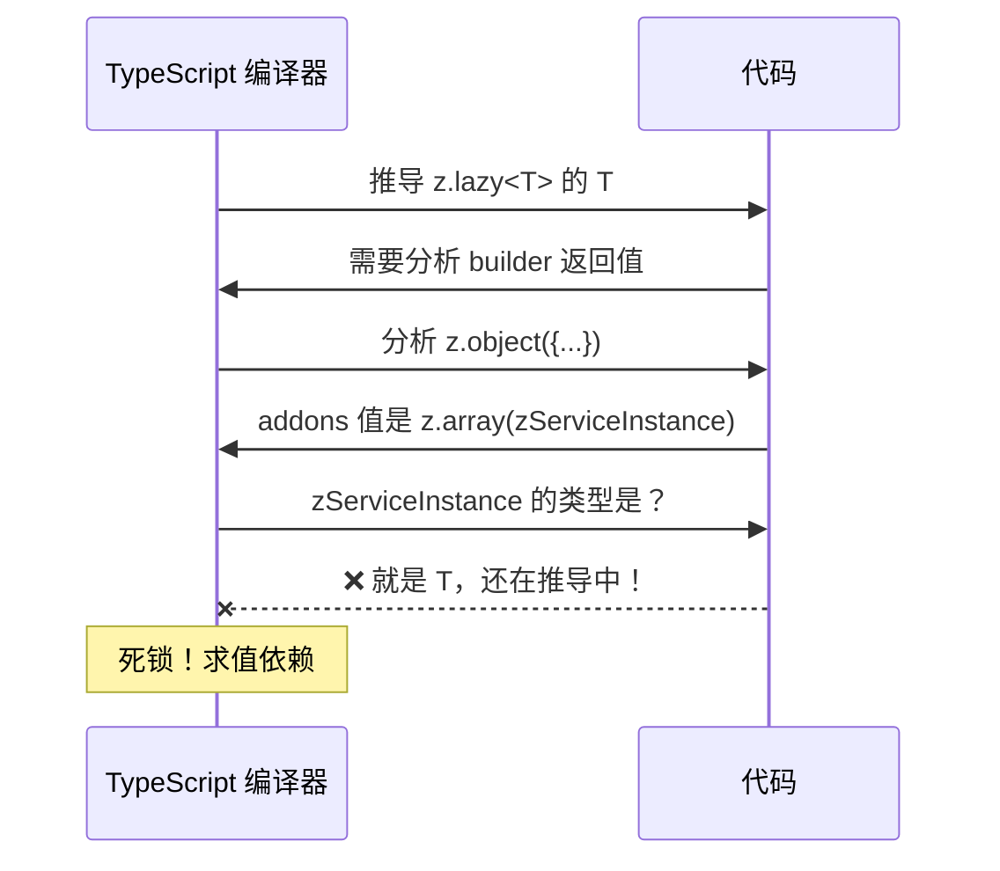

</div>
</div>

<!--
让我们像解方程一样看这个推导过程。

TS 要推导 T，就要分析 builder 的返回值。
返回值是 z.object，那就分析每个字段。
遇到 addons 字段，值是 z.array(zServiceInstance)。
这是一个函数调用，要知道返回类型，先要知道参数 zServiceInstance 的类型。
但 zServiceInstance 的类型就是 T，还在推导中！

这就是"求值依赖"：要算 T 先要知道参数，要知道参数先要算 T。死锁了。
-->

---

## Getter 推导过程：结构依赖

<div class="grid grid-cols-2 gap-6">
<div class="mt-4">

```typescript
const zService = z.object({
  get addons() {
    return z.array(zServiceInstance);
  }
});
```

<div class="mt-3 p-3 bg-green-500/10 border border-green-500/30 rounded-lg text-sm">
  <span class="text-green-400 font-bold">结构依赖</span>：先建立类型结构，再填充具体类型，允许递归引用
</div>

</div>

<div class="mt-4 flex justify-center">

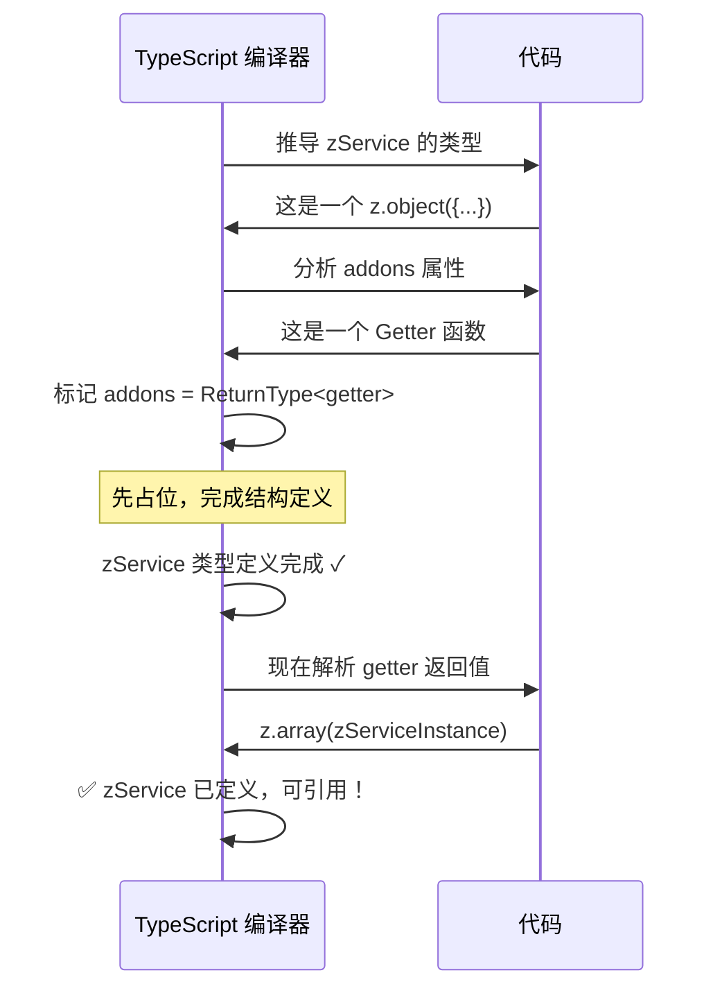

</div>
</div>

<!--
Getter 的推导过程完全不同。

TS 分析 z.object，遇到 addons 是一个 Getter。
它不需要立刻分析 Getter 内部，只需要标记：addons 的类型等于这个 Getter 的返回类型。
这样 zService 的类型结构就建立好了。
然后回来解析 Getter 的返回值时，zService 已经定义完成，可以正常引用。

这就是"结构依赖"：先建立类型结构，再填充具体类型。TS 允许这种形式的递归。
-->

---

## 总结：求值依赖 vs 结构依赖

<div class="grid grid-cols-2 gap-8 mt-6">

<div class="p-5 bg-red-500/10 border-2 border-red-500/30 rounded-xl">
  <div class="text-xl font-bold text-red-400 mb-3">❌ 求值依赖</div>

```typescript
z.array(zServiceInstance)
//      ^^^^^^^^^^^^^^^^
//      作为参数，必须立即求值
```

  <div class="mt-3 text-sm opacity-80">
    要算出 T → 先要知道参数类型<br/>
    要知道参数类型 → 先要算出 T<br/>
    <span class="text-red-400">→ 死锁！</span>
  </div>
</div>

<div class="p-5 bg-green-500/10 border-2 border-green-500/30 rounded-xl">
  <div class="text-xl font-bold text-green-400 mb-3">✅ 结构依赖</div>

```typescript
get addons() {
  return z.array(zServiceInstance);
}
```

  <div class="mt-3 text-sm opacity-80">
    先建立类型结构（占位）<br/>
    再填充具体类型<br/>
    <span class="text-green-400">→ 允许递归引用！</span>
  </div>
</div>

</div>

<div class="mt-6 p-3 bg-cyan-500/10 border border-cyan-500/30 rounded-lg text-center">
  <span class="opacity-70">Getter 把</span>
  <span class="text-red-400 font-bold">求值依赖</span>
  <span class="opacity-70">转换为</span>
  <span class="text-green-400 font-bold">结构依赖</span>
  <span class="opacity-70">，打破循环！</span>
</div>

<!--
总结一下：核心区别是"求值依赖"和"结构依赖"。

求值依赖：参数必须立即求值，形成 T 依赖参数，参数依赖 T 的死锁。
结构依赖：先建立类型结构，再填充具体类型，TS 允许这种递归。

Getter 的神奇之处就是把求值依赖转换为结构依赖，从而打破循环！
-->

---

## 最终方案：两阶段转换

<div class="mt-4">

````md magic-move {lines: true}
```typescript
// 原始问题：z.lazy 导致类型推断失效
export const zServiceInstance = z.lazy(() =>
  z.object({
    serviceInstanceId: zId,
    name: z.string(),
    addons: z.array(zServiceInstance),
  })
) as unknown as z.ZodSchema<ServiceInstance>;
// ❌ 类型推断失效，派生困难
```

```typescript
// Step 1：自引用字段 → Getter
export const zServiceInstance = z.lazy(() =>
  z.object({
    serviceInstanceId: zId,
    name: z.string(),
    get addons() {
      return z.array(zServiceInstance);
    },
  })
) as unknown as z.ZodSchema<ServiceInstance>;
// 类型推断恢复了！
```

```typescript
// Step 2：移除 z.lazy 包装
export const zServiceInstance = z.object({
  serviceInstanceId: zId,
  name: z.string(),
  get addons() {
    return z.array(zServiceInstance);
  },
});
// ✅ z.infer 正常，派生能力完整！
```

```typescript
// 收益：派生 Schema 变得无比简单
const zExtended = zServiceInstance.extend({
  extra: z.string(),
  get addons() {
    return z.array(zExtended); 
  }
});
// 🎉 .extend() / .pick() / .omit() / .merge() 全都能用！
```
````

<v-clicks>

- **Phase 1**: ast-grep 识别自引用字段，自动转换为 `getter` 形式
- **Phase 2**: 移除外层 `z.lazy` 包装，恢复 `z.infer` 类型推断
- **Benefit**: 派生 Schema 就像操作普通对象一样简单

</v-clicks>

</div>

<!--
我们的解决方案利用了 JavaScript getter 的延迟求值特性。

Phase 1：用 ast-grep 识别所有自引用的字段，自动转换为 getter 形式。
getter 的特点是：只有在访问时才会执行，这样就避免了初始化时的循环引用问题。

Phase 2：既然循环引用已经通过 getter 解决了，就可以移除外层的 z.lazy 包装。
一旦移除 z.lazy，z.infer 就能正常工作，所有的派生能力都恢复了！

这个改造完全由 ast-grep 自动完成，开发者无需关心底层细节。
-->

---

## 核心实现：AST-Grep 脚本

<div mt-4></div>
```typescript {all|3-9|10-15|16-24|all}
// scripts/sync-models-to-zod.ts

// 1. 深度检测循环引用
function containsSelfReference(node: SgNode, schemaName: string): boolean {
  return node.findAll({
    rule: { pattern: schemaName } // 查找所有对自身的引用
  }).length > 0;
}

// 2. 转换字段 (Rule)
if (containsSelfReference(fieldValue, schemaName)) {
  //主要逻辑：将 value 包装进 getter
  replaceField(field, `get ${fieldName}() { return ${originalValue}; }`);
}

// 3. 移除 Lazy (Rule)
root.findAll({ rule: { pattern: 'z.lazy($FUNC)' } }).forEach(node => {
  if (node.text().includes('get ')) {
    // 如果包含 getter，说明循环引用已处理，可以安全移除 lazy
    const objectBody = node.getMatch('FUNC').find('z.object($_)');
    node.replace(objectBody.text()); 
  }
});
```

<!--
这是核心脚本的伪代码：
我们利用 ast-grep 的 findAll 能力，能够深度遍历 AST，准确判断字段是否包含自引用。
一旦检测到，就将其转换为 getter。
最后，再次扫描整个文件，如果发现 lazy 内部已经有了 getter，就可以安全地把 lazy 壳拆掉。
-->

---
layout: fact
---

## Philosophy of Isomorphic Schema
同构 Schema 的哲学


---

## 传统开发的痛点

<div class="grid grid-cols-3 gap-4 items-center justify-center h-full mt-[-5%]">

<div class="p-4 border-2 border-red-500/30 rounded-lg bg-red-500/5">
  <div class="text-lg font-bold mb-3 text-red-400">😵 类型定义分散</div>
  <ul class="text-sm list-disc pl-4 space-y-2 opacity-70">
    <li>后端维护 Proto</li>
    <li>BFF 维护 Schema</li>
    <li>前端维护 TypeScript</li>
    <li class="text-red-300">三处独立，各自为战</li>
  </ul>
</div>

<div class="p-4 border-2 border-yellow-500/30 rounded-lg bg-yellow-500/5">
  <div class="text-lg font-bold mb-3 text-yellow-400">🔄 同步困难</div>
  <ul class="text-sm list-disc pl-4 space-y-2 opacity-70">
    <li>协议变更时多处修改</li>
    <li>容易遗漏某一端</li>
    <li>版本不一致难排查</li>
    <li class="text-yellow-300">改一处，漏三处</li>
  </ul>
</div>

<div class="p-4 border-2 border-orange-500/30 rounded-lg bg-orange-500/5">
  <div class="text-lg font-bold mb-3 text-orange-400">📝 校验逻辑重复</div>
  <ul class="text-sm list-disc pl-4 space-y-2 opacity-70">
    <li>BFF 写一套校验</li>
    <li>前端再写一套校验</li>
    <li>错误消息不一致</li>
    <li class="text-orange-300">重复劳动，容易出错</li>
  </ul>
</div>

</div>

<!--
传统开发模式有三大痛点：
1. 类型定义分散在三个地方，各自维护
2. 协议变更时需要同步多处，容易遗漏
3. 校验逻辑重复编写，前后端不一致
-->

---

## 同构 Schema：一处定义，多处复用

<div justify-center text-center py-10>

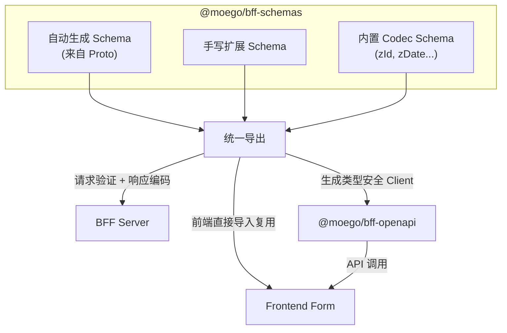
</div>

<!--
同构 Schema 的核心理念：
Schema 在 @moego/bff-schemas 包中统一定义，以 TypeScript 源码形式发布。
三个消费方：BFF Server 用于请求验证，OpenAPI 用于生成 Client，前端直接导入用于表单校验。
真正做到一处修改，处处生效。
-->

---

## Schema 的三种使用方式

<div class="mt-8">

| 使用场景 | 导入来源 | 用途 | Schema 形态 |
|---------|---------|------|------------|
| **BFF Server** | `@moego/bff-schemas` | 请求验证、响应编码 | 完整 Schema（含 Codec） |
| **API 调用** | `@moego/bff-openapi` | 类型推断、调用 API | Strip 后的 Schema |
| **前端运行时** | `@moego/bff-schemas` | 表单校验 | 完整 Schema（含校验规则） |

</div>

<v-clicks>

- **BFF Server**: 使用完整 Schema，包含 Codec 的 encode/decode 能力
- **OpenAPI Client**: 使用 Strip 后的 Schema，导出外部类型给前端
- **前端表单**: 直接复用 BFF 的 Schema，校验规则和错误消息完全一致

</v-clicks>

<!--
同一个 Schema 在不同场景有不同的使用方式：
1. BFF Server 需要完整的 Codec 能力
2. OpenAPI Client 需要 Strip 后的外部类型
3. 前端表单可以直接复用 Schema 做校验
-->

---

## 前端复用实践：表单校验

<div mt-6></div>

````md magic-move {lines: true}
```typescript
// 1. BFF 侧：在 @moego/bff-schemas 中定义 Schema
export const CreateCustomerSchema = z.object({
  name: z.string()
    .min(1, '客户名称不能为空')
    .max(100, '客户名称不能超过 100 个字符'),
  email: z.string()
    .email('请输入有效的邮箱地址'),
  phone: zE164Phone,
}).openapi('CreateCustomer');
```

```typescript
// 2. 前端：直接导入 Schema 做表单校验
import { CreateCustomerSchema } from '@moego/bff-schemas/customer.schema';

function CustomerForm() {
  const handleSubmit = (formData: unknown) => {
    const result = CreateCustomerSchema.safeParse(formData);
    
    if (!result.success) {
      // ✅ 错误消息与 BFF 定义完全一致！
      const errors = result.error.flatten().fieldErrors;
      // { name: ['客户名称不能为空'], email: ['请输入有效的邮箱地址'] }
      setFormErrors(errors);
      return;
    }
    
    // 校验通过，提交数据
    submitToApi(result.data);
  };
}
```

```typescript
// 3. 收益对比
// ❌ 传统方式：前端重复定义校验规则
const frontendValidation = {
  name: (v) => v.length > 0 ? null : '名称不能为空',  // 可能和后端不一致
  email: (v) => /^.+@.+$/.test(v) ? null : '邮箱格式错误',  // 正则可能不同
};

// ✅ 同构方式：直接复用 BFF Schema
const result = CreateCustomerSchema.safeParse(formData);
// - 校验规则 100% 一致
// - 错误消息 100% 一致
// - 零重复代码
```
````

<!--
这是同构 Schema 最直观的好处：
前端直接导入 BFF 的 Schema，用于表单校验。
校验规则、错误消息都和 BFF 完全一致，零重复代码。
再也不用担心前后端校验逻辑不一致的问题了。
-->

---

## 问题：Enum 类型不兼容

<div mt-4></div>

````md magic-move {lines: true}
```typescript
// Step 1: 我们在 @moego/bff-schemas 定义了 Enum
// packages/schemas/src/appointment.schema.ts

export enum AppointmentStatus {
  UPCOMING = 'UPCOMING',
  IN_PROGRESS = 'IN_PROGRESS',
  COMPLETED = 'COMPLETED',
}

// ✅ 前端可以导入使用
```

```typescript
// Step 2: 生成 OpenAPI Client 时，也创建了同样的 Enum
// @moego/bff-openapi/clients/client.appointment.ts (生成的代码)

// 生成器看到 Schema 用了 enum，于是也生成一份
export enum AppointmentStatus {  // 同样的名字
  UPCOMING = 'UPCOMING',         // 同样的值
  IN_PROGRESS = 'IN_PROGRESS',
  COMPLETED = 'COMPLETED',
}

export function updateAppointment(data: {
  status: AppointmentStatus;  // 👈 用的是生成的 enum
}): Promise<void>;
```

```typescript
// Step 3: 前端想要复用 Schema 的 Enum 来调用 API
import { AppointmentStatus } from '@moego/bff-schemas';
import { updateAppointment } from '@moego/bff-openapi';

// 看起来很合理对吧？
updateAppointment({
  status: AppointmentStatus.UPCOMING,
});
```

```typescript
// Step 4: 💥 TypeScript 报错了！
import { AppointmentStatus } from '@moego/bff-schemas';
import { updateAppointment } from '@moego/bff-openapi';

updateAppointment({
  status: AppointmentStatus.UPCOMING,
  //      ^^^^^^^^^^^^^^^^^^^^^^^^^^^
  // ❌ TS Error: Type 'AppointmentStatus' is not assignable 
  //    to type 'AppointmentStatus'.
  //    Two different types with this name exist, but they are unrelated.
});

// 😱 两个 enum 值完全相同，但 TypeScript 认为它们是不同类型！
```
````

<!--
让我们一步步来看这个问题是怎么产生的。

首先，我们在 bff-schemas 包里定义了一个 AppointmentStatus 枚举。

然后，生成 OpenAPI Client 时，生成器看到 Schema 里用了这个 enum，
于是也生成了一份完全相同的 enum 定义。

接下来，前端开发者想要复用 Schema 包的 enum 来调用 API，
这看起来很合理，毕竟都是同一个业务概念。

但是 TypeScript 报错了！虽然两个 enum 的值完全相同，
但它们是两个独立的类型定义，TypeScript 认为它们是不兼容的。
这是 TypeScript 的设计特性，用来防止不同来源的枚举混用。
-->

---

## 解决方案：Enum 来源标记

<div mt-4></div>

````md magic-move {lines: true}
```typescript
// 问题回顾：前端使用 Schema 的 enum 调用 API
import { AppointmentStatus } from '@moego/bff-schemas';
import { updateAppointment } from '@moego/bff-openapi';

updateAppointment({
  status: AppointmentStatus.UPCOMING,  
  // ❌ TS Error: Type 'AppointmentStatus' is not assignable 
  // to type 'AppointmentStatus_Generated'
});
```

```typescript
// 解决方案：createNativeEnum 标记来源
// packages/schemas/src/appointment.schema.ts
import { createNativeEnum } from './utils/createNativeEnum';

export enum AppointmentStatusEnum {
  UPCOMING = 'UPCOMING',
  PAST = 'PAST',
}

export const AppointmentStatus = createNativeEnum(
  'AppointmentStatusEnum',      // Enum export 变量名称
  z.nativeEnum(AppointmentStatusEnum)
);
// 👆 自动记录来源：@moego/bff-schemas/appointment.schema
```

```typescript
// 生成的 OpenAPI Client 直接导入原始 enum
// @moego/bff-openapi/clients/client.appointment.ts (生成的代码)

// ✨ 不再重新生成 enum，而是直接从源导入
import { AppointmentStatusEnum } from '@moego/bff-schemas/appointment.schema';
export { AppointmentStatusEnum };

// 前端使用时类型完全一致
import { AppointmentStatusEnum, updateAppointment } from '@moego/bff-openapi';

updateAppointment({
  status: AppointmentStatusEnum.UPCOMING,  // ✅ 类型完美匹配
});
```
````

<v-click>
<div class="mt-4 text-center">
  <div class="inline-block px-4 py-2 bg-green-500/10 border border-green-500/30 rounded-lg text-sm">
    <span class="text-green-400 font-bold">核心思路：</span>
    <span class="opacity-70 ml-2">整个链路只有一个 enum 定义，生成的 Client 直接导入而非重新创建</span>
  </div>
</div>
</v-click>

<!--
解决方案是 createNativeEnum 工具函数。

它的作用是在定义 enum 时标记来源路径。
这样在生成 OpenAPI Client 时，生成器就知道这个 enum 来自哪里，
直接 import 原始 enum 而不是重新创建一个新的。

最终效果：整个链路只有一个 enum 定义，从 bff-schemas 到 bff-openapi 到前端，
类型完全一致，不会出现不兼容的问题。
-->

---
layout: fact
---

## The Format Gap

边界层的数据格式转换

<!--
Schema 解决了类型安全和协议定义的问题。
但 BFF 作为边界层，还有一个避不开的挑战：数据格式转换。
-->

---

## 你是否遇到过这些问题？

<div class="mt-8 space-y-6">

<v-click>
<div class="p-4 bg-red-500/10 border-l-4 border-red-500 rounded-r-lg">
  <div class="font-bold text-red-400 mb-2">💥 BigInt 序列化失败</div>
  <div class="font-mono text-sm opacity-80">
    TypeError: Do not know how to serialize a BigInt
  </div>
</div>
</v-click>

<v-click>
<div class="p-4 bg-red-500/10 border-l-4 border-red-500 rounded-r-lg">
  <div class="font-bold text-red-400 mb-2">📅 日期格式混乱</div>
  <div class="font-mono text-sm opacity-80">
    后端: <span class="text-orange-400">{year: 2024, month: 1, day: 15}</span> → 
    前端期望: <span class="text-blue-400">"2024-01-15"</span>
  </div>
</div>
</v-click>

<v-click>
<div class="p-4 bg-red-500/10 border-l-4 border-red-500 rounded-r-lg">
  <div class="font-bold text-red-400 mb-2">⏰ 时间戳不兼容</div>
  <div class="font-mono text-sm opacity-80">
    Proto Timestamp: <span class="text-orange-400">{seconds: 1705286400n, nanos: 0}</span> → 
    前端: <span class="text-blue-400">1705286400000</span>
  </div>
</div>
</v-click>

</div>

<!--
你是否遇到过这些问题？

BigInt 无法直接 JSON 序列化，会直接报错。
后端返回的日期是结构化对象，前端期望的是 ISO 字符串。
Proto 的 Timestamp 和 JS 的毫秒时间戳格式完全不同。

这些都是 BFF 边界层必须处理的数据格式差异。
-->

---

## 手动转换的痛苦

<div class="grid grid-cols-2 gap-6 mt-6">

<div>

```typescript
// 每个接口都要手动转换...
function transformPetResponse(proto: ProtoPet) {
  return {
    id: proto.id.toString(),  // bigint → string
    birthDate: formatGoogleDate(proto.birthDate),
    createdAt: timestampToMs(proto.createdAt),
    updatedAt: timestampToMs(proto.updatedAt),
    // ... 还有很多字段
  };
}

function transformPetRequest(json: JsonPet) {
  return {
    id: BigInt(json.id),  // string → bigint
    birthDate: parseGoogleDate(json.birthDate),
    createdAt: msToTimestamp(json.createdAt),
    // ... 反向转换
  };
}
```

</div>

<div class="space-y-4">

<v-click>
<div class="p-3 bg-red-500/10 border border-red-500/30 rounded-lg">
  <div class="text-red-400 font-bold text-sm">😩 重复劳动</div>
  <div class="text-xs opacity-70">每个接口都要写类似的转换代码</div>
</div>
</v-click>

<v-click>
<div class="p-3 bg-red-500/10 border border-red-500/30 rounded-lg">
  <div class="text-red-400 font-bold text-sm">🐛 容易出错</div>
  <div class="text-xs opacity-70">漏转一个字段，线上就炸了</div>
</div>
</v-click>

<v-click>
<div class="p-3 bg-red-500/10 border border-red-500/30 rounded-lg">
  <div class="text-red-400 font-bold text-sm">🔗 转换逻辑分散</div>
  <div class="text-xs opacity-70">入参出参分开写，容易不一致</div>
</div>
</v-click>

<v-click>
<div class="p-3 bg-red-500/10 border border-red-500/30 rounded-lg">
  <div class="text-red-400 font-bold text-sm">📝 缺乏类型保证</div>
  <div class="text-xs opacity-70">转换函数的类型签名手动维护</div>
</div>
</v-click>

</div>

</div>

<!--
传统方案是手动写转换函数。

每个接口都要写 transform 函数，请求和响应分开转换。
字段多了容易漏，逻辑分散难维护，还没有类型保证。

有没有更优雅的方案？
-->

---

## 我们需要什么？

<div class="mt-8 grid grid-cols-3 gap-6">

<v-click>
<div class="p-6 bg-cyan-500/10 border border-cyan-500/30 rounded-xl text-center">
  <div class="text-4xl mb-4">🔄</div>
  <div class="font-bold text-cyan-400 mb-2">双向转换</div>
  <div class="text-sm opacity-70">encode/decode 一体化定义</div>
</div>
</v-click>

<v-click>
<div class="p-6 bg-green-500/10 border border-green-500/30 rounded-xl text-center">
  <div class="text-4xl mb-4">🎯</div>
  <div class="font-bold text-green-400 mb-2">类型安全</div>
  <div class="text-sm opacity-70">转换前后类型自动推导</div>
</div>
</v-click>

<v-click>
<div class="p-6 bg-purple-500/10 border border-purple-500/30 rounded-xl text-center">
  <div class="text-4xl mb-4">🧩</div>
  <div class="font-bold text-purple-400 mb-2">可组合</div>
  <div class="text-sm opacity-70">与 Schema 无缝集成</div>
</div>
</v-click>

</div>

<v-click>

<div class="mt-10 text-center">
  <div class="inline-block px-6 py-3 bg-yellow-500/10 border border-yellow-500/30 rounded-lg">
    <span class="text-yellow-400 font-bold text-lg">Zod 4 的答案：z.codec()</span>
  </div>
</div>

</v-click>

<!--
我们需要的是：
1. 双向转换一体化定义，不用分开写 encode 和 decode
2. 类型安全，转换前后的类型自动推导
3. 可组合，与现有的 Schema 体系无缝集成

Zod 4 给出了答案：z.codec()
-->

---
layout: fact
---

## Codec Mechanism

<div mt-4></div>
<CodecVisualizer />

<!--
接下来我们来看 Codec 机制。
BFF 作为前后端的边界层，需要处理一个核心问题：数据格式的差异。
前端使用 JSON 友好的格式，后端使用 Proto 友好的格式。
Codec 就是在边界处自动完成双向转换的机制。
-->

---

## 什么是 Codec？

<div class="grid grid-cols-2 gap-8 mt-6">

<div>
  <div class="text-lg font-bold mb-4 text-cyan-400">📚 传统计算机科学中的 Codec</div>
  <div class="p-4 bg-gray-800/50 rounded-lg border border-gray-600/30">
    <div class="font-mono text-xl mb-2">
      <span class="text-blue-400">Co</span>der + <span class="text-orange-400">Dec</span>oder
    </div>
    <div class="text-sm opacity-70 space-y-2">
      <div>• 音视频编解码：MP3, H.264, HEVC</div>
      <div>• 字符编码：UTF-8, Base64</div>
      <div>• 数据压缩：gzip, zstd</div>
    </div>
    <div class="mt-3 text-xs opacity-50">
      核心思想：在不同格式之间进行<span class="text-cyan-400">双向转换</span>
    </div>
  </div>
</div>

<div>
  <div class="text-lg font-bold mb-4 text-green-400">✨ Zod 4 引入的 z.codec()</div>
  <div class="p-4 bg-gray-800/50 rounded-lg border border-green-500/30">
    <div class="font-mono text-sm mb-3">
      <span class="text-purple-400">z.codec</span>(external, internal, {<br/>
      <span class="pl-4 text-blue-400">encode</span>: internal → external,<br/>
      <span class="pl-4 text-orange-400">decode</span>: external → internal,<br/>
      })
    </div>
    <div class="text-sm opacity-70 space-y-2">
      <div>• <span class="text-blue-400">外部类型</span>：前端/API 看到的</div>
      <div>• <span class="text-orange-400">内部类型</span>：后端/系统使用的</div>
    </div>
    <div class="mt-3 text-xs opacity-50">
      将 Codec 思想引入 <span class="text-green-400">Schema 验证</span>
    </div>
  </div>
</div>

</div>

<!--
Codec 这个词来自传统计算机科学，是 Coder + Decoder 的缩写。
我们熟悉的 MP3、H.264 都是 Codec，它们在不同格式之间进行双向转换。

Zod 4 将这个概念引入了 Schema 验证领域。
z.codec() 定义了外部类型和内部类型之间的双向转换规则。
这完美契合了 BFF 边界数据转换的需求。
-->

---

## BFF 边界的数据差异

<div class="grid grid-cols-2 gap-6 mt-6">

<div class="p-4 border-2 border-blue-500/30 rounded-lg bg-blue-500/5">
  <div class="text-lg font-bold mb-3 text-blue-400">🌐 前端世界 (JSON)</div>
  <div class="font-mono text-sm bg-black/30 p-3 rounded space-y-2">
    <div><span class="text-gray-400">id:</span> <span class="text-green-400">"123456789"</span></div>
    <div><span class="text-gray-400">date:</span> <span class="text-green-400">"2024-01-15"</span></div>
    <div><span class="text-gray-400">time:</span> <span class="text-green-400">1705286400000</span></div>
  </div>
  <div class="text-xs mt-3 opacity-60">JSON 只支持基础类型</div>
</div>

<div class="p-4 border-2 border-orange-500/30 rounded-lg bg-orange-500/5">
  <div class="text-lg font-bold mb-3 text-orange-400">⚙️ 后端世界 (Proto)</div>
  <div class="font-mono text-sm bg-black/30 p-3 rounded space-y-2">
    <div><span class="text-gray-400">id:</span> <span class="text-yellow-400">123456789n</span> <span class="text-xs opacity-40">(bigint)</span></div>
    <div><span class="text-gray-400">date:</span> <span class="text-yellow-400">{year, month, day}</span></div>
    <div><span class="text-gray-400">time:</span> <span class="text-yellow-400">{seconds, nanos}</span></div>
  </div>
  <div class="text-xs mt-3 opacity-60">Proto 使用丰富的结构化类型</div>
</div>

</div>

<div class="mt-6 text-center">
  <div class="inline-block px-4 py-2 bg-cyan-500/10 border border-cyan-500/30 rounded-lg">
    <span class="text-cyan-400 font-bold">z.codec()</span>
    <span class="opacity-60 ml-2">= BFF 边界的双向数据转换</span>
  </div>
</div>

<!--
问题很清晰：
- 前端：JSON 不支持 BigInt、只有字符串和数字
- 后端：gRPC/Proto 有丰富的类型，比如 bigint、GoogleDate、Timestamp
- 这两个世界的数据格式完全不同

z.codec() 正好解决了这个问题，让我们能在 Schema 层面定义转换规则。
-->

---

## z.codec() API：三要素

<div mt-6></div>

````md magic-move {lines: true}
```typescript
// z.codec() 的核心结构
z.codec(
  externalSchema,  // 1️⃣ 外部类型：前端看到的
  internalSchema,  // 2️⃣ 内部类型：后端使用的
  {
    encode,        // 3️⃣ 内部 → 外部（响应时）
    decode,        // 3️⃣ 外部 → 内部（请求时）
  }
)
```

```typescript
// 实际例子：zId
export const zId = z.codec(
  z.coerce.string().regex(/^-?\d+$/),  // 外部：string
  z.bigint(),                          // 内部：bigint
  {
    encode: (value) => value.toString(),  // 123n → "123"
    decode: (value) => BigInt(value),     // "123" → 123n
  }
);
```

```typescript
// 数据流向示意
// 
// 请求时 (decode)：
// 前端发送 { id: "123" } → BFF 收到 { id: 123n }
//
// 响应时 (encode)：  
// 后端返回 { id: 123n } → 前端收到 { id: "123" }
```
````

<!--
z.codec 接受三个核心参数：
1. 外部 Schema：定义前端看到的类型
2. 内部 Schema：定义后端使用的类型
3. encode/decode 函数：定义如何在两种类型之间转换

这样我们就在 Schema 层面屏蔽了底层的类型差异，开发者无需手动处理转换。
-->

---

## 内置 Codec：解决真实痛点

<div class="grid grid-cols-3 gap-4 mt-6">

<div class="p-3 border border-blue-500/30 rounded-lg bg-blue-500/5">
  <div class="text-base font-bold mb-2 text-blue-400">zId</div>
  <div class="text-xs opacity-60 mb-2">大整数 ID 转换</div>
  <div class="font-mono text-xs bg-black/30 p-2 rounded">
    <div><span class="text-green-400">"123"</span> ↔ <span class="text-yellow-400">123n</span></div>
  </div>
  <div class="text-xs mt-2 text-red-400/80">解决：JSON BigInt 精度丢失</div>
</div>

<div class="p-3 border border-green-500/30 rounded-lg bg-green-500/5">
  <div class="text-base font-bold mb-2 text-green-400">zDate</div>
  <div class="text-xs opacity-60 mb-2">日期格式转换</div>
  <div class="font-mono text-xs bg-black/30 p-2 rounded">
    <div><span class="text-green-400">"2024-1-15"</span></div>
    <div class="text-center opacity-40">↕</div>
    <div><span class="text-yellow-400">{year, month, day}</span></div>
  </div>
  <div class="text-xs mt-2 text-red-400/80">解决：GoogleDate 对象转换</div>
</div>

<div class="p-3 border border-purple-500/30 rounded-lg bg-purple-500/5">
  <div class="text-base font-bold mb-2 text-purple-400">zTimestamp</div>
  <div class="text-xs opacity-60 mb-2">时间戳转换</div>
  <div class="font-mono text-xs bg-black/30 p-2 rounded">
    <div><span class="text-green-400">1705286400000</span></div>
    <div class="text-center opacity-40">↕</div>
    <div><span class="text-yellow-400">{seconds, nanos}</span></div>
  </div>
  <div class="text-xs mt-2 text-red-400/80">解决：Protobuf Timestamp</div>
</div>

</div>

<!--
我们内置了三种最常用的 Codec：
1. zId：解决 JSON 不支持 BigInt 导致的精度丢失
2. zDate：前端 ISO 字符串与 GoogleDate 对象的转换
3. zTimestamp：毫秒数与 Protobuf Timestamp 的转换

这些都是在实际项目中遇到的真实痛点，通过 Codec 机制优雅解决。
-->

---

## 实战：zId 代码实现

```typescript
// packages/schemas/src/shared/id.ts
export const zId = z.codec(
  z.coerce.string().regex(/^-?\d+$/),  // 外部：匹配数字字符串
  z.bigint(),                          // 内部：JavaScript bigint
  {
    encode: (value) => value.toString(),  // bigint → "123"
    decode: (value) => BigInt(value),     // "123" → 123n
  }
);

// 还有变体：允许空字符串
export const zIdAllowEmpty = z.codec(z.string(), z.bigint(), {
  encode: (value) => value === 0n ? '' : value.toString(),
  decode: (value) => BigInt(value),
});
```

<v-click>

<div class="mt-4 p-3 bg-yellow-500/10 border border-yellow-500/30 rounded-lg">
  <div class="text-sm space-y-1">
    <div>
      <span class="text-yellow-400 font-bold">💡 为什么外部类型用 string 而不是 number？</span>
    </div>
    <div class="opacity-70 text-xs">
      <span class="text-red-400">①</span> JSON 规范不支持 bigint，只有 number 类型<br/>
      <span class="text-red-400">②</span> JS Number 最大安全整数是 2<sup>53</sup>，后端 ID 常超过此限制<br/>
      <span class="text-red-400">③</span> 用 string 传输可保证任意大小的整数不丢失精度
    </div>
  </div>
</div>

</v-click>

<!--
这是 zId 的实际代码。
为什么用 string？
1. JSON 规范本身不支持 bigint 类型，只有 number
2. JavaScript 的 Number 类型最大安全整数是 2^53，后端的雪花 ID 等常常超过这个限制
3. 用 string 传输可以保证任意大小的整数都不会丢失精度

zIdAllowEmpty 是一个变体，处理空 ID 的场景。
-->

---

## 实战：zDate 代码实现

```typescript
// packages/schemas/src/shared/date.ts
const DateString = z.string().regex(/^\d{4}-\d{1,2}-\d{1,2}$/)
  .openapi('DateString');

const GoogleDate = z.object({
  year: z.number(),
  month: z.number().min(1).max(12),
  day: z.number().min(1).max(31),
}).openapi('GoogleDate');

export const zDate = z.codec(DateString, GoogleDate, {
  encode: (value) => `${value.year}-${value.month}-${value.day}`,
  decode: (value) => {
    const [year, month, day] = value.split('-').map(Number);
    return { year, month, day };
  },
}).openapi('MoeDate');
```

<!--
zDate 处理日期格式转换。
前端习惯用 ISO 字符串格式，后端 gRPC 使用 GoogleDate 对象。
通过 Codec，开发者只需要传入/接收字符串，底层转换完全透明。
-->

---

## 实战：zTimestamp 代码实现

```typescript
// packages/schemas/src/appointment.schema.ts
export const zTimestampMilliseconds = z.codec(
  z.number().int().openapi({ description: '时间戳（毫秒数）' }),
  zTimestamp,  // { seconds: bigint, nanos: number }
  {
    encode: (ts) => {
      // Timestamp 对象 → 毫秒数
      return (Number(ts.seconds) * 1000) + (ts.nanos / 1000000);
    },
    decode: (milliseconds) => {
      // 毫秒数 → Timestamp 对象
      const seconds = BigInt(Math.floor(milliseconds / 1000));
      const nanos = (milliseconds % 1000) * 1000000;
      return { seconds, nanos };
    },
  },
).openapi('TimestampMilliseconds');
```

<!--
zTimestamp 处理 Protobuf 的 Timestamp 类型。
前端习惯用毫秒级时间戳，后端 Proto 用的是 seconds + nanos 的组合。
这种转换如果每次手写会非常繁琐，Codec 让它变得完全透明。
-->

---

## Route 中的使用

````md magic-move {lines: true}
```typescript
// 请求时：decode 自动触发
app.openapi(route, async (c) => {
  const { customerId } = c.req.valid('json');
  //       ^? bigint - 已经自动从 "123" 转换为 123n
  
  const result = await c.callService(
    CustomerServiceClient,
    'getCustomer',
    { id: customerId }  // 直接传给后端
  );
  
  return c.json(result, HTTP_CODE.SUCCESS);
});
```

```typescript
// 响应时：encode 需要显式调用
app.openapi(route, async (c) => {
  const { customerId } = c.req.valid('json');
  
  const result = await c.callService(
    CustomerServiceClient,
    'getCustomer', 
    { id: customerId }
  );
  
  // 响应的 schema 可能有多个，框架无法自动推断
  // 因此需要显式指定用哪个 schema 来 encode
  return c.json(
    ResponseSchema.encode(result),  // ✍🏻 显式调用
    HTTP_CODE.SUCCESS
  );
});
```
````

<!--
在 Route 中使用 Codec：
1. decode 是自动的：c.req.valid('json') 会自动触发 decode
2. encode 需要显式调用

为什么 encode 要显式调用？
- 返回的数据对应的 schema 可能不同，框架无法自动推断
- 类比 request：也需要显式指定 valid('json') 来告诉框架用哪个 schema
- 这种设计让类型转换更加可控和明确
-->

---

## Codec vs Transform：为什么选择 Codec？

<div class="grid grid-cols-2 gap-6 mt-8">

<div class="p-4 border-2 border-green-500/40 rounded-lg bg-green-500/5">
  <div class="text-xl font-bold mb-4 text-green-400">✅ Codec</div>
  <ul class="space-y-3 text-sm">
    <li class="flex items-start gap-2">
      <span class="text-green-400">✓</span>
      <div><span class="font-bold">双向转换</span><br/><span class="opacity-60">encode + decode</span></div>
    </li>
    <li class="flex items-start gap-2">
      <span class="text-green-400">✓</span>
      <div><span class="font-bold">OpenAPI 导出外部类型</span><br/><span class="opacity-60">前端看到 string</span></div>
    </li>
    <li class="flex items-start gap-2">
      <span class="text-green-400">✓</span>
      <div><span class="font-bold">响应格式化</span><br/><span class="opacity-60">.encode() 方法</span></div>
    </li>
  </ul>
</div>

<div class="p-4 border-2 border-red-500/30 rounded-lg bg-red-500/5 opacity-70">
  <div class="text-xl font-bold mb-4 text-red-400">❌ Transform</div>
  <ul class="space-y-3 text-sm">
    <li class="flex items-start gap-2">
      <span class="text-red-400">✗</span>
      <div><span class="font-bold">单向转换</span><br/><span class="opacity-60">只有 input 方向</span></div>
    </li>
    <li class="flex items-start gap-2">
      <span class="text-red-400">✗</span>
      <div><span class="font-bold">OpenAPI 导出内部类型</span><br/><span class="opacity-60">前端看到 bigint（无法序列化）</span></div>
    </li>
    <li class="flex items-start gap-2">
      <span class="text-red-400">✗</span>
      <div><span class="font-bold">响应无法处理</span><br/><span class="opacity-60">没有反向转换能力</span></div>
    </li>
  </ul>
</div>

</div>

<!--
为什么选择 Codec 而不是 Transform？

Codec 的核心优势：
1. 双向转换 - Transform 只能处理输入
2. OpenAPI 导出外部类型 - 前端看到的是 string，可以正常序列化
3. 有 .encode() 方法 - 响应时可以转换数据

Transform 的问题是它会把内部类型（如 bigint）暴露到 OpenAPI，前端根本无法使用。
-->

---
layout: fact
---

## Error Handling
RESTful 风格错误处理

<!--
接下来我们来看错误处理机制。
BFF 作为前后端的桥梁，需要将后端的 gRPC 错误优雅地转换为前端友好的 HTTP 错误。
这不仅关乎用户体验，更关乎系统的可观测性。
-->

---

## 为什么选择 RESTful 风格？

<div class="grid grid-cols-2 gap-8 mt-8">

<div class="p-4 border border-red-500/30 bg-red-500/5 rounded-lg text-left">
  <div class="text-xl font-bold mb-4 text-red-400">Legacy: RPC Style</div>
  <div class="font-mono text-sm bg-black/30 p-2 rounded mb-2">HTTP 200 OK</div>
  <pre class="text-xs text-gray-400">
{
  "code": 50001,
  "message": "Invalid Password",
  "data": null
}
  </pre>
  <ul class="text-sm mt-4 list-disc pl-4 text-gray-400">
    <li>监控无法自动识别错误</li>
    <li>网关层无法感知</li>
    <li>前端需手动判断 code</li>
  </ul>
</div>

<div class="p-4 border border-green-500/30 bg-green-500/5 rounded-lg text-left">
  <div class="text-xl font-bold mb-4 text-green-400">Current: RESTful Style</div>
  <div class="font-mono text-sm bg-black/30 p-2 rounded mb-2">HTTP 400 Bad Request</div>
  <pre class="text-xs text-gray-400">
{
  "code": 50001,
  "message": "Invalid email or password."
}
  </pre>
  <ul class="text-sm mt-4 list-disc pl-4 text-gray-400">
    <li>Datadog 自动标红告警</li>
    <li>网关自动拦截异常流量</li>
    <li>HTTP 语义清晰标准</li>
  </ul>
</div>

</div>

<!--
我们从以前的 RPC 风格（永远返回 200）迁移到了标准的 RESTful 风格。
核心收益是可观测性的提升：
监控系统（Datadog）天然只能识别 HTTP 状态码，
RESTful 风格让我们能直接利用基础设施的能力，自动统计错误率，进行链路追踪。
-->

---

## 错误码自动映射

<div class="mt-6">

```typescript
// packages/schemas/src/shared/code.ts
export const RpcCode2HttpCode: Record<RPCStrandErrCode, HTTP_CODE> = {
  [RPCStrandErrCode.OK]: HTTP_CODE.SUCCESS,                    // 0 → 200
  [RPCStrandErrCode.InvalidArgument]: HTTP_CODE.BAD_REQUEST,   // 3 → 400
  [RPCStrandErrCode.NotFound]: HTTP_CODE.NOT_FOUND,            // 5 → 404
  [RPCStrandErrCode.PermissionDenied]: HTTP_CODE.FORBIDDEN,    // 7 → 403
  [RPCStrandErrCode.Unauthenticated]: HTTP_CODE.UNAUTHORIZED,  // 16 → 401
  [RPCStrandErrCode.ResourceExhausted]: HTTP_CODE.TOO_MANY_REQUESTS, // 8 → 429
  [RPCStrandErrCode.Internal]: HTTP_CODE.INTERNAL_SERVER_ERROR, // 13 → 500
  [RPCStrandErrCode.Unavailable]: HTTP_CODE.SERVICE_UNAVAILABLE, // 14 → 503
  // ... 完整映射
};
```

</div>

<v-click>

<div class="mt-4 p-3 bg-blue-500/10 border border-blue-500/30 rounded-lg">
  <span class="text-blue-400 font-bold">自动映射</span>
  <span class="opacity-70 ml-2">后端 gRPC 错误码 → 标准 HTTP 状态码，无需手动处理</span>
</div>

</v-click>

<!--
我们定义了完整的 gRPC 错误码到 HTTP 状态码的映射表。
这样 BFF 就可以自动将后端的 gRPC 错误转换为标准的 HTTP 错误码。
开发者无需关心底层的转换逻辑。
-->

---

## 业务错误码处理

<div class="mt-4"></div>

````md magic-move {lines: true}
```typescript
// 1. 标准 gRPC 错误码：自动映射
// InvalidArgument (3) → HTTP 400
// NotFound (5) → HTTP 404
// PermissionDenied (7) → HTTP 403
```

```typescript
// 2. 业务错误码（> 100000）：特殊处理
// 业务错误码由后端定义，表示具体的业务异常
// 例如：100001 = 邮箱已存在，100002 = 密码强度不足

if (grpcStatus > MIN_BIZ_ERROR_CODE) {  // MIN_BIZ_ERROR_CODE = 100000
  return c.json({
    code: grpcStatus,
    message: err.rawMessage,
  }, HTTP_CODE.INTERNAL_SERVER_ERROR);  // 统一返回 500
}
```

```typescript
// 3. 自定义业务错误映射：精细化控制
export const CommonAuthnErrors = {
  [ErrorCode.EMAIL_PASSWORD_MISMATCH]: { 
    httpCode: HTTP_CODE.BAD_REQUEST,   // → 400
    message: 'Invalid email or password.' 
  },
  [ErrorCode.ACCOUNT_FROZEN]: { 
    httpCode: HTTP_CODE.FORBIDDEN,     // → 403
    message: 'Account has been frozen.' 
  },
  [ErrorCode.SESSION_EXPIRED]: { 
    httpCode: HTTP_CODE.UNAUTHORIZED,  // → 401
    message: 'Session expired, please login again.' 
  },
};
```
````

<!--
错误码处理分为三层：
1. 标准 gRPC 错误码：自动映射到对应的 HTTP 状态码
2. 业务错误码（大于 100000）：默认返回 500，表示服务端错误
3. 自定义业务错误映射：针对特定场景，可以精细化配置 HTTP 状态码和友好文案
-->

---

## 全局错误处理中间件

```typescript {all|3-4|6-14|16-20|all}
// server/middleware/error-wrap.middleware.ts
export const ErrorMiddleware: ErrorHandler = (err, c) => {
  // 1. 记录链路追踪，Datadog 可追溯
  span?.setTag('error', err);
  
  // 2. gRPC 服务调用异常处理
  if (err instanceof SvcInvokeException) {
    const grpcStatus = err.code;
    
    // 业务错误码（> 100000）→ 500
    if (grpcStatus > MIN_BIZ_ERROR_CODE) {
      return c.json({ code: grpcStatus, message: err.rawMessage }, 
        HTTP_CODE.INTERNAL_SERVER_ERROR);
    }
    
    // 标准 gRPC 错误码 → 对应 HTTP 状态码
    return c.json({ code: grpcStatus, message: err.rawMessage }, 
      RpcCode2HttpCode[grpcStatus] ?? HTTP_CODE.INTERNAL_SERVER_ERROR);
  }
  
  // 3. 其他错误类型处理...
};
```

<!--
全局错误处理中间件的核心逻辑：
1. 首先记录链路追踪信息，确保 Datadog 能追溯到错误
2. 判断是否是 gRPC 服务调用异常
3. 区分业务错误码和标准 gRPC 错误码，分别处理
4. 返回格式化的 JSON 响应，包含错误码和错误信息
-->

---

## 核心收益

<div class="grid grid-cols-3 gap-6 mt-6">

<div class="p-5 border border-blue-500/30 bg-blue-500/5 rounded-lg">
  <div class="text-3xl mb-3">📊</div>
  <div class="text-lg font-bold text-blue-400">可观测性</div>
  <div class="text-sm opacity-80 mt-3 leading-relaxed">
    Datadog 自动识别 4xx/5xx 错误
  </div>
  <div class="text-xs opacity-50 mt-2">
    无需额外配置即可告警、统计错误率
  </div>
</div>

<div class="p-5 border border-green-500/30 bg-green-500/5 rounded-lg">
  <div class="text-3xl mb-3">📦</div>
  <div class="text-lg font-bold text-green-400">统一响应格式</div>
  <div class="text-sm opacity-80 mt-3 leading-relaxed">
    zResponseError Schema 标准错误结构
  </div>
  <div class="text-xs opacity-50 mt-2">
    前端统一处理，减少样板代码
  </div>
</div>

<div class="p-5 border border-yellow-500/30 bg-yellow-500/5 rounded-lg">
  <div class="text-3xl mb-3">🔗</div>
  <div class="text-lg font-bold text-yellow-400">全链路追踪</div>
  <div class="text-sm opacity-80 mt-3 leading-relaxed">
    span.setTag 记录完整错误上下文
  </div>
  <div class="text-xs opacity-50 mt-2">
    问题定位效率提升 10x
  </div>
</div>

</div>

<div class="mt-8 text-center">
  <div class="inline-block px-6 py-3 bg-gradient-to-r from-blue-500/20 via-green-500/20 to-yellow-500/20 rounded-full border border-white/10">
    <span class="opacity-70">RESTful 风格 + 自动映射 + 全局中间件</span>
    <span class="mx-2">=</span>
    <span class="font-bold">生产级错误处理</span>
  </div>
</div>

<!--
错误处理机制带来的三个核心收益：
1. 可观测性：RESTful 风格让监控系统天然识别错误
2. 统一响应格式：前端只需要处理一种错误结构
3. 全链路追踪：从前端到后端的错误都可追溯
-->

---
layout: fact
---

## Development Efficiency
自动化工具链

<!--
第三个核心优势是开发效率。
自动化工具链带来的效率提升是巨大的。
-->

---

## 自动化工作流

<div mt-4></div>

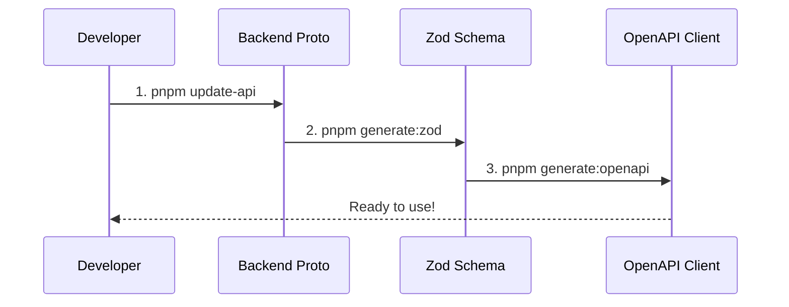

<div class="mt-8 flex justify-center">
  <PR link="https://github.com/MoeGolibrary/moego-bff/actions/workflows/update-api.yaml" title="Update API Pipeline (update zod & openapi in ci)" />
</div>
<!--
我们的自动化工作流非常简单：
1. pnpm update-api：更新后端 Proto
2. pnpm generate:zod：重新生成 Zod Schema
3. pnpm generate:openapi：重新生成 OpenAPI Client
整个流程仅需 2 分钟！
-->

---

## Vision
Automated Release Flow

<div class="flex flex-col justify-center items-center w-full h-full mt-[-60px]">

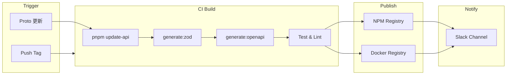


<div v-click class="mt-4 p-3 bg-orange-500/10 rounded-lg text-sm">
后端 Proto 更新 → 自动触发 Schema 生成 → 发布 NPM 包 → 前端无感升级
</div>

</div>

<!--
CI/CD 流程确保自动化：
1. Push tag 或后端 Proto 更新触发流水线
2. 自动运行 update-api、generate:zod、generate:openapi
3. 测试通过后发布到 NPM 和 Docker Registry
4. Slack 通知团队
前端只需更新依赖版本，即可获取最新类型。
-->

---
---

## 创建新领域

```bash
$ pnpm cr  # 交互式创建

? 请输入路由名称 (例如: book, user): customer
? 是否生成示例路由? Yes

✅ 已创建目录：server/routes/customer/
✅ 已创建 Schema：packages/schemas/src/customer.schema.ts
✅ 已生成示例路由：server/routes/customer/getCustomer.ts
✅ 已注册到路由入口

🎉 新领域创建完成！
```

<!--
创建新领域也很简单，运行 pnpm cr 命令：
1. 输入领域名称（如 customer、order）
2. 选择是否生成示例路由
3. 自动创建目录结构、Schema 文件、示例路由
4. 自动注册到路由入口
整个过程不到 1 分钟。
-->

---
---

## 多进程架构
Cluster-Based Architecture

<div class="flex justify-center mt-6">

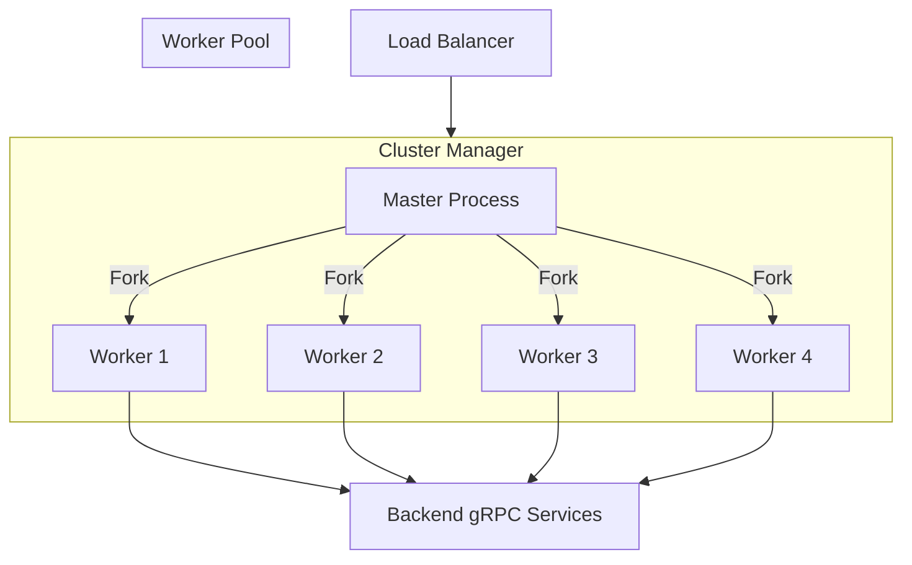

</div>

<div class="grid grid-cols-2 gap-4 mt-4 text-sm">
<div class="p-3 bg-blue-500/10 rounded-lg">
<strong>Worker 进程:</strong> 根据 CPU 核数自动创建，处理 HTTP 请求
</div>
<div class="p-3 bg-green-500/10 rounded-lg">
<strong>链路追踪:</strong> span.setTag('cluster.id', process.pid)
</div>
</div>

<!--
运行时架构采用 Node.js Cluster 模式。
Master 进程负责管理，根据 CPU 核数 fork Worker 进程。
每个 Worker 独立处理请求，通过 gRPC 连接后端服务。
链路追踪会记录 cluster.id，方便排查问题。
-->

---
layout: fact
---

## Architecture & Artifacts
从协议到调用的完整链路

<div class="mt-8 text-lg opacity-70">

**Proto** → **Zod Schema** → **BFF Route** → **OpenAPI Client** → **Frontend**

</div>

<!--
接下来我们进入架构和产物章节。
我会以一个完整的链路来串讲：从后端提供 Proto 协议开始，到最终前端调用 BFF Client。
在这个过程中，我们也会回顾前面讲过的各项技术。
-->

---

## 全景流水线
End-to-End Type Safety Pipeline

<div class="flex justify-center items-center w-full h-[380px]">

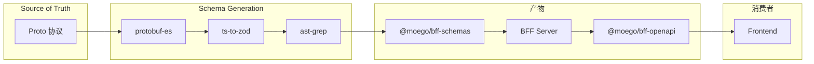

</div>

<!--
这是我们的完整流水线全景图。
从 Proto 协议出发，经过 protobuf-es 生成 TS 类型，
再通过 ts-to-zod 和 ast-grep 转换为 Zod Schema，
最终产出三个核心产物：Schemas 包、BFF Server 和 OpenAPI Client。
整条链路保证端到端的类型安全。
-->

---

## 三大核心产物
Build Artifacts Overview

<div class="grid grid-cols-3 gap-6 mt-8">

<div class="p-5 bg-blue-500/15 rounded-xl border border-blue-500/30">
  <div class="text-3xl mb-3">🐳</div>
  <div class="text-lg font-bold mb-2">Runtime Server</div>
  <div class="text-sm opacity-60 mb-3">Docker Image</div>
  <div class="text-xs bg-black/30 p-2 rounded font-mono">
    K8S 部署<br/>
    多进程架构<br/>
    链路追踪
  </div>
</div>

<div class="p-5 bg-green-500/15 rounded-xl border border-green-500/30">
  <div class="text-3xl mb-3">📦</div>
  <div class="text-lg font-bold mb-2">@moego/bff-schemas</div>
  <div class="text-sm opacity-60 mb-3">NPM Package (TS 源码)</div>
  <div class="text-xs bg-black/30 p-2 rounded font-mono">
    运行时校验<br/>
    前端复用<br/>
    Codec 机制
  </div>
</div>

<div class="p-5 bg-purple-500/15 rounded-xl border border-purple-500/30">
  <div class="text-3xl mb-3">🔗</div>
  <div class="text-lg font-bold mb-2">@moego/bff-openapi</div>
  <div class="text-sm opacity-60 mb-3">NPM Package</div>
  <div class="text-xs bg-black/30 p-2 rounded font-mono">
    类型安全 Client<br/>
    响应校验 Hooks<br/>
    质量左移
  </div>
</div>

</div>

<!--
我们的构建产出三个核心产物：
1. Docker 镜像用于 K8S 部署
2. bff-schemas 包含所有 Zod Schema，供 BFF Server 和前端复用
3. bff-openapi 提供类型安全的 API Client
接下来我们以登录功能为例，走一遍完整链路。
-->

---

## Step 1/5: 后端定义 Proto
Source of Truth → <span class="text-blue-400 text-sm">Proto 协议</span>

<div class="mt-6">

```protobuf {all|3-5|7-10|all}
// backend/proto/authn/v1/authn_service.proto

message LoginRequest {
  string email = 1;           // 用户邮箱
  string password = 2;        // 用户密码
  AccountSource source = 3;   // 业务来源
  
  // MFA 相关字段
  optional string challenge_token = 4;
  optional string challenge_code = 5;
}

message LoginResponse {
  optional string session_token = 1;  // 会话令牌
  bool require_mfa = 5;               // 是否需要 MFA
  optional AuthenticationFactor factor = 7;
}
```

</div>

<div v-click class="mt-4 p-3 bg-blue-500/10 rounded-lg text-sm">
<strong>Recap:</strong> Proto 是类型的 <span class="text-blue-400 font-bold">Source of Truth</span>，所有下游类型都从这里派生
</div>

<!--
第一步，后端团队定义 Proto 协议。
这是登录接口的 Request 和 Response 定义。
注意：Proto 是我们整个系统的 Source of Truth，所有类型都从这里派生。
-->

---

## Step 2/5: Proto → Zod Schema
<span class="text-gray-400 text-sm">Proto</span> → <span class="text-green-400 text-sm">Zod Schema</span> → BFF → OpenAPI → Frontend

````md magic-move
```typescript
// protobuf-es 生成的 TS 类型
export interface LoginRequest {
  email: string;
  password: string;
  source: AccountSource;
  challengeToken?: string;
  challengeCode?: string;
}
```

```typescript
// ts-to-zod 初步转换
export const zLoginRequest = z.object({
  email: z.string(),
  password: z.string(),
  source: z.nativeEnum(AccountSource),
  challengeToken: z.string().optional(),
  challengeCode: z.string().optional(),
});
```

```typescript
// ast-grep 增强后的最终产物
export const zLoginRequest = z.object({
  email: z.string()
    .openapi({ description: '用户的电子邮件地址。' }),  // 添加 OpenAPI 元数据
  password: z.string()
    .openapi({ description: '用户的密码。' }),
  source: createNativeEnum(AccountSource), // Enum 类型增强
  challengeToken: z.string().optional()
    .openapi({ description: '用于进行中的 MFA 质询的令牌。' }),
  challengeCode: z.string().optional()
    .openapi({ description: '用户收到的 MFA 验证码。' }),
}).openapi("LoginRequest");
```
````

<div v-click class="mt-4 p-3 bg-green-500/10 rounded-lg text-sm">
<strong>Recap:</strong> <span class="text-green-400">ast-grep</span> 结构化转换 + <span class="text-green-400">.openapi()</span> 元数据注入 + <span class="text-green-400">getter</span> 解决循环引用
</div>

<!--
第二步，自动转换 Proto 到 Zod Schema。
这是一个 magic-move 动画，展示转换过程：
1. protobuf-es 先生成 TS 类型
2. ts-to-zod 转换为基础 Zod Schema
3. ast-grep 增强：添加 .openapi() 元数据、处理 Enum 导出
回顾前面讲的：ast-grep 做结构化转换，getter 处理循环引用。
-->

---

## Step 3/5: Schema 裁剪
<span class="text-gray-400 text-sm">Proto → Zod</span> → <span class="text-yellow-400 text-sm">Schema 裁剪</span> → BFF Route → OpenAPI → Frontend

```typescript
// authn.schema.ts - 在路由定义前，先裁剪 Schema
export const zLoginResponseSchema = zLoginResponse
  .omit({ 
    sessionToken: true,  // 敏感字段不暴露给前端
    sessionMaxAge: true 
  })
  .openapi('LoginResponse');

// 请求 Schema 也需要裁剪
export const zLoginRequestSchema = zLoginRequest
  .omit({
    ip: true,          // 由 BFF 自动注入
    userAgent: true,   // 由 BFF 自动注入
  });
```

<div v-click class="mt-4 p-3 bg-yellow-500/10 rounded-lg text-sm">
<strong>Recap:</strong> <span class="text-yellow-400">.omit()</span> 裁剪敏感字段 - Response 隐藏 token，Request 移除 BFF 注入字段
</div>

<!--
Schema 生成后、路由定义前，我们需要做 Schema 裁剪：
- Response 端：移除 sessionToken 等敏感字段，不暴露给前端
- Request 端：移除 ip、userAgent 等字段，这些由 BFF 自动注入
裁剪后的 Schema 才是面向前端的 API 契约。
-->

---

## Step 3.1: BFF Route 定义
<span class="text-gray-400 text-sm">Proto → Zod → 裁剪</span> → <span class="text-cyan-400 text-sm">BFF Route</span> → OpenAPI → Frontend

```typescript
// server/routes/authn/login.ts
import { zLoginRequestSchema, zLoginResponseSchema } from '@moego/bff-schemas/authn.schema';
import { HTTP_CODE } from '@moego/bff-schemas';

// 路由定义 - 使用裁剪后的 Schema
const login = createRoute({
  method: 'post',
  path: '/login',
  request: createJsonRequest(zLoginRequestSchema),
  responses: createJsonResponse(HTTP_CODE.SUCCESS, zLoginResponseSchema, 'Login'),
});
```

<div v-click class="mt-4 p-3 bg-cyan-500/10 rounded-lg text-sm">
<strong>Recap:</strong> <span class="text-cyan-400">Schema 同构复用</span> - 导入裁剪后的 Schema，createRoute 自动校验请求/响应
</div>

<!--
路由定义非常简洁：
1. 导入裁剪后的 Schema
2. createRoute 定义路由元信息
3. Schema 同时用于运行时校验和 OpenAPI 文档生成
这就是"同构 Schema"的核心：一处定义，多处复用。
-->

---

## Step 3.2: BFF Route 实现
<span class="text-gray-400 text-sm">Proto → Zod → 裁剪 → 定义</span> → <span class="text-cyan-400 text-sm">BFF 实现</span> → OpenAPI → Frontend

```typescript
app.openapi(login, async (c) => {
  const params = c.req.valid('json');  // Codec decode: string → bigint
  const [err, res] = await c.invokeSvcMethod(AuthnServiceClient, 'login', params);
  if (err) handleAuthnServiceError(c, err, errorMap);  // 错误码映射
  return c.json(zLoginResponseSchema.encode(res));  // Codec encode: bigint → string
});

// 错误码映射表
const errorMap: Partial<Record<ErrorCode, ErrorConfig>> = {
  [ErrorCode.EMAIL_PASSWORD_MISMATCH]: { 
    httpCode: HTTP_CODE.BAD_REQUEST, 
    message: 'Invalid email or password.' 
  },
};
```

<div v-click class="mt-4 p-3 bg-cyan-500/10 rounded-lg text-sm">
<strong>Recap:</strong> <span class="text-cyan-400">Codec decode</span> (string→bigint) + <span class="text-cyan-400">schema.encode()</span> (bigint→string) + <span class="text-cyan-400">错误映射</span>
</div>

<!--
路由实现包含三个核心机制：
1. c.req.valid('json') 触发 Codec decode，将前端传来的 string 转为 bigint
2. 返回前需手动调用 schema.encode() 将 bigint 转回 string
3. handleAuthnServiceError 将 gRPC 错误码映射为 RESTful HTTP 响应
decode 自动，encode 手动，确保类型安全。
-->

---

## Step 4/5: 生成 OpenAPI Client
<span class="text-gray-400 text-sm">Proto → Zod → BFF</span> → <span class="text-purple-400 text-sm">OpenAPI Client</span> → Frontend

<div class="grid grid-cols-2 gap-6 mt-6">

<div>

```bash
# 生成命令
pnpm generate:openapi authn
```

```yaml
# docs/openapi.authn.yaml
paths:
  /moego.bff/authn/login:
    post:
      operationId: login
      requestBody:
        content:
          application/json:
            schema:
              $ref: '#/components/schemas/LoginRequest'
      responses:
        '200':
          content:
            application/json:
              schema:
                $ref: '#/components/schemas/LoginResponse'
```

</div>

<div>

```
packages/openapi/
├── docs/
│   └── openapi.authn.yaml   # OpenAPI 文档
└── clients/
    └── client.authn.ts      # 类型安全 Client
```

<div v-click class="mt-4 p-3 bg-purple-500/10 rounded-lg text-sm">
<strong>Recap:</strong>
- Schema <span class="text-purple-400">strip</span> 移除 transform
- Enum 从 <span class="text-purple-400">Proto 导入</span>
- 运行时 <span class="text-purple-400">校验 hooks</span>
</div>

</div>

</div>

<!--
第四步，生成 OpenAPI Client。
一条命令生成两个产物：
1. OpenAPI YAML 文档 - 可用于 Swagger UI
2. TypeScript Client - 类型安全的 API 调用
回顾：Schema strip 移除内部类型、Enum 直接导入避免重复定义。
-->

---

## Step 5/5: 前端调用
<span class="text-gray-400 text-sm">Proto → Zod → BFF → OpenAPI</span> → <span class="text-teal-400 text-sm">Frontend</span> ✅

```typescript
// Frontend - 导入 Client
import { authnClientFactory, type LoginResponse } from '@moego/bff-openapi';
const authnClient = authnClientFactory(fetcher);

// 调用 API - 完整类型提示
const response = await authnClient.login({
  email: 'user@example.com',
  password: '******',
  source: AccountSource.WEB,  // Enum 类型提示
});
//    ^? LoginResponse

// 类型安全的响应处理
if (response.requireMfa) {
  const factor = response.factor;
  //    ^? AuthenticationFactor | undefined
}
```

<div v-click class="mt-4 p-3 bg-teal-500/10 rounded-lg text-sm">
<strong>Recap:</strong> 质量左移 - <span class="text-teal-400">onValidateResponseError</span> 在开发环境检测后端返回不一致
</div>

<!--
最后一步，前端调用。
导入 Client，获得完整的类型提示：
- 请求参数有类型检查
- 响应数据有自动补全
- Enum 值可以直接使用
质量左移：开发环境下 onValidateResponseError 会检测响应是否符合 Schema。
-->

---
layout: fact
---

## Quality Shift Left
质量左移

<!--
刚才提到了质量左移，这里我们详细展开。
除了编译时的类型检查，运行时的校验也同样重要。
-->

---

## 运行时检查：拒绝 NPE

<div mt-10></div>

````md magic-move {lines: true}
```typescript
// packages/client-utils/src/client.ts
const client = createClient({
  baseUrl: '/api',
  // ⚡️ 运行时自动检查不符合 Schema 的响应
  onValidateResponseError: ({ error, request, response }) => {
    // 当返回检验不通过时, 触发 hooks
  }
});
```

```typescript
// packages/client-utils/src/client.ts
const client = createClient({
  baseUrl: '/api',
  // ⚡️ 运行时自动检查不符合 Schema 的响应
  onValidateResponseError: ({ error, request, response }) => {
    console.error('Data Integrity Error!', error);
    
    // 1. 上报 Sentry / Datadog
    reportError(error);
    
    // return true 表示不中止请求
    return true;
  }
});
```
````

<v-clicks>

- **🛡️ 自动识别**：只要后端返回的数据与 Schema 不符, 立马触发 hooks
- **📊 监控告警**：第一时间发现后端 API 的非兼容性变更
- **🚫 拒绝 NPE**：从源头杜绝 "Cannot read property of undefined"

</v-clicks>

<!--
我们在 Client 初始化时配置了 onValidateResponseError 钩子。
一旦后端返回的数据不符合 Schema 定义（比如缺少必填字段），Client 会立即抛出异常并上报监控。
这意味着我们不需要等到用户点击按钮报错时才发现问题，而是在数据到达前端的那一刻就拦截住了。

这就是"质量左移"的核心思想：把问题发现的时机尽可能提前，而不是等到生产环境用户反馈。
-->

---
layout: fact
---

## Observability
可观测性

---

## Recap: 核心收益
What We Achieved

<div class="grid grid-cols-2 gap-4 mt-6">

<div class="p-4 border-l-4 border-blue-400 bg-gray-500/10">
  <div class="text-lg font-bold">1. 端到端类型安全</div>
  <div class="text-sm opacity-60 mt-2">
    Proto → Zod → Client<br/>
    从后端协议到前端调用，100% 类型一致
  </div>
</div>

<div class="p-4 border-l-4 border-green-400 bg-gray-500/10">
  <div class="text-lg font-bold">2. 质量左移</div>
  <div class="text-sm opacity-60 mt-2">
    编译时检查 + 运行时校验<br/>
    onValidateResponseError 及早发现问题
  </div>
</div>

<div class="p-4 border-l-4 border-yellow-400 bg-gray-500/10">
  <div class="text-lg font-bold">3. 优雅的转换</div>
  <div class="text-sm opacity-60 mt-2">
    ast-grep 结构化转换<br/>
    Codec 机制 + getter 延迟求值
  </div>
</div>

<div class="p-4 border-l-4 border-red-400 bg-gray-500/10">
  <div class="text-lg font-bold">4. 标准化运维</div>
  <div class="text-sm opacity-60 mt-2">
    RESTful 错误规范<br/>
    自动化流水线 + 多进程架构
  </div>
</div>

</div>

<!--
回顾今天分享的四个核心收益：
1. 端到端类型安全 - 从 Proto 到前端调用，类型一脉相承
2. 质量左移 - 编译时和运行时双重保障
3. 优雅的转换 - ast-grep、Codec、getter 三板斧
4. 标准化运维 - 错误规范 + 自动化流水线
这就是 MoeGo BFF 的架构全貌。
-->


---
layout: center
class: text-center
---

# Q & A

<div class="mt-10 text-center">
  <div class="text-4xl mb-4">🙋‍♂️</div>
  <div class="text-xl opacity-70">Join #moego-bff</div>
  <div class="text-xl opacity-70">欢迎交流提问</div>
</div>

<!--
感谢大家的聆听！现在是 Q&A 时间，欢迎提问。
-->

---
layout: center
class: text-center
---

# Thank you!

<div class="mt-5 space-y-4">
  <section text-s text-gray-400 text-sm>
    Created by <logos-slidev ml-2 /> Slidev
  </section>
  <div class="text-sm opacity-50 mt-8">
  Slides: https://github.com/Doctor-wu/talks/2025/moegobff_sz</div>
</div>
