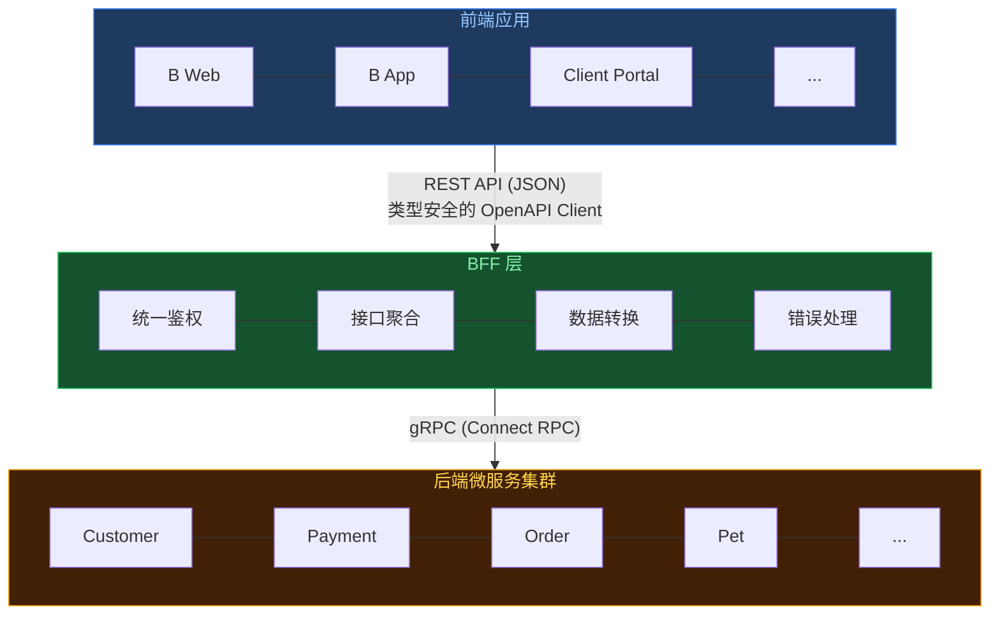

<h2>Modernized BFF Architecture</h2>
<h5 class="text-gray-500">类型安全的端到端实践</h5>
<p class="text-gray-500 text-s">
Doctor Wu / 2025-12-26
</p>

<!--
大家好，今天我要分享的是现代化 BFF 架构的实践经验。
在微服务时代，BFF 层作为前后端的桥梁，如何做到类型安全、高效开发，是我们今天要探讨的主题。
-->

---
layout: intro
class: pl-35
glowSeed: 14
---

## Doctor Wu

<div class="[&>*]:important-leading-10 opacity-80">

{MoeGo} 前端工程师<br>
{Vue} {VueUse} 核心团队成员<br>

</div>

<div my-10 w-max flex="~ gap-1" items-center justify-center>
  <div i-ri-user-3-line op50 ma text-xl />
  <div><a href="https://doctorwu.me" target="_blank" class="border-none! font-300">doctorwu.me</a></div>
  <div i-ri-github-line op50 ma text-xl ml4/>
  <div><a href="https://github.com/Doctor-wu" target="_blank" class="border-none! font-300">Doctor-wu</a></div>
</div>


<!--
我是 Doctor Wu，目前在 MoeGo 负责前端基础设施建设。
同时也是 Vue 和 VueUse 的核心团队成员。
今天分享的 BFF 方案是我们团队在生产环境中实践的经验总结。
-->

---
layout: center
---

## 议题概览

<div grid="~ cols-2 gap-4" class="w-140 mx-auto mt-10">

<div class="p-6 rounded-lg bg-blue-500/10 border-2 border-blue-500/30">
  <div class="text-xl mb-2">📝 端到端类型安全</div>
  <div class="text-sm opacity-50">Proto → Zod → OpenAPI</div>
</div>

<div class="p-6 rounded-lg bg-green-500/10 border-2 border-green-500/30">
  <div class="text-xl mb-2">🔄 Codec 机制</div>
  <div class="text-sm opacity-50">边界数据双向转换</div>
</div>

<div class="p-6 rounded-lg bg-yellow-500/10 border-2 border-yellow-500/30">
  <div class="text-xl mb-2">⚡ 开发效率</div>
  <div class="text-sm opacity-50">自动化工具链</div>
</div>

<div class="p-6 rounded-lg bg-red-500/10 border-2 border-red-500/30">
  <div class="text-xl mb-2">🚨 错误处理</div>
  <div class="text-sm opacity-50">RESTful 风格的创新</div>
</div>

</div>

<!--
今天的分享分为四个核心部分：
1. 端到端类型安全：从后端到前端的类型一致性保障
2. Codec 机制：边界数据的优雅转换方案
3. 开发效率：自动化工具链带来的效率提升
4. 错误处理：RESTful 风格的错误码映射与链路追踪
-->

---
layout: fact
---

## 什么是 BFF？
Backend for Frontend

<!--
在开始之前，我们先明确一下 BFF 的定义。
BFF 是 Backend for Frontend 的缩写，它是一个专门为前端服务的中间层。
-->

---

## BFF 整体架构

<div class="flex justify-center mt-14">



</div>

<!--
这是 BFF 在整个系统中的位置。
前端应用通过 REST API 与 BFF 通信，BFF 则通过 gRPC 与后端微服务集群通信。
BFF 的核心职责包括：接口聚合、协议转换（HTTP ↔ gRPC）、统一鉴权、类型安全保障。
-->

---
layout: fact
---

## 传统方案的痛点
为什么需要新的 BFF 方案？

<!--
在介绍我们的方案之前，先来看看传统 BFF 方案存在的问题。
-->

---

## 三大痛点

<tldraw document="doc-traditional-bff-pain-points" class="h-90 w-[85%]" doc="tldraw/doc-traditional-bff-pain-points.json"></tldraw>

<!--
传统 BFF 方案主要有三大痛点：
1. 类型不一致：前后端手动维护类型，容易出现不一致
2. 重复劳动：Schema 需要在多处定义，Proto 更新后需要手动同步
3. 数据转换困难：JSON 和 gRPC 的类型差异（如 BigInt、Date）处理繁琐
这些问题导致开发效率低、运行时错误多、维护成本高。
-->

---

## 传统开发流程的复杂度

<tldraw document="doc-traditional-workflow-complexity" class="h-90 w-[85%]" doc="tldraw/doc-traditional-workflow-complexity.json"></tldraw>

<!--
看这个流程图，传统方案下开发一个接口需要：
1. 查看 Proto 定义
2. 手写 TypeScript 类型
3. 手写 Zod Schema
4. 手写数据转换逻辑
5. 前端再定义一遍类型
整个流程复杂、繁琐、易出错！
-->

---
layout: fact
---

## End-to-End Type Safety
端到端类型安全

<!--
接下来，我们来看第一个核心优势：端到端类型安全。
这是我们 BFF 方案的基石。
-->

---

## Single Source of Truth
同构 Schema 哲学

<tldraw document="doc-schema-isomorphism-flow" class="h-80 w-[85%]" doc="tldraw/doc-schema-isomorphism-flow.json"></tldraw>

<!--
我们的核心理念是 Single Source of Truth（单一数据源）。
Schema 只需要定义一次，就能在 BFF Server、OpenAPI Client 和 Frontend 中复用。
这样就避免了多处定义带来的不一致问题。
-->

---

## Schema 定义与前端复用

```typescript
// packages/bff-schemas/src/customer/create.ts
export const CreateCustomerSchema = z.object({
  name: z.string().min(1, '客户名称不能为空'),
  email: z.string().email('请输入有效的邮箱地址'),
  phone: z.string().regex(/^1[3-9]\d{9}$/, '请输入有效的手机号'),
}).openapi('CreateCustomer');

// BFF Server 使用
app.openapi(route, async (c) => {
  const data = c.req.valid('json'); // ✅ 自动验证
  // ...
});

// 前端直接复用（表单校验）
const result = CreateCustomerSchema.safeParse(formData);
if (!result.success) {
  console.error(result.error.flatten());
}
```

<!--
看这个例子，Schema 定义一次后：
1. BFF Server 可以用它来验证请求
2. 前端可以直接复用来做表单校验
3. 类型完全一致，不会出现不一致的问题
-->

---
layout: fact
---

## Proto → Zod 自动生成
从后端 Proto 自动生成 Zod Schema

<!--
那么 Schema 从哪里来？我们是从后端的 Proto 定义自动生成的。
-->

---

## 自动生成流程

<tldraw document="doc-proto-to-zod-pipeline" class="h-80 w-[85%]" doc="tldraw/doc-proto-to-zod-pipeline.json"></tldraw>

<!--
生成流程分为四步：
1. Proto 定义（后端维护）
2. protobuf-es 生成 TypeScript 类型
3. ts-to-zod 生成初始 Zod Schema
4. ast-grep 进行 AST 转换，替换类型、添加 .openapi()、处理循环引用等
整个流程只需要运行 pnpm generate:zod 命令即可完成。
-->

---

## ast-grep 介绍

<tldraw document="doc-ast-grep-concepts" class="h-90 w-[85%]" doc="tldraw/doc-ast-grep-concepts.json"></tldraw>

<!--
这里我想重点介绍一下 ast-grep 这个工具。
ast-grep 是一个基于 AST（抽象语法树）的代码搜索和转换工具，而不是基于正则表达式。
它有三个核心概念：
1. Pattern：代码模式匹配，比如匹配 z.bigint()
2. Rule：规则对象，包括 atomic（原子）、relational（关系）、composite（组合）
3. Edit：代码转换操作，包括 replace、insert、delete
-->

---

## AST 转换实战

<tldraw document="doc-ast-grep-transformation" class="h-90 w-[85%]" doc="tldraw/doc-ast-grep-transformation.json"></tldraw>

<!--
看这个实际的转换例子：
转换前是 ts-to-zod 生成的代码，import 是普通的 zod，类型是 z.bigint()、z.date()。
经过 ast-grep 转换后：
1. import 更新为 @hono/zod-openapi
2. 类型替换为 zId、zDate
3. 添加 .openapi() 调用
4. 处理循环引用
5. 提取注释作为 description
-->

---

## AST 转换代码示例

````md magic-move
```typescript
// 转换前（ts-to-zod 生成）
import { z } from 'zod';

export const zCustomer = z.object({
  id: z.bigint(),
  name: z.string(),
  birthDate: z.date(),
});
```

```typescript
// 转换后（ast-grep 处理）
import { z } from '@hono/zod-openapi';
import { zId } from '@moego/bff-schemas/shared/id';
import { zDate as zSharedDate } from '@moego/bff-schemas/shared/date';

export const zCustomer = z.object({
  id: zId,  // ✅ 自动替换
  name: z.string(),
  birthDate: zSharedDate,  // ✅ 自动替换
}).openapi('Customer');  // ✅ 自动添加
```
````

<!--
这是一个具体的代码对比，可以清楚地看到 ast-grep 做了哪些转换。
-->

---

## ast-grep 转换核心代码

```typescript{all|4-5|7-9|all}
// scripts/sync-models-to-zod.ts
function updateZodDefinition(root: SgNode) {
  const edits: Edit[] = [];
  // 使用 ast-grep 查找所有 z.bigint()
  const bigintNodes = root.findAll('z.bigint()');
  
  bigintNodes.forEach((node) => {
    // 结构化替换为 zId
    const edit = node.replace('zId');
    edits.push(edit);
  });
  
  return edits;
}
```

<!--
这是 ast-grep 转换的核心代码实现。
1. 使用 findAll 查找所有匹配 z.bigint() 的 AST 节点
2. 对每个节点执行结构化替换为 zId
3. 收集所有的编辑操作
ast-grep 的强大之处在于它是基于 AST 的，所以替换是精确的、结构化的。
-->

---
layout: fact
---

## 循环引用处理的演进历程
从 z.lazy 到 getter 的迭代

<!--
在自动生成过程中，我们遇到了一个很棘手的问题：循环引用。
让我们来看看我们是如何一步步解决这个问题的。
-->

---

## 循环引用演进历程

<tldraw document="doc-circular-reference-evolution" class="h-80 w-[85%]" doc="tldraw/doc-circular-reference-evolution.json"></tldraw>

<!--
我们经历了三个阶段：
阶段 1：使用 z.lazy，类型推断失效，需要手动断言，IDE 提示丢失
阶段 2：z.lazy + unwrap，仍需 .unwrap()，代码冗余，不够优雅
阶段 3：使用 getter 延迟求值，完美类型推断，IDE 完全支持，代码简洁优雅
这个突破得益于 Zod 4 支持了 getter 延迟求值。
-->

---

## 问题起源：z.lazy 的类型困境

```typescript
// Proto 定义（含循环引用）
message ServiceInstanceImpl {
  int64 service_instance_id = 1;
  repeated ServiceInstanceImpl addons = 9;  // 自引用
}

// protobuf-es 初始生成
export const zServiceInstanceImpl = z.lazy(() =>
  z.object({
    serviceInstanceId: zId,
    addons: z.array(zServiceInstanceImpl),  // 循环引用
  })
) as unknown as z.ZodSchema<ServiceInstanceImpl>;  // ❌ 需要手动类型断言
```

<!--
问题的起源是这样的：
后端 Proto 定义中有一个服务实例的消息类型，它的 addons 字段是自引用的。
protobuf-es 生成的代码使用 z.lazy 来处理这种循环引用。
但是这样就需要手动类型断言，非常不优雅。
-->

---

## z.lazy 的四大痛点

<tldraw document="doc-zlazy-type-problems" class="h-90 w-[85%]" doc="tldraw/doc-zlazy-type-problems.json"></tldraw>

<!--
z.lazy 带来的问题有四个：
1. z.infer 返回 any，类型推断完全失效
2. 必须手写 interface + as unknown as 断言
3. IDE 智能提示丢失，开发体验极差
4. Schema 扩展困难，.and()、.merge() 都不工作
这些问题严重影响了开发效率和类型安全性。
-->

---

## 最终方案：getter 延迟求值

````md magic-move
```typescript
// ❌ 旧方案：z.lazy + 类型断言
export const zServiceInstanceImpl: z.ZodSchema<ServiceInstanceImpl> = z.lazy(() =>
  z.object({
    serviceInstanceId: zId,
    addons: z.array(zServiceInstanceImpl),
  })
) as unknown as z.ZodSchema<ServiceInstanceImpl>;
```

```typescript
// ✅ 新方案：z.object + getter（Zod 4 支持）
export const zServiceInstanceImpl = z.object({
  serviceInstanceId: zId.openapi({ description: '服务实例ID' }),
  // 使用 getter 处理循环引用字段
  get addons() {
    return z.array(zServiceInstanceImpl).openapi({ 
      description: '子服务实例列表' 
    });
  },
}).openapi("ServiceInstanceImpl");
```
````

<!--
最终的方案是使用 getter 延迟求值。
新方案的优势：
1. 完美的类型推断，z.infer 正常工作
2. 无需手动类型断言
3. IDE 智能提示完全恢复
4. Schema 扩展变得简单
5. 代码更加简洁优雅
-->

---

## ast-grep 两阶段转换

<tldraw document="doc-getter-two-phase-transform" class="h-80 w-[85%]" doc="tldraw/doc-getter-two-phase-transform.json"></tldraw>

<!--
那么如何自动将 z.lazy 转换为 getter 呢？
我们使用 ast-grep 实现了两阶段转换：
阶段一：检测循环引用字段，转换为 getter 函数
阶段二：移除 z.lazy 包装，改为普通 z.object
这样就实现了自动化、批量、精确的代码转换。
-->

---

## 两阶段转换代码

```typescript{all|2-10|12-20|all}
// 阶段一：转换字段为 getter
function convertCircularFieldsToGetters(root: SgNode) {
  const lazyNodes = root.findAll({ rule: { pattern: 'z.lazy($FUNC)' } });
  lazyNodes.forEach((node) => {
    // 检查字段是否引用 lazy schema
    if (containsSelfReference(field, schemaName)) {
      const getterCode = `get ${fieldName}() { return ${value}; }`;
      edits.push(fieldNode.replace(getterCode));
    }
  });
}

// 阶段二：移除 lazy 包装
function removeLazyWrapper(root: SgNode) {
  root.findAll('z.lazy($FUNC)').forEach((node) => {
    if (hasGetter(node)) {
      const replacement = extractObject(node) + '.openapi("Name")';
      edits.push(node.replace(replacement));
    }
  });
}
```

<!--
这是两阶段转换的核心代码。
阶段一先检测循环引用并转换字段为 getter，阶段二再移除 lazy 包装。
两个阶段分开执行，确保转换的正确性。
-->

---

## OpenAPI 驱动的客户端生成

<tldraw document="doc-openapi-client-generation" class="h-80 w-[85%]" doc="tldraw/doc-openapi-client-generation.json"></tldraw>

<!--
有了 Zod Schema 后，我们可以生成 OpenAPI 文档，然后基于 OpenAPI 生成类型安全的客户端。
流程是：Route 定义 → OpenAPI YAML → openapi-zod-client → AST 重写 → 类型安全 Client
这样前端就可以使用完全类型安全的 API 客户端了。
-->

---

## 客户端使用示例

```typescript
import { createCustomerClient } from '@moego/bff-openapi';

const client = createCustomerClient(fetcher);

// ✅ 完整的类型提示和校验
const customer = await client.getCustomer({ customerId: '123' });
//    ^? const customer: Customer

// ❌ TypeScript 编译错误
const invalid = await client.getCustomer({ id: 123 });
//                                        ^^^ 
// Argument of type '{ id: number }' is not assignable to 
// parameter of type '{ customerId: string }'
```

<!--
看这个客户端使用示例：
1. 导入生成的客户端
2. 调用 API 方法时，TypeScript 提供完整的类型提示
3. 参数类型错误会在编译时被捕获
这就是端到端类型安全的威力。
-->

---

## 运行时校验：质量左移

```typescript
const client = createCustomerClient(fetcher, {
  onValidateResponseError: (error, meta) => {
    // 响应校验失败 → 立即感知问题
    reportToSentry({
      type: 'BFF_RESPONSE_VALIDATION_ERROR',
      realm: meta.realm,
      method: meta.bffMethod,
      error: error.flatten(),
    });
    return false; // 抛出异常
  },
});
```

<!--
除了编译时的类型检查，我们还有运行时的 Schema 校验。
当 BFF 返回的数据不符合 Schema 时，客户端会立即检测到并上报错误。
这样可以在开发阶段就发现问题，而不是等到用户反馈。
这就是质量左移的实践。
-->

---
layout: fact
---

## Codec Mechanism
双向数据转换

<!--
接下来讲第二个核心优势：Codec 机制。
这是我们处理边界数据转换的优雅方案。
-->

---

## Codec 概念：双向转换

<tldraw document="doc-codec-bidirectional-flow" class="h-80 w-[85%]" doc="tldraw/doc-codec-bidirectional-flow.json"></tldraw>

<!--
Codec 提供双向转换能力：
- decode：外部输入（JSON string）→ 内部类型（bigint）用于请求解析
- encode：内部类型（bigint）→ 外部输出（JSON string）用于响应格式化
它在 Frontend、BFF 和 Backend 之间起到桥梁作用。
-->

---

## 内置 Codec: zId

````md magic-move
```typescript
// 问题：JSON 不支持 BigInt
{
  "id": 123456789012345678901234567890  // ❌ 精度丢失
}
```

```typescript
// 解决方案：Codec
export const zId = z.codec(
  z.coerce.string().regex(/^-?\d+$/),  // 外部：JSON string
  z.bigint(),                          // 内部：JS bigint
  {
    encode: (value) => value.toString(),  // bigint → "123"
    decode: (value) => BigInt(value),     // "123" → 123n
  }
);
```
````

<!--
zId 是我们的第一个内置 Codec。
问题是 JSON 不支持 BigInt，大数值会精度丢失。
我们的解决方案是：
- 外部用 string 表示
- 内部用 bigint 计算
- Codec 自动处理双向转换
-->

---

## 内置 Codec: zDate

```typescript
// 问题：前端 ISO 字符串 vs 后端 GoogleDate
const DateString = z.string().regex(/^\d{4}-\d{1,2}-\d{1,2}$/);
const GoogleDate = z.object({
  year: z.number(),
  month: z.number().min(1).max(12),
  day: z.number().min(1).max(31),
});

export const zDate = z.codec(DateString, GoogleDate, {
  encode: (value) => `${value.year}-${value.month}-${value.day}`,
  decode: (value) => {
    const [year, month, day] = value.split('-').map(Number);
    return { year, month, day };
  },
}).openapi('MoeDate');
```

<!--
zDate 是第二个内置 Codec。
问题是前端习惯用 ISO 字符串（2024-01-01），后端 gRPC 用 GoogleDate 对象。
Codec 自动处理两种格式的转换，开发者不需要关心底层细节。
-->

---

## Route 中的 Codec 使用

````md magic-move
```typescript
app.openapi(route, async (c) => {
  // ✅ decode 自动生效
  const { customerId } = c.req.valid('json');
  // customerId 已经是 bigint 类型
  
  const result = await c.callService(
    CustomerServiceClient,
    'getCustomer',
    { id: customerId }  // 直接使用 bigint
  );
  
  return c.json(result, HTTP_CODE.SUCCESS);
});
```

```typescript
app.openapi(route, async (c) => {
  // ✅ decode 自动生效
  const { customerId } = c.req.valid('json');
  // customerId 已经是 bigint 类型
  
  const result = await c.callService(
    CustomerServiceClient,
    'getCustomer',
    { id: customerId }  // 直接使用 bigint
  );
  
  // ⚠️ encode 需要手动调用
  return c.json(
    ResponseSchema.encode(result),  // bigint → string
    HTTP_CODE.SUCCESS
  );
});
```
````

<!--
在 Route 中使用 Codec：
1. decode 是自动的：请求进来时自动将 string 转为 bigint
2. encode 需要手动调用：响应时需要显式调用 .encode() 将 bigint 转为 string
这样设计是为了让开发者明确知道什么时候发生了数据转换。
-->

---

## Codec vs Transform

<tldraw document="doc-codec-vs-transform" class="h-90 w-[85%]" doc="tldraw/doc-codec-vs-transform.json"></tldraw>

<!--
为什么选择 Codec 而不是 Transform？
Codec 的优势：
1. 双向转换，支持 encode 和 decode
2. 响应格式化支持，有 .encode() 方法
3. OpenAPI 导出的是外部类型（前端看到的是 string）
4. 前端使用友好，传入原始类型即可
Transform 只有单向转换，无法满足我们的需求。
-->

---
layout: fact
---

## Development Efficiency
自动化工具链

<!--
第三个核心优势是开发效率。
自动化工具链带来的效率提升是巨大的。
-->

---

## 自动化工作流

<tldraw document="doc-automation-workflow" class="h-80 w-[85%]" doc="tldraw/doc-automation-workflow.json"></tldraw>

<!--
我们的自动化工作流非常简单：
1. pnpm update-api：更新后端 Proto
2. pnpm generate:zod：重新生成 Zod Schema
3. pnpm generate:openapi：重新生成 OpenAPI Client
整个流程仅需 2 分钟！
-->

---

## 创建新路由

```bash
$ pnpm cr  # 交互式创建

? 请输入 realm 名称: customer
? 请输入 route 名称: get-customer-detail
? 请选择 HTTP 方法: GET

✅ 已创建 Schema 文件：packages/bff-schemas/src/customer/get-customer-detail.ts
✅ 已创建 Route 文件：server/routes/customer/get-customer-detail.ts
✅ 已注册到路由索引：server/routes/customer/index.ts

🎉 新路由创建完成！
```

<!--
创建新路由也很简单，运行 pnpm cr 命令：
1. 交互式输入 realm 名称、route 名称、HTTP 方法
2. 自动生成 Schema 文件
3. 自动生成 Route 文件
4. 自动注册到路由索引
整个过程不到 1 分钟。
-->

---

## CI/CD 流程

<tldraw document="doc-cicd-pipeline" class="h-80 w-[85%]" doc="tldraw/doc-cicd-pipeline.json"></tldraw>

<!--
我们的 CI/CD 流程也很完善：
1. Schema 变更后提交代码
2. CI 自动执行 generate:openapi
3. 自动发布 npm 包 @moego/bff-openapi
4. 前端更新依赖后立即感知变更
这样前端可以第一时间知道 API 的变化。
-->

---

## 开发效率对比

<tldraw document="doc-development-efficiency-comparison" class="h-90 w-[85%]" doc="tldraw/doc-development-efficiency-comparison.json"></tldraw>

<!--
让我们看看具体的效率对比：
后端 API 更新：传统方案 30 分钟，我们的方案 2 分钟
新增接口：传统方案 20 分钟，我们的方案 5 分钟
类型不一致检测：传统方案运行时报错，我们的方案编译时就发现
效率提升 10 倍！
-->

---
layout: fact
---

## Error Handling
RESTful 风格错误处理

<!--
最后一个核心优势是错误处理机制。
这是我们 BFF 方案的一个重要创新点。
-->

---
layout: fact
---

## 与后端大仓的错误码协作
RESTful 风格的创新

<!--
我们的 BFF 和后端大仓合作制定了错误码的规范。
后端大仓定义服务的业务错误码，BFF 消费业务错误码，返回对应的 HTTP Status Code 和用户友好的报错文案。
相比于 RPC 风格永远返回 200，更加贴合 RESTful 风格。
-->

---

## 错误码映射规范

```typescript
// packages/schemas/src/shared/code.ts
export const RpcCode2HttpCode: Record<RPCStrandErrCode, HTTP_CODE> = {
  [RPCStrandErrCode.OK]: HTTP_CODE.SUCCESS,               // 0 → 200
  [RPCStrandErrCode.InvalidArgument]: HTTP_CODE.BAD_REQUEST,  // 3 → 400
  [RPCStrandErrCode.NotFound]: HTTP_CODE.NOT_FOUND,       // 5 → 404
  [RPCStrandErrCode.PermissionDenied]: HTTP_CODE.FORBIDDEN, // 7 → 403
  [RPCStrandErrCode.Unauthenticated]: HTTP_CODE.UNAUTHORIZED, // 16 → 401
  [RPCStrandErrCode.ResourceExhausted]: HTTP_CODE.TOO_MANY_REQUESTS, // 8 → 429
  [RPCStrandErrCode.Unimplemented]: HTTP_CODE.NOT_IMPLEMENTED, // 12 → 501
  [RPCStrandErrCode.Internal]: HTTP_CODE.INTERNAL_SERVER_ERROR, // 13 → 500
  [RPCStrandErrCode.Unavailable]: HTTP_CODE.SERVICE_UNAVAILABLE, // 14 → 503
  // ... 完整映射
};
```

<!--
我们定义了完整的 gRPC 错误码到 HTTP 状态码的映射表。
这样 BFF 就可以将后端的 gRPC 错误转换为标准的 HTTP 错误码。
-->

---

## 错误类型体系

<tldraw document="doc-error-handling-architecture" class="h-80 w-[85%]" doc="tldraw/doc-error-handling-architecture.json"></tldraw>

<!--
我们的错误类型体系包括：
1. LogicException：业务逻辑错误，带有可选的错误码
2. SvcInvokeException：gRPC 服务调用错误，包含 gRPC code 和原始消息
这些错误都会被全局错误处理中间件捕获并统一处理。
-->

---

## 全局错误处理中间件

```typescript{all|5-8|10-22|all}
// server/middleware/error-wrap.middleware.ts
export const ErrorMiddleware: ErrorHandler = (err, c) => {
  // 记录链路追踪
  span?.setTag('error', err);
  
  // gRPC 错误 → HTTP 错误
  if (err instanceof SvcInvokeException) {
    const grpcStatus = err.code;
    
    // 业务错误码（> 100000）→ 500
    if (grpcStatus > MIN_BIZ_ERROR_CODE) {
      return c.json({
        code: grpcStatus,
        message: err.rawMessage,
      }, HTTP_CODE.INTERNAL_SERVER_ERROR);
    }
    
    // 标准 gRPC 错误码 → 对应 HTTP 状态码
    return c.json({
      code: grpcStatus,
      message: err.rawMessage,
    }, RpcCode2HttpCode[grpcStatus] ?? HTTP_CODE.INTERNAL_SERVER_ERROR);
  }
  
  // 其他错误处理...
};
```

<!--
全局错误处理中间件的逻辑：
1. 记录链路追踪信息
2. 判断 gRPC 错误类型
3. 业务错误码（大于 100000）统一返回 500
4. 标准 gRPC 错误码映射到对应的 HTTP 状态码
5. 返回格式化的 JSON 响应
-->

---

## RPC vs RESTful 错误处理

<tldraw document="doc-rpc-vs-restful-error" class="h-90 w-[85%]" doc="tldraw/doc-rpc-vs-restful-error.json"></tldraw>

<!--
对比传统 RPC 风格和我们的 RESTful 风格：
RPC 风格：永远返回 HTTP 200，Datadog/APM 无法识别错误，需要解析 body
RESTful 风格：返回正确的 HTTP 状态码，Datadog 自动识别错误，链路追踪自动标记失败请求
这样第三方系统（如网关、负载均衡）可以直接识别请求状态。
-->

---

## 链路追踪的优势

<tldraw document="doc-error-tracing-flow" class="h-80 w-[85%]" doc="tldraw/doc-error-tracing-flow.json"></tldraw>

<!--
完整的错误处理流程：
1. gRPC 错误（code: 5, message: NotFound）
2. 错误码映射（RpcCode2HttpCode: 5 → 404）
3. HTTP 响应（404 Not Found + 用户友好文案）
4. Datadog APM 自动识别 4xx/5xx，标记失败请求，统计错误率
这大大提升了可观测性，便于监控和排查问题。
-->

---
layout: section
---

# 技术架构总览

<!--
接下来简要介绍一下我们的技术架构。
-->

---

## 技术栈总览

<tldraw document="doc-tech-stack-overview" class="h-90 w-[85%]" doc="tldraw/doc-tech-stack-overview.json"></tldraw>

<!--
我们的技术栈包括：
- Hono：轻量、高性能、TypeScript 友好的 Web 框架
- Zod + @hono/zod-openapi：运行时验证 + OpenAPI 生成
- Connect RPC：gRPC-Web 兼容的后端通信
- ast-grep：结构化代码转换工具
- dd-trace：Datadog APM 链路追踪
- TypeScript：类型安全的基石
-->

---

## 多进程架构

<tldraw document="doc-cluster-architecture" class="h-80 w-[85%]" doc="tldraw/doc-cluster-architecture.json"></tldraw>

<!--
我们的 BFF 使用多进程架构：
- Cluster Manager：进程管理器
- Worker 进程池：最多 4 个 Worker 进程
- 自动负载均衡
- Worker 崩溃自动重启
- 充分利用多核 CPU
-->

---
layout: fact
---

## 方案对比与总结

<!--
最后让我们来总结一下。
-->

---

## 与传统方案对比

| 对比维度 | 传统 BFF | 我们的方案 |
|---------|---------|-----------|
| **类型安全** | 手动维护，易不一致 | Proto → Zod 自动生成 + 运行时校验 |
| **开发效率** | 手动同步，重复劳动 | 自动化工具链，命令一键生成 |
| **数据转换** | 手写转换逻辑 | Codec 双向转换机制 |
| **错误处理** | RPC 风格（永远 200） | RESTful 风格（正确的 HTTP Status Code） |
| **维护成本** | Schema 多处定义 | Single Source of Truth |
| **循环引用** | z.lazy + 手动类型断言 | getter 延迟求值 + 完美类型推断 |

<!--
全方位的对比可以看出我们的方案在各个维度都有显著优势。
-->

---

## 核心竞争力总结

<div grid="~ cols-2 gap-6" class="mt-10">

<div>

### ✅ 技术亮点

- **同构思想**：Schema 定义一次，Server/Client 共享
- **自动化工具链**：ast-grep 驱动的代码生成
- **质量左移**：编译时 + 运行时双重保障
- **RESTful 规范**：正确的错误码映射，链路可追踪

</div>

<div>

### ✅ 实际效果

- **效率提升 10 倍**：2 分钟完成 API 更新
- **类型 100% 一致**：前后端类型完全同步
- **错误率降低 90%**：编译时发现大部分问题
- **可观测性提升**：Datadog 自动识别错误

</div>

</div>

<!--
总结一下我们的核心竞争力：
技术亮点：同构思想、自动化工具链、质量左移、RESTful 规范
实际效果：效率提升 10 倍、类型 100% 一致、错误率降低 90%、可观测性大幅提升
-->

---

## 适用场景

<div class="mt-10 space-y-4">

<div class="p-4 rounded-lg bg-blue-500/10 border-2 border-blue-500/30">
  ✅ 微服务架构，需要 BFF 层聚合
</div>

<div class="p-4 rounded-lg bg-green-500/10 border-2 border-green-500/30">
  ✅ 前端需要类型安全保障
</div>

<div class="p-4 rounded-lg bg-yellow-500/10 border-2 border-yellow-500/30">
  ✅ 团队重视开发效率和代码质量
</div>

<div class="p-4 rounded-lg bg-purple-500/10 border-2 border-purple-500/30">
  ✅ 需要完善的链路追踪和错误监控
</div>

</div>

<!--
这个方案适用于：
1. 微服务架构，需要 BFF 层聚合
2. 前端需要类型安全保障
3. 团队重视开发效率和代码质量
4. 需要完善的链路追踪和错误监控
-->

---

## 技术亮点回顾

<div grid="~ cols-2 gap-8" class="mt-10">

<div>

### ast-grep
结构化代码转换的利器

```typescript
// 精确、批量、自动化
root.findAll('z.bigint()')
  .forEach(node => 
    node.replace('zId')
  )
```

</div>

<div>

### getter 延迟求值
优雅解决循环引用

```typescript
z.object({
  get field() {
    return z.array(schema)
  }
})
```

</div>

<div>

### Codec 机制
边界数据转换的最佳实践

```typescript
z.codec(external, internal, {
  encode, decode
})
```

</div>

<div>

### 错误码规范
与后端大仓的协作创新

```typescript
RpcCode2HttpCode
// gRPC → HTTP
```

</div>

</div>

<!--
最后回顾一下四个技术亮点：
1. ast-grep：结构化代码转换的利器
2. getter 延迟求值：优雅解决循环引用
3. Codec 机制：边界数据转换的最佳实践
4. 错误码规范：与后端大仓的协作创新
-->

---
layout: center
class: text-center
---

# Q & A

<div class="mt-10">
  <div class="text-4xl mb-4">🙋‍♂️</div>
  <div class="text-xl opacity-70">欢迎提问与交流</div>
</div>

<!--
感谢大家的聆听！现在是 Q&A 时间，欢迎提问。
-->

---
layout: center
class: text-center
---

# 感谢聆听

<div class="mt-10 space-y-4">
  <div class="text-2xl opacity-70">Doctor Wu</div>
  <div class="flex items-center justify-center gap-4">
    <div>GitHub: @Doctor-wu</div>
    <div>|</div>
    <div>Twitter: @Doctorwu666</div>
  </div>
  <div class="text-sm opacity-50 mt-8">Slides: https://github.com/Doctor-wu/talks</div>
</div>

<!
